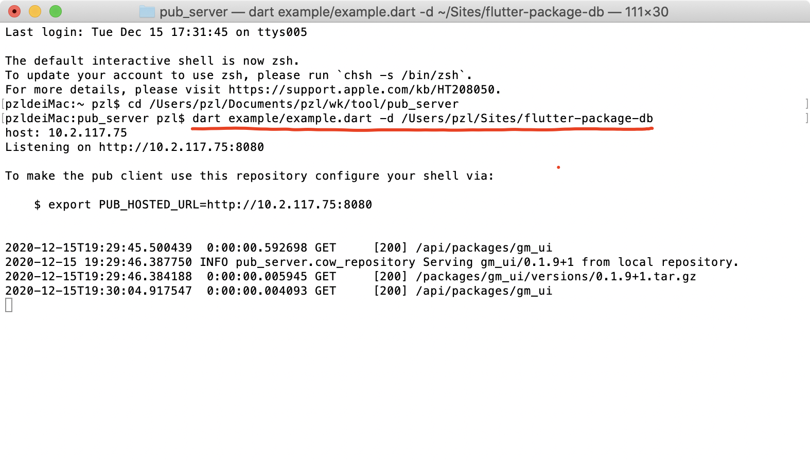
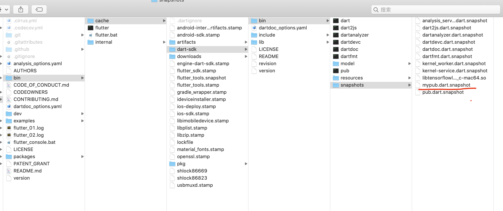
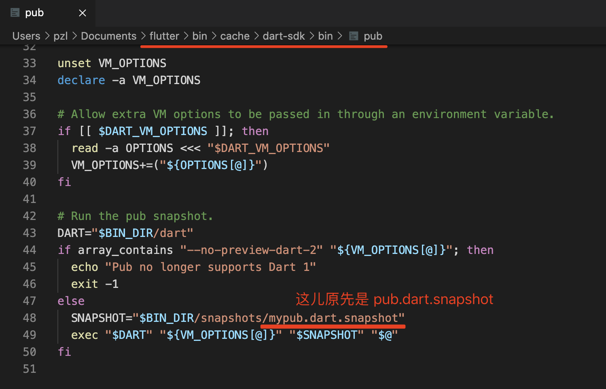
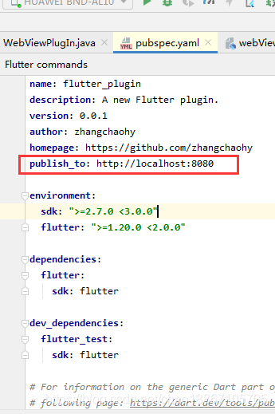
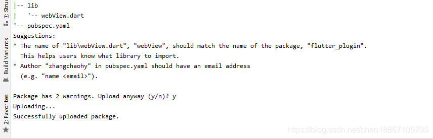
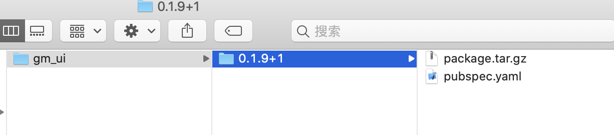
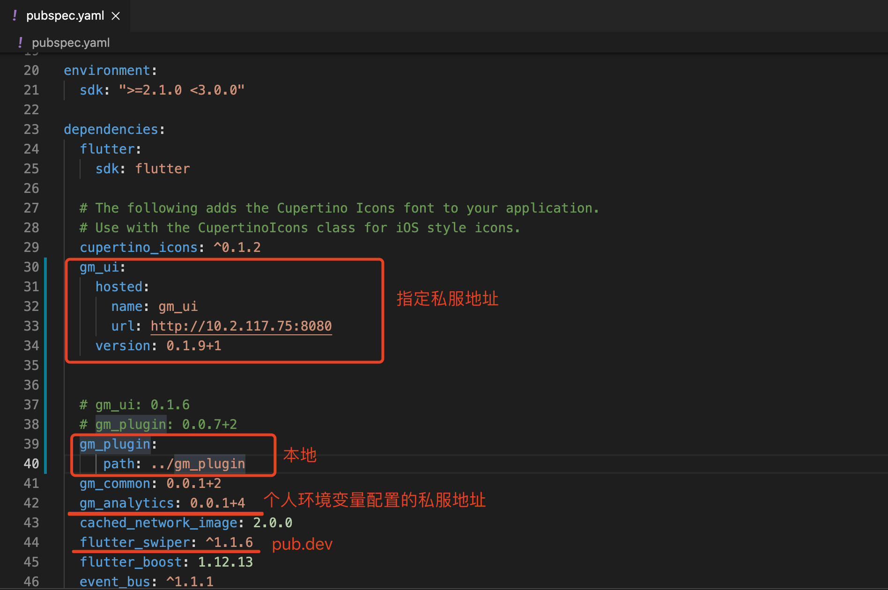
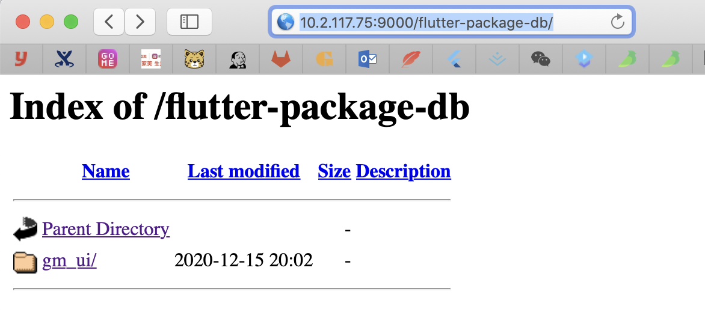
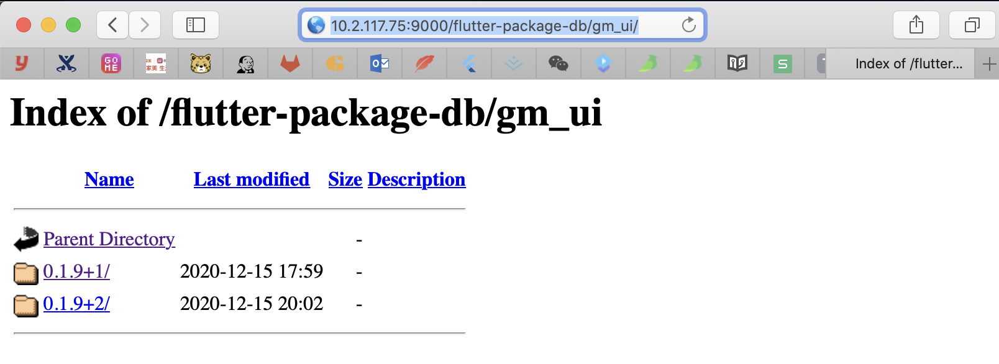

目的：搭建私服的目的是上传自己的flutter插件提供给其他开发者下载使用。

### 1， pub_server安装及启动。

pub_server类似于maven仓库一样可以存储flutter插件。

pub_server下载地址：https://pub.dev/packages/pub_server

按照官网启动即可： dart example/example.dart -d /Users/pzl/Sites/flutter-package-db

### 2, 获取绕过google认证的dart pub snapshot。

这里，我已经编译好了一个可以使用的snapshot。

下载地址： https://github.com/zhangchaohy/flutterLearning

将其放到flutter sdk中：.../flutter/bin/cache/dart-sdk/bin/snapshots/mypub.dart.snapshot

修改pub可执行文件：

### 3， 上传插件

修改插件yaml文件

执行发布命令
flutter pub publish

在  /Users/pzl/Sites/flutter-package-db 这个目录下，可以看到如下插件：

### 4， 使用

注：
上边图片中，标明了4中插件的依赖方式，其实插件的依赖方式，有很多，使用地址：
a,  指定私服地址，可以用在私服地址有多个的情况。
b,  本地, 调试插件的时候可以使用这种方式。
c,  个人在环境变量配置中的私服地址，例如: export PUB_HOSTED_URL=*********。
d,  其实就是依赖官方pub.dev中的插件。

### 5， 显示
私服虽然搭建成功了，也可以发布了，有的时候，我们想知道一个插件的最新版本，或者，插件真的发布成功了么？ 

我们不可能每次都去搭建改私服的机器上去看一下，这个插件包是否真的存在。

其实，我们可以在该私服机器上，搭建一个apache, 或者能提供web服务的就行，显示出文件目录，这样，我们有直观的感受。

