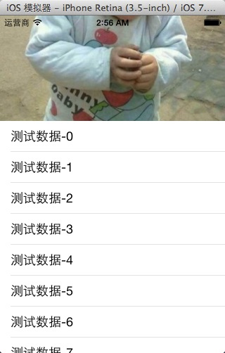
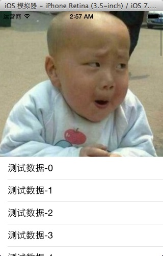
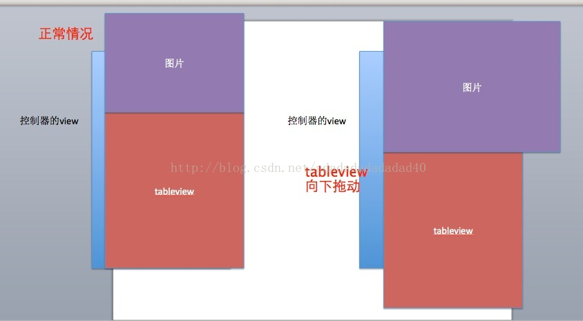

经常在以下应用中看到这样的效果：在tableview的上边，有一个背景图片，当向下拖动tableview时，顶部的背景图片自动变大，当tableview被放回的时候，图片自动还原。

一：效果图：

正常图片：



向下拖动图片：



二：原理如下：

- 1，假如，控制器就是tableviewcontroller,设置tableview的顶部内边距，将tableview的顶部留出来。

- 2，在tableview中，放入一个imageview,一定要放入最底部，将imageview设置大一点

- 3，设置imageview的内容模式为等比例拉伸(这是最重要的)

- 4，当tableview拖动的时候，计算拖动的距离。如果是向下拖动，将imageview的高度变大，那么，宽度会自动变大，这样，上边的图片看起来就会等比例变大。当tableview向上反弹或者向上拖动的时候，这时候，要注意了，imageview就不在自动变了，维持先前的大小。

三：示意图：




四：事例代码：（为了方便，就直接将控制器整成一个tableviewController）

```
#import "CZViewController.h"

#import "UIView+Extension.h"

CGFloat const CZInitH = 320;

CGFloat const CZInitW = 320;

CGFloat const CZInsetTop = 150;

@interface CZViewController ()

@property(nonatomic,strong) UIImageView *imageView;

@end

@implementation CZViewController

- (void)viewDidLoad{
    [super viewDidLoad];
    //先设置tableview的顶部内边距

    self.tableView.contentInset = UIEdgeInsetsMake(CZInsetTop, 0, 0, 0);

    

    UIImageView *imageView = [[UIImageView alloc] init];

    imageView.image = [UIImage imageNamed:@"biaoqingdi"];

    

    //imageview的一部分在屏幕外，一部分在屏幕中

    imageView.frame = CGRectMake(0, -CZInitH, CZInitW, CZInitH);

    //设置imageView等比例伸缩

    imageView.contentMode = UIViewContentModeScaleAspectFill;

    [self.tableView insertSubview:imageView atIndex:0];

    self.imageView = imageView;

}

/** tableview已经拖拽 */
-(void)scrollViewDidScroll:(UIScrollView *)scrollView{

    //计算往下拖拽的距离

    CGFloat dragDelta = -CZInsetTop - scrollView.contentOffset.y;

    if(dragDelta < 0){ //如果dragDelta＜0，说明，tableview向上拖动

        dragDelta = 0;

    }

    //设置imageview的高度

    self.imageView.height = CZInitH + dragDelta;

}

#pragma mark - tableview的数据源方法

-(NSInteger)tableView:(UITableView *)tableView numberOfRowsInSection:(NSInteger)section{

    return 20;

}

-(UITableViewCell *)tableView:(UITableView *)tableView cellForRowAtIndexPath:(NSIndexPath *)indexPath{

    static NSString *ID = @"cell";

    UITableViewCell *cell = [tableView dequeueReusableCellWithIdentifier:ID];

    if(cell == nil){

        cell = [[UITableViewCell alloc] initWithStyle:UITableViewCellStyleDefault reuseIdentifier:ID];

    }

    cell.textLabel.text = [NSString stringWithFormat:@"测试数据-%d",indexPath.row];

    return cell;

}
@end
```