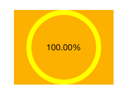

最终要实现的效果，如图：



将实现这个效果的View写成了分类：

.h文件：

```
#import <UIKit/UIKit.h>
@interface CZProgressView : UIView

@property(nonatomic,assign) CGFloat progress;

@end
```

.m文件：

```
#import "CZProgressView.h"
@interface CZProgressView ()
@property(nonatomic,strong) UILabel *label;
@end

@implementation CZProgressView

-(UILabel *)label{
    if(_label == nil){
       _label = [[UILabelalloc] initWithFrame:self.bounds];
		_label.textAlignment = NSTextAlignmentCenter;
		[self addSubview:_label];
    }

    return _label;
}

- (id)initWithFrame:(CGRect)frame{
    self = [super initWithFrame:frame];
    if (self) {
        self.backgroundColor = [UIColor clearColor];
    }
    return self;
}

-(void)setProgress:(CGFloat)progress{
    _progress = progress;

    self.label.text = [NSStringstringWithFormat:@"%0.2f%%",progress* 100];

    [self setNeedsDisplay];
}

- (void)drawRect:(CGRect)rect{

    UIBezierPath *path = [UIBezierPath bezierPath];
    CGFloat w = rect.size.width * 0.5;
    CGFloat h = rect.size.height * 0.5;
    CGPoint centerPoint = CGPointMake(w,h);
    CGFloat radius = w > h ? h : w;

    radius-= 5;
    CGFloat startAngle = - M_PI_2;
    CGFloat endAngle = self.progress * 2 * M_PI + startAngle;

    [path addArcWithCenter:centerPoint radius:radius startAngle:startAngleendAngle:endAngle clockwise:YES];

    path.lineWidth = 10.0;
    path.lineCapStyle = kCGLineCapRound;

    [[UIColor yellowColor] set];

    [path stroke];
}
```


