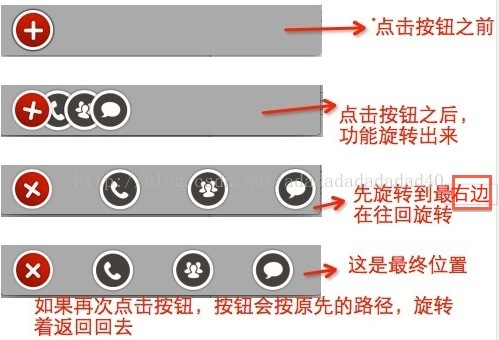
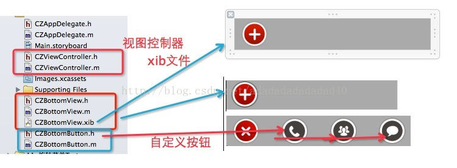
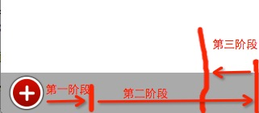

我们先看一下，最终要实现的情况：如图：



再看一下，项目代码的结构图：



实现思路：

- 1，自定义view类和xib文件，将view类和xib文件关联上。

- 2，在view的初始化方法中，添加自定义按钮。在添加按钮的时候，将按钮的图片,tag,bounds,以及监听添加上。并且将按钮添加到按钮集合中，下面要用到集合做循环遍历用。

- 3，在layoutSubviews方法中，设置按钮的位置，如果按钮不在零点，那么就在当前的位置。并且把菜单按钮放到最上边。

- 4，当菜单按钮别点击时，先判断是需要打开菜单，还是关闭菜单。(通过判断按钮是否旋转过就可以判断)

- 5，通过组合动画，一个是平移，一个是旋转。平移的时候，总共分为三阶段，每一阶段都有不同的平移位置，旋转角度。

- 6，在动画执行之后，一定不要让动画再回到原先的位置。因为平移和旋转都是在图层上做的操作，不是真实的，按钮的真实位置还在动画之前的位置呢，所以，要设置一下按钮的真实位置，这样，按钮就可以在点击的时候，就会有反应了。

- 7，点击按钮的时候，通知代理，按钮被人点击了。





第一部分：视图控制器的代码：

```
#import "CZViewController.h"

#import "CZBottomView.h"

@interface CZViewController () <CZBottomViewDelegate>

@property (weak, nonatomic) IBOutletUIView *bottomView;

@end

@implementation CZViewController

- (void)viewDidLoad

{

    [superviewDidLoad];

    

    CZBottomView *btmView = [CZBottomViewbottomView];

    btmView.delegate =self;

    [self.bottomViewaddSubview:btmView];

}


/**

 *  CZBottomView的代理方法

 *  @param bottomButton 当前被点击的按钮

 *  @param index        被点击按钮的索引

 */


-(void)bottomView:(CZBottomView *)bottomView didBtnClick:(CZBottomButton *)bottomButton index:(NSInteger)index{

   NSLog(@"点击了第%d个按钮",index);

}
```

第二部分：

1，CZBottomView的头文件：

```
#import <UIKit/UIKit.h>

@class CZBottomButton,CZBottomView;

@protocol CZBottomViewDelegate <NSObject>

@optional

//按钮的点击事件

-(void)bottomView:(CZBottomView *)bottomView didBtnClick:(CZBottomButton *)bottomButton index:(NSInteger)index;

@end

@interface CZBottomView :UIView

//代理

@property(nonatomic,weak)id<CZBottomViewDelegate> delegate;


//快速创建

+(instancetype)bottomView;

@end
```

2，CZBottomView的实现文件：

```
#import "CZBottomView.h"

#import "CZBottomButton.h"


//动画持续时间

#define AniDuration 3.0

@interface CZBottomView ()


//最左边的菜单按钮

@property (weak, nonatomic) IBOutletUIButton *menuBtn;

//所有按钮的集合

@property(nonatomic,strong)NSMutableArray *btns;


//最左边菜单按钮的点击事件

- (IBAction)menuBtnClick;


@end


@implementation CZBottomView


-(NSMutableArray *)btns{

   if(!_btns){

       _btns = [NSMutableArrayarray];

    }

   return _btns;

}

/**

 *  快速创建

 */

+(instancetype)bottomView{

   return [[[NSBundlemainBundle] loadNibNamed:@"CZBottomView"owner:niloptions:nil]lastObject];

    

}


- (id)initWithFrame:(CGRect)frame

{

   self = [superinitWithFrame:frame];

   if (self) {

       // 初始化数据

        [selfsetUp];

    }

    return self;

}


-(id)initWithCoder:(NSCoder *)aDecoder{

   if(self = [superinitWithCoder:aDecoder]){

       // 初始化数据

        [selfsetUp];

    }

    return self;

}

/**

 *  初始化数据

 */

-(void)setUp{

    //添加3个按钮

    [selfaddBtnWithImgName:@"menu_btn_call"andTag:0];

    [selfaddBtnWithImgName:@"menu_btn_cheyou"andTag:1];

    [selfaddBtnWithImgName:@"menu_btn_tixing"andTag:2];

}

/**

 *  添加按钮

 *

 *  @param imgName 按钮图片的名称

 *  @param tag     tag

 */

-(void)addBtnWithImgName:(NSString *)imgName andTag:(NSInteger)tag{

    //初始化按钮

    CZBottomButton *btn = [CZBottomButtonbuttonWithType:UIButtonTypeCustom];

    

    //设置按钮的图片

    [btn setBackgroundImage:[UIImageimageNamed:imgName] forState:UIControlStateNormal];

    btn.tag = tag;

    btn.bounds =CGRectMake(0,0, 44, 44);

    

    //添加监听

    [btn addTarget:selfaction:@selector(btnClick:)forControlEvents:UIControlEventTouchUpInside];

    [selfaddSubview:btn];

    [self.btnsaddObject:btn];

}

/**

 *  按钮的点击事件

 */

-(void)btnClick:(CZBottomButton *)btn{

    //先判断代理是否实现了此方法

   if([self.delegaterespondsToSelector:@selector(bottomView:didBtnClick:index:)]){

        [self.delegatebottomView:selfdidBtnClick:btn index:btn.tag];

    }

}


-(void)layoutSubviews{

    [superlayoutSubviews];

    //设置按钮的frame

    for (CZBottomButton *btnin self.btns) {

        //如果按钮的位置不是0，那么将按钮置于它当前的位置，如果是0，那么放置在菜单按钮的位置

       if(!CGPointEqualToPoint(btn.currentPoint,CGPointZero)){

            btn.center = btn.currentPoint;

        }else{

            btn.center =self.menuBtn.center;

        }

        

    }

    //将菜单按钮放到最上边

    [selfbringSubviewToFront:self.menuBtn];

}


- (IBAction)menuBtnClick {

    

    //主菜单按钮也要旋转

    BOOL isOpen =CGAffineTransformIsIdentity(self.menuBtn.transform);

    [UIViewanimateWithDuration:AniDurationanimations:^{

       if(isOpen){

           //打开

            self.menuBtn.transform = CGAffineTransformMakeRotation(M_PI_4);

        }else{

           //关闭

            self.menuBtn.transform =CGAffineTransformIdentity;

        }

    }];


    [selfopenBtn:isOpen];

}

/**

 *  是否打开按钮

 */

-(void)openBtn:(BOOL)isOpen{

    //按钮间隔的位置

   CGFloat padding = 80;

    

    //菜单按钮的位置

   CGPoint menuCenter = self.menuBtn.center;

    //平移，旋转

   for (int i=0; i<self.btns.count; i++) {

       CZBottomButton *btn = self.btns[i];

        

        //x轴需要移动的距离

       CGFloat move = (i+1) * padding;

        

       //按钮中心点

       CGPoint btnCenter = btn.center;

        btnCenter.x += move;

        

       //平移动画

        CAKeyframeAnimation *keyTranslationAni = [CAKeyframeAnimationanimation];

        keyTranslationAni.keyPath =@"position";

        

       //最开始的位置

       NSValue *value1 = [NSValuevalueWithCGPoint:self.menuBtn.center];

        

        //第一阶段末尾位置

       NSValue *value2 = [NSValuevalueWithCGPoint:CGPointMake(menuCenter.x + move *0.3, menuCenter.y)];

        

        //第二阶段末尾位置

       NSValue *value3 = [NSValuevalueWithCGPoint:CGPointMake(menuCenter.x + move *1.1, menuCenter.y)];

        

        //第三阶段末尾位置

       NSValue *value4 = [NSValuevalueWithCGPoint:CGPointMake(menuCenter.x + move, menuCenter.y)];

        

        //如果是打开，那么顺序是1,2,3,4,如果是要关闭菜单，那么顺序是4，3，2，1

       if(isOpen){

            keyTranslationAni.values =@[value1,value2,value3,value4];

        }else{

            keyTranslationAni.values =@[value4,value3,value2,value1];

        }

        

        

       //旋转动画

        CAKeyframeAnimation *rotationAni = [CAKeyframeAnimationanimation];

        rotationAni.keyPath =@"transform.rotation";

        

        //如果是打开，显示0,2PI,4PI,2PI  ,如果是要关闭菜单，那么顺序是0,2PI,0,-2PI

       if(isOpen){

            rotationAni.values =@[@(0),@(M_PI *2),@(M_PI *4),@(M_PI *2)];

        }else{

            rotationAni.values =@[@(0),@(M_PI *2),@(0),@(-M_PI *2)];

        }

        

       //组动画

        CAAnimationGroup *group = [CAAnimationGroupanimation];

        

       //动画持续时间

        group.duration =AniDuration;

        group.animations =@[keyTranslationAni,rotationAni];

        

        //动画结束之后，不要回到原先的位置

        group.removedOnCompletion =NO;

        group.fillMode =kCAFillModeForwards;

        [btn.layeraddAnimation:group forKey:nil];

        

        //设置按钮的当前位置

       if(isOpen){

            btn.currentPoint = btnCenter;

        }else{

            btn.currentPoint =self.menuBtn.center;

        }

                

    }

}

@end
```

第三部分：

1，CZBottomButton的头文件


```
#import <UIKit/UIKit.h>

@interface CZBottomButton :UIButton

@property(nonatomic,assign)CGPoint currentPoint;

@end

```

2，CZBottomButton的实现文件

```
#import "CZBottomButton.h"
@implementation CZBottomButton
@end
```
