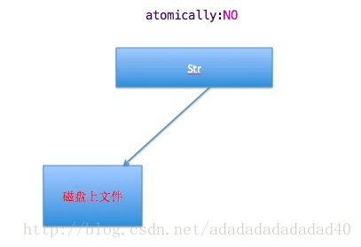

在日常操作中，有时我们需要将字符串写入到文本文件上，例如：

    NSString *str=@"123456这是字符串ss";

    //如果文件不存在，会自动创建文件

    //如果文件夹不存在，会直接报错

   NSString *path=@"/Users/mac/Desktop/abcss.txt";

    

    NSError *err=nil;

    //YES代表要进行原子性操作，也就是会创建一个中间的临时文件

    [strwriteToFile:path atomically:YESencoding:NSUTF8StringEncodingerror:&err];

    

    if(err){

       //[err localizedDescription] 会返回主要的错误信息

       NSLog(@"写入错误：%@",[errlocalizedDescription]);

    }else{

        NSLog(@"写入成功");

    }

如上事例代码中，atomically:YES 表示：在操作文件时，是原子性操作，会先创建一个中间临时文件，等到字符都写入到文件中以后，在将临时文件的拷贝到目标文件，如果在写入的过程中，出现错误，目标文件不会创建或者不会被更改。如果是NO，则表示，直接将字符串写入到目标文件中，如果写入的过程中出现错误，目标文件不会自动更改，即写入多少，就是多少。

以下是atomically为YES的情况

以下是atomically为NO的情况

