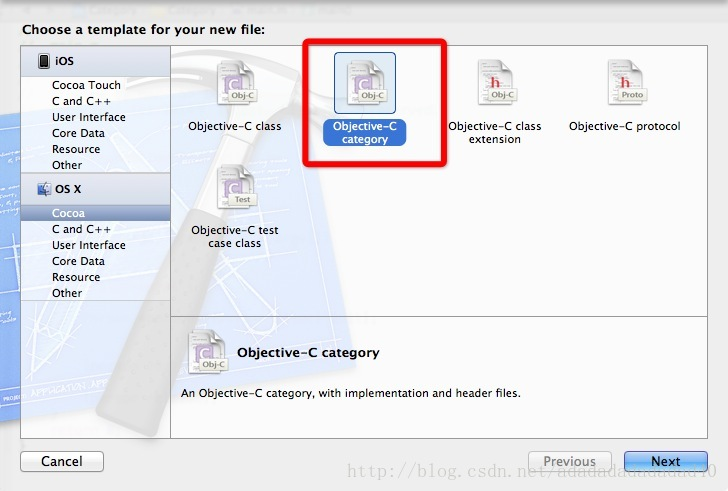
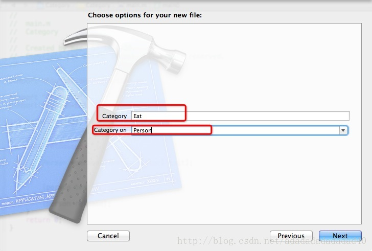
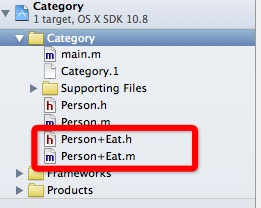
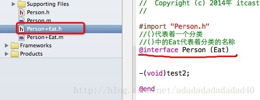
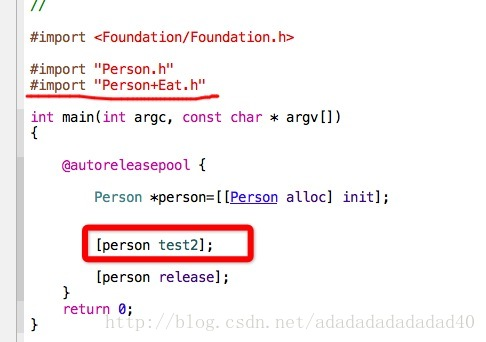

简单介绍:

1，OC提供了一种与其他语言不同的方式，可以动态的为已经存在的类添加新的方法，在java,.net中是没有这种语法的。它就是Category

2,  这样设计就可以保证先前一开始设计的类的方法比较少，随着功能的增加，类的方法越来越多，再次扩展的时候，可以不用再在修改先前的类，而在新添加的类上添加方法，这样扩展性就比较好。

3，Category使用简单，实现了方法的模块化开发，把不同的方法放到不同的分类文件中。

使用方法：

a , 创建Category的时候，选择 Objective-C category：

category:代表要创建的分类

category on : 代表给哪个类创建分类

创建完之后，生成了两个文件：Person+Eat.h 和 Person+Eat.m      +号的意思就代表分类

再看一下这两个文件中的内容：

要扩展的方法跟平时在先在.h中声明方法，然后再.m文件中实现方法是一样的。

在方法的使用时，要先导入Person+Eat.h文件，然后才能使用.h中的方法。例如，如下图片中的方法体中，在Person的分类Eat中，实现了一个test2方法，调用的时候，就用Person对象即可调用：

使用场合：

1，在需求变更的情况下，有可能为某些类添加新的方法。

2，一些类中包含了许多的不同用途的方法实现，而这些方法需要不用的成员实现，分模块开发。

3，在使用基础类的时候，希望实现自己的方法，比如为NSString扩展一个XML方法
