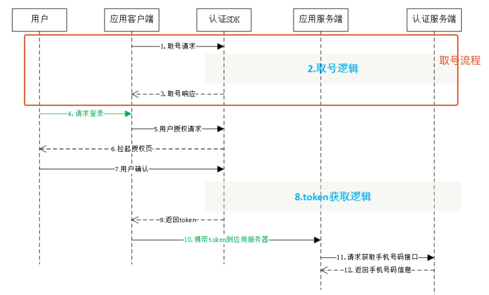

## 一、简介
为了降低用户使用APP的成本，提高APP使用率，并减少恶意刷登录接口风险，本文简单介绍 “中国移动”提供的一键登录功能，其他家的功能基本差不多。

流程图：

步骤分析：

1. 预取号：主要完成的功能包括：发起取号请求、网络判断、蜂窝数据网络切换等操作并缓存凭证scrip。这个过程可以提前进行。

2. 授权：应用客户端调用SDK接口，SDK拉起用户授权页面，用户确认授权后，SDK将返回token给应用客户端。本步骤可以给用户选择是否授权的机会。

3. 登录\注册：客户端将token发送给应用后端服务器，后端服务从移动的认证服务器获取手机号，并使用手机号登录，返回客户端登录信息。

## 二、兼容
三家运营商都拥有自己的 SDK，但各自的 SDK 不一定支持别家的认证。这导致目前许多接入了一键登录的产品，只支持某一个运营商。

如果要兼容三大运营商，就需要分别接入三个 SDK。现在我们也有更简单的方法，就是接入一个整合了三大运营商认证能力的第三方 SDK，目前主要有以下几家：

> 阿里 - 号码认证服务

> 创蓝 - 闪验

> 极光 - 极光认证

> mob - 秒验

原理和使用方法基本都是一样的，具体以查看它们的文档。