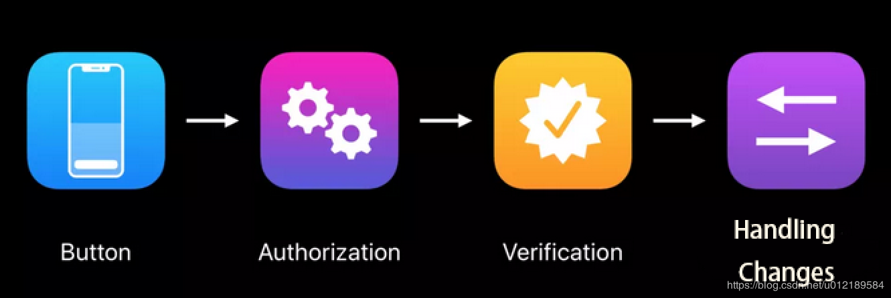
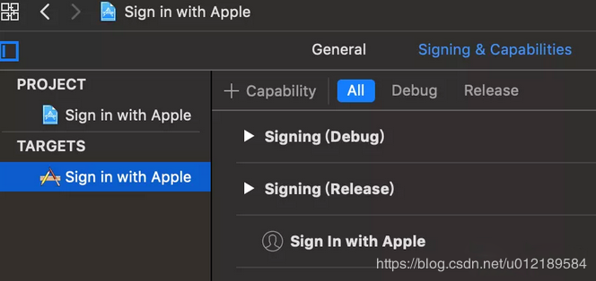
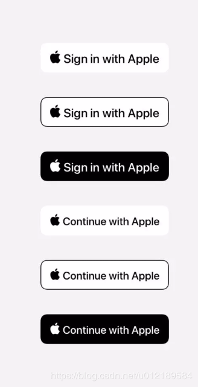
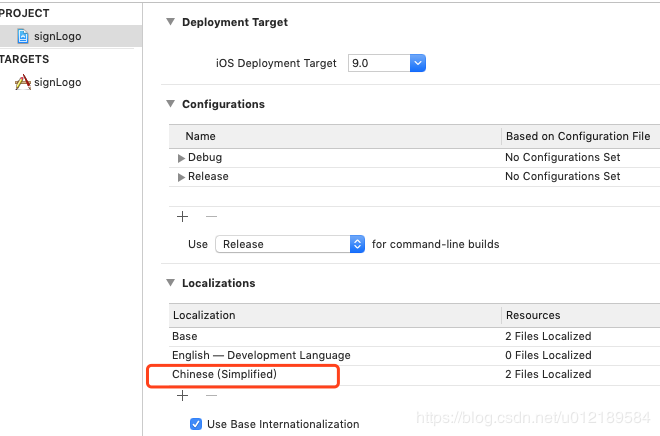
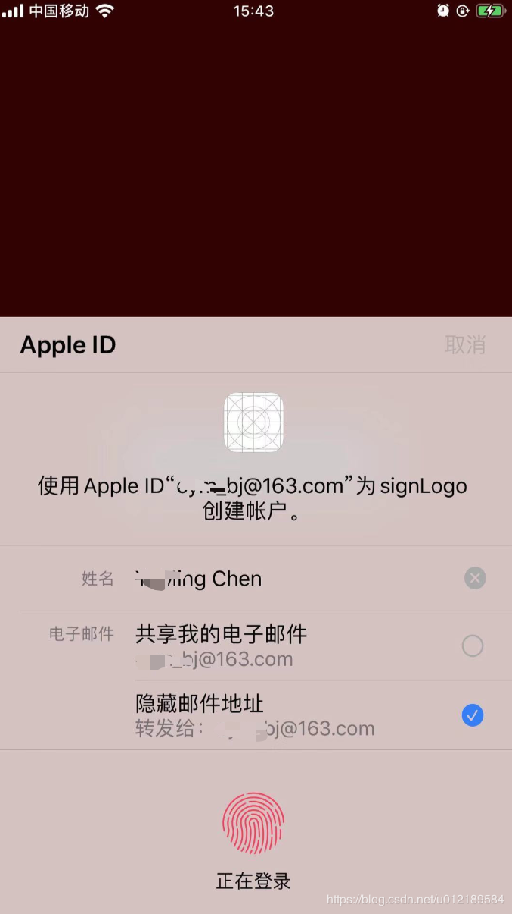
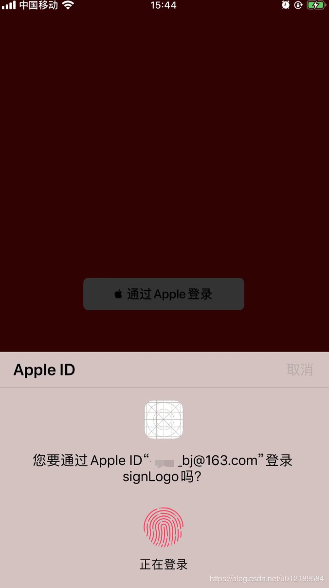
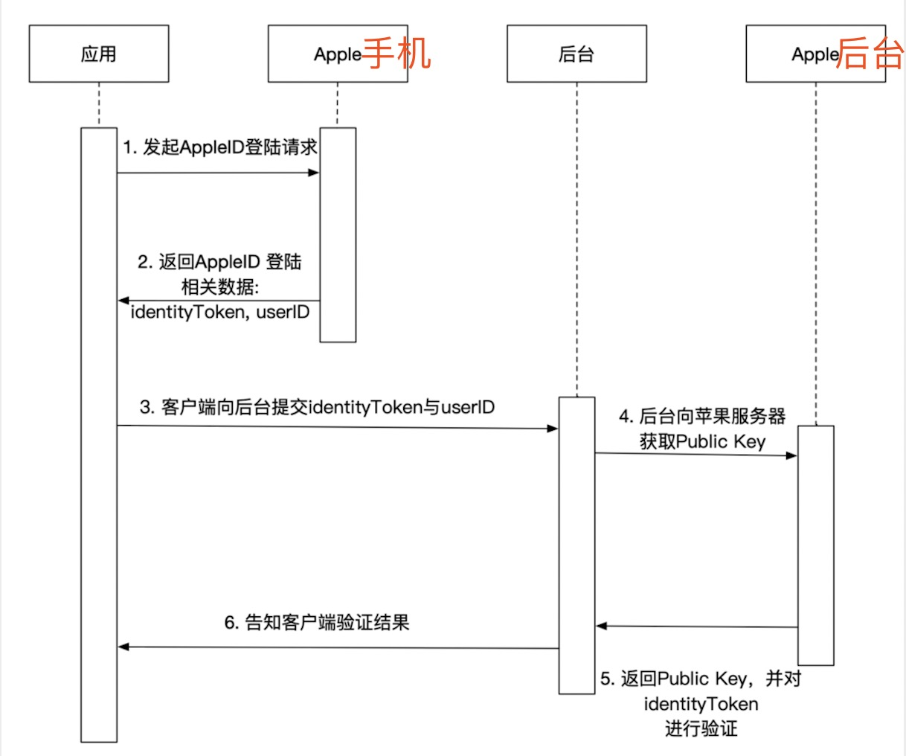
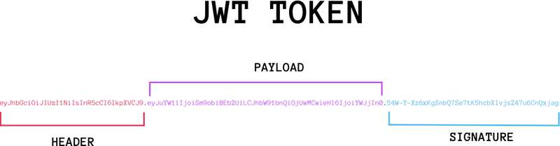
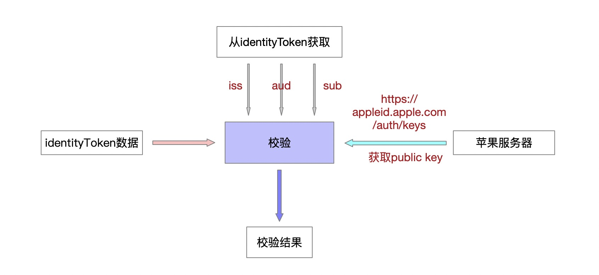

## 一、 sign in with apple 简介  
 苹果官方介绍:
 
 ```
The fast, easy way to sign in to apps and websites.

Sign In With Apple 是一种在app 和网站上快速、容易登录的方式。

Sign In with Apple makes it easy for users to sign in to your apps and websites using their Apple ID. 
Instead of filling out forms, verifying email addresses, and choosing new passwords, they can use 
Sign In with Apple to set up an account and start using your app right away. All accounts are protected
with two-factor authentication for superior security, and Apple will not track users’ activity in your app or website.

对于用户来说，Sign In With Apple 使他们可以使用Apple ID容易地登录apps和网站。
而不需要填写表单，验证邮件，选择新密码。用户可以使用Sign In With Apple 创建新用户并立即可以开始使用你的app。
为了提高安全性，双重因子验证保护了帐号的安全性。而且Apple 不会跟踪用户在app 和网站的行为信息。
 ```
 
注： 如果开发者使用了第三方登录，那必须也得使用苹果登录，这是苹果官方的硬性要求。如果没有使用第三方登录，开发者是可以不使用苹果登录的。

集成步骤：



## 二、 相关设置

### 1、开启 Sign in with Apple 功能

1. 登录开发者网站，在需要添加 Sign in with Apple 功能的 Identifier 开启功能。(苹果后台)

	
	
2. Xcode 里面 Signing & Capabilities 开启 Sign in with Apple 功能。（XCode工程设置）

	

## 三、 App端实现  
### 1、使用苹果提供的按钮

官方提供了一个 ASAuthorizationAppleIDButton （继承自UIControl），使用这个来创建一个登录按钮。

```
ASAuthorizationAppleIDButton *loginBtn = [[ASAuthorizationAppleIDButton alloc]initWithAuthorizationButtonType:ASAuthorizationAppleIDButtonTypeSignIn authorizationButtonStyle:ASAuthorizationAppleIDButtonStyleWhite];
[loginBtn addTarget:self action:@selector(signInWithApple) forControlEvents:UIControlEventTouchUpInside];
loginBtn.center = self.view.center;
loginBtn.bounds = CGRectMake(0, 0, 200, 40);
[self.view addSubview:loginBtn];

```

这个按钮具有两种文案类型和三个样式，分别是：

```
typedef NS_ENUM(NSInteger, ASAuthorizationAppleIDButtonType) {
    ASAuthorizationAppleIDButtonTypeSignIn,
    ASAuthorizationAppleIDButtonTypeContinue,
    ASAuthorizationAppleIDButtonTypeDefault = ASAuthorizationAppleIDButtonTypeSignIn,
} 
 
typedef NS_ENUM(NSInteger, ASAuthorizationAppleIDButtonStyle) {
    ASAuthorizationAppleIDButtonStyleWhite,
    ASAuthorizationAppleIDButtonStyleWhiteOutline,
    ASAuthorizationAppleIDButtonStyleBlack,
}
```

样式如下图：



从图上可以看出：

**>** Apple 提供的登录按钮有三种外观：白色，带有黑色轮廓线的白色和黑色。

**>** 文案有两种：Sign In with Apple 和 Continue with Apple。（具体使用哪个文案，根据自身业务需求来定）

另外，按钮宽高默认值为 {width:130, height:30}。

对于 ASAuthorizationAppleIDButton 我们能够自定义的东西比较少，比如背景色不能更改，文案只有两种可选，并且值不能修改，可以调整的只有圆角cornerRadius和size 。

本地化：必要且重要的一点




### 2、Authorization 发起授权登录请求

```
#pragma mark- 点击登录
-(void)signInWithApple API_AVAILABLE(ios(13.0))
{
    ASAuthorizationAppleIDProvider *provider = [[ASAuthorizationAppleIDProvider alloc]init];
    ASAuthorizationAppleIDRequest * request = [provider createRequest];
    request.requestedScopes = @[ASAuthorizationScopeFullName,ASAuthorizationScopeEmail];
    
    ASAuthorizationController *vc= [[ASAuthorizationController alloc]initWithAuthorizationRequests:@[request]];
    vc.delegate = self;
    vc.presentationContextProvider = self;
    
    [vc performRequests];
}

```

>ASAuthorizationAppleIDProvider 这个类比较简单，头文件中可以看出，主要用于创建一个 ASAuthorizationAppleIDRequest 以及获取对应 userID 的用户授权状态。在上面的方法中我们主要是用于创建一个 ASAuthorizationAppleIDRequest ，用户授权状态的获取后面会提到。

>给创建的 request 设置 requestedScopes ，这是个 ASAuthorizationScope 数组，目前只有两个值，ASAuthorizationScopeFullName 和 ASAuthorizationScopeEmail，根据需求去设置即可。

>然后，创建 ASAuthorizationController ，它是管理授权请求的控制器，给其设置 delegate 和 presentationContextProvider ，最后启动授权 performRequests 。


设置上下文

ASAuthorizationControllerPresentationContextProviding 就一个方法，主要是告诉 ASAuthorizationController 展示在哪个 window 上。

```
-(ASPresentationAnchor)presentationAnchorForAuthorizationController:(ASAuthorizationController *)controller
API_AVAILABLE(ios(13.0)){
   return  self.view.window;
}

```

### 3、Verification 授权

用户发起授权请求后，系统就会弹出用户登录验证的页面。




在用户没有同意授权之前或者取消授权之后，点击登录的时候，都会弹出上面这个界面，在这个授权页面，我们可以修改自己的用户名，以及可以选择共享我的电子邮箱或者隐藏邮件地址。这样一来，就可以达到隐藏自己真实信息的目的。

授权一次后，再次点击登录按钮，则会直接弹出下面这个窗口：



授权回调处理

下面是 ASAuthorizationControllerDelegate 方法，一个是授权成功的回调，一个是失败的回调。

```
#pragma mark- 授权成功的回调
-(void)authorizationController:(ASAuthorizationController *)controller didCompleteWithAuthorization:(ASAuthorization *)authorization
API_AVAILABLE(ios(13.0)){
    
    if ([authorization.credential isKindOfClass:[ASAuthorizationAppleIDCredential class]]) {
        
        ASAuthorizationAppleIDCredential * credential = authorization.credential;
        
        NSString *state = credential.state;
        
        NSString * userID = credential.user;
        
        NSPersonNameComponents *fullName = credential.fullName;
        NSString * email = credential.email;
        //refresh token
        NSString * authorizationCode = [[NSString alloc]initWithData:credential.authorizationCode encoding:NSUTF8StringEncoding];
        // access token
        NSString * identityToken = [[NSString alloc]initWithData:credential.identityToken encoding:NSUTF8StringEncoding];
        
        ASUserDetectionStatus realUserStatus = credential.realUserStatus;
		 
		 NSLog(@"state: %@", state);
		 NSLog(@"userID: %@", userID);
		 NSLog(@"fullName: %@", fullName);
		 NSLog(@"email: %@", email);
		 NSLog(@"authorizationCode: %@", authorizationCode);
		 NSLog(@"identityToken: %@", identityToken);
		 NSLog(@"realUserStatus: %@", @(realUserStatus));
    }
   
}
 
#pragma mark- 授权失败的回调
- (void)authorizationController:(ASAuthorizationController *)controller didCompleteWithError:(NSError *)error
API_AVAILABLE(ios(13.0)){
    
    NSString * errorMsg = nil;
    
    switch (error.code) {
        case ASAuthorizationErrorCanceled:
            errorMsg = @"用户取消了授权请求";
            break;
        case ASAuthorizationErrorFailed:
            errorMsg = @"授权请求失败";
            break;
        case ASAuthorizationErrorInvalidResponse:
            errorMsg = @"授权请求响应无效";
            break;
        case ASAuthorizationErrorNotHandled:
            errorMsg = @"未能处理授权请求";
            break;
        case ASAuthorizationErrorUnknown:
            errorMsg = @"授权请求失败未知原因";
            break;
    
    }
  
}

```

当我们授权成功后，我们可以在 authorizationController:didCompleteWithAuthorization: 这个代理方法中获取到 ASAuthorizationAppleIDCredential ，通过这个可以拿到用户的 userID、email、fullName、authorizationCode、identityToken 以及 realUserStatus 等信息。

这些信息具体含义和用途：

-  User ID: Unique, stable, team-scoped user ID，苹果用户唯一标识符，该值在同一个开发者账号下的所有 App 下是一样的，开发者可以用该唯一标识符与自己后台系统的账号体系绑定起来。

-  Verification data: Identity token, code，验证数据，用于传给开发者后台服务器，然后开发者服务器再向苹果的身份验证服务端验证本次授权登录请求数据的有效性和真实性，详见 Sign In with Apple REST API。如果验证成功，可以根据 userIdentifier 判断账号是否已存在，若存在，则返回自己账号系统的登录态，若不存在，则创建一个新的账号，并返回对应的登录态给 App。

-  Account information: Name, verified email，苹果用户信息，包括全名、邮箱等。

-  Real user indicator: High confidence indicator that likely real user，用于判断当前登录的苹果账号是否是一个真实用户，取值有：unsupported、unknown、likelyReal。

-  失败情况会走 authorizationController:didCompleteWithError

### 4、Handling Changes

通过上面的步骤一个完整的授权，已经完成。BUT，我们还需要处理一些 Case。

-  用户终止 App 中使用 Sign in with Apple 功能

-  用户在设置里注销了 AppleId

这些情况下，App 需要获取到这些状态，然后做退出登录操作，或者重新登录。

我们需要在 App 启动的时候，通过 getCredentialState:completion: 来获取当前用户的授权状态。

```
- (BOOL)application:(UIApplication *)application didFinishLaunchingWithOptions:(NSDictionary *)launchOptions {
    
    if (@available(iOS 13.0, *)) {
        NSString *userIdentifier = 钥匙串中取出的 userIdentifier;
        if (userIdentifier) {
            ASAuthorizationAppleIDProvider *appleIDProvider = [ASAuthorizationAppleIDProvider new];
            [appleIDProvider getCredentialStateForUserID:userIdentifier
                                              completion:^(ASAuthorizationAppleIDProviderCredentialState credentialState,
                                                           NSError * _Nullable error)
            {
                switch (credentialState) {
                    case ASAuthorizationAppleIDProviderCredentialAuthorized:
                        // The Apple ID credential is valid
                        break;
                    case ASAuthorizationAppleIDProviderCredentialRevoked:
                        // Apple ID Credential revoked, handle unlink
                        break;
                    case ASAuthorizationAppleIDProviderCredentialNotFound:
                        // Credential not found, show login UI
                        break;
                }
            }];
        }
    }
    
    return YES;
}

```

ASAuthorizationAppleIDProviderCredentialState 解析如下：

-  ASAuthorizationAppleIDProviderCredentialAuthorized 授权状态有效；
-  ASAuthorizationAppleIDProviderCredentialRevoked 上次使用苹果账号登录的凭据已被移除，需解除绑定并重新引导用户使用苹果登录；

-  ASAuthorizationAppleIDProviderCredentialNotFound 未登录授权，直接弹出登录页面，引导用户登录。

另外，在 App 使用过程中，还可以通过通知方法来监听 revoked 状态，可以添加 ASAuthorizationAppleIDProviderCredentialRevokedNotification 这个通知，收到这个通知的时候，我们可以：

 - 用户退出当前设备 和 重新登录授权

```
- (void)observeAppleSignInState
{
    if (@available(iOS 13.0, *)) {
        [[NSNotificationCenter defaultCenter] addObserver:self
                                                 selector:@selector(handleSignInWithAppleStateChanged:)
                                                     name:ASAuthorizationAppleIDProviderCredentialRevokedNotification
                                                   object:nil];
    }
}
 
- (void)handleSignInWithAppleStateChanged:(NSNotification *)notification
{
    // Sign the user out, optionally guide them to sign in again
    NSLog(@"%@", notification.userInfo);

}
```

## 四、 后端校验
### 1、整体流程图

  

 > #### 1、步骤1与2在客户端内完成，客户端选择使用ASAuthorizationAppleIDProvider来完成登录，如果登录成功，苹果将会返回如下数据:
  -  **User ID**: 苹果用户唯一标识符，它在同一个开发者账号下的所有 App 下是一样的，我们可以用它来与后台的账号体系绑定起来（类似于微信的OpenID）。
  -  **Verification Data**: 包括identityToken, authorizationCode。用于传给开发者后台服务器，然后开发者服务器再向苹果的身份验证服务端验证本次授权登录请求数据的有效性和真实性。
  -  **Account Information**: 苹果用户信息，包括全名、邮箱等，登录时用户可以选择隐藏真实的邮件地址和随意修改姓名。
Real User Indicator: 用于判断当前登录的苹果账号是否是一个真实用户，取值有：unsupported、unknown、likelyReal。

 > #### 2、步骤3中，客户端会把identityToken, authorizationCode, userID这三个参数传给后台，用于验证本次登录的有效性。
 
### 2、JWT数据
在应用传递数据给后台的参数中，有一个字段: identityToken， 它是一个经过签名的JSON Web Token(JWT), 大概像下面这样:


它是一个很长的字符串，中间用点（.）分隔成三个部分。注意，JWT 内部是没有换行的，这里只是为了便于展示，将它写成了几行。

JWT 的三个部分依次如下。

```
- Header（头部）
- Payload（负载）
- Signature（签名）
```

写成一行，就是下面的样子。

```
Header.Payload.Signature
```



**注意：**

header(第一部分) 和 Payload(第二部分) 都是使用Base64编码过的,使用时需要先解码
 
第一部分解码:

```
{
    "kid": "AIDOPK1",
    "alg": "RS256"
}
```

第二部分解码:

```
{
    "iss": "https://appleid.apple.com",
    "aud": "**********",
    "exp": 1570617356,
    "iat": 1570616756,
    "sub": "00*****1790047f40335c6c1a.0641",
    "c_hash": "eqOdpr_**TyHiRymHbPQ",
    "auth_time": 1570616756
}

```

**备注:**  此时 iss，aud 和 sub 这三个字段在验证的时候需要使用。

JWT的这个三部分的字段分别代表：

> - **header:** 包括了key id 与加密算法
> - **payload:**
	* iss: 签发机构，苹果
	* aud: 接收者，目标app
	* exp: 过期时间
	* iat: 签发时间
	* sub: 用户id
	* c_hash: 一个哈希数列，作用未知
	* auth_time: 签名时间
> - **signature:** 用于验证JWT的签名

### 3、校验identityToken
上边我们了解了identityToken的数据组成，那么，怎么来校验这个字段的真伪性呢？



> ##### 1、从苹果服务器获取publickey

```
public PublicKey getPublicKey() throws Exception {
	String urlData = getUrlData("https://appleid.apple.com/auth/keys");
	Map maps = (Map)JSON.parse(urlData);
	List keys = (List<Map>)maps.get("keys");
	Map o = (Map) keys.get(0);
	Jwk jwa = Jwk.fromValues(o);
	try {
	    PublicKey publicKey = jwa.getPublicKey();
	    return publicKey;
	} catch (InvalidPublicKeyException e) {
	    e.printStackTrace();
	}
	return null;
}

```

需要引入 jar 包：

```
<dependency>
    <groupId>com.auth0</groupId>
    <artifactId>jwks-rsa</artifactId>
    <version>0.9.0</version>
</dependency>
```  

> ##### 2、解析identityToken

```
String jwt = "app端请求的identityToken";
String decode = Base64.decoded(jwt.split("\\.")[1]);
String substring = decode.substring(0, decode.indexOf("}")+1);
JSONObject jsonObject = JSON.parseObject(substring);
String iss = jsonObject.getString("iss");
String sub = jsonObject.getString("sub");
String aud = jsonObject.getString("aud");

``` 

> ##### 3、验证

``` 
public String verify(String jwt, String iss,String aud, String sub) throws Exception {
    PublicKey publicKey = getPublicKey();
    JwtParser jwtParser = Jwts.parser().setSigningKey(publicKey);
    jwtParser.requireIssuer(iss);
    jwtParser.requireAudience(aud);
    jwtParser.requireSubject(sub);
    try {
        Jws<Claims> claim = jwtParser.parseClaimsJws(jwt);
        if (claim != null && claim.getBody().containsKey("auth_time")) {
            return "SUCCESS";
        }
        return "FIALD";
    } catch (ExpiredJwtException e) {
        log.error("apple identityToken expired", e);
        return "FIALD";
    } catch (Exception e) {
        log.error("apple identityToken illegal", e);
        return "FIALD";
    } 
}
``` 
 

使用到的jar包：

``` 
<dependency>
  <groupId>io.jsonwebtoken</groupId>
  <artifactId>jjwt</artifactId>
  <version>0.7.0</version>
</dependency> 
``` 


 
