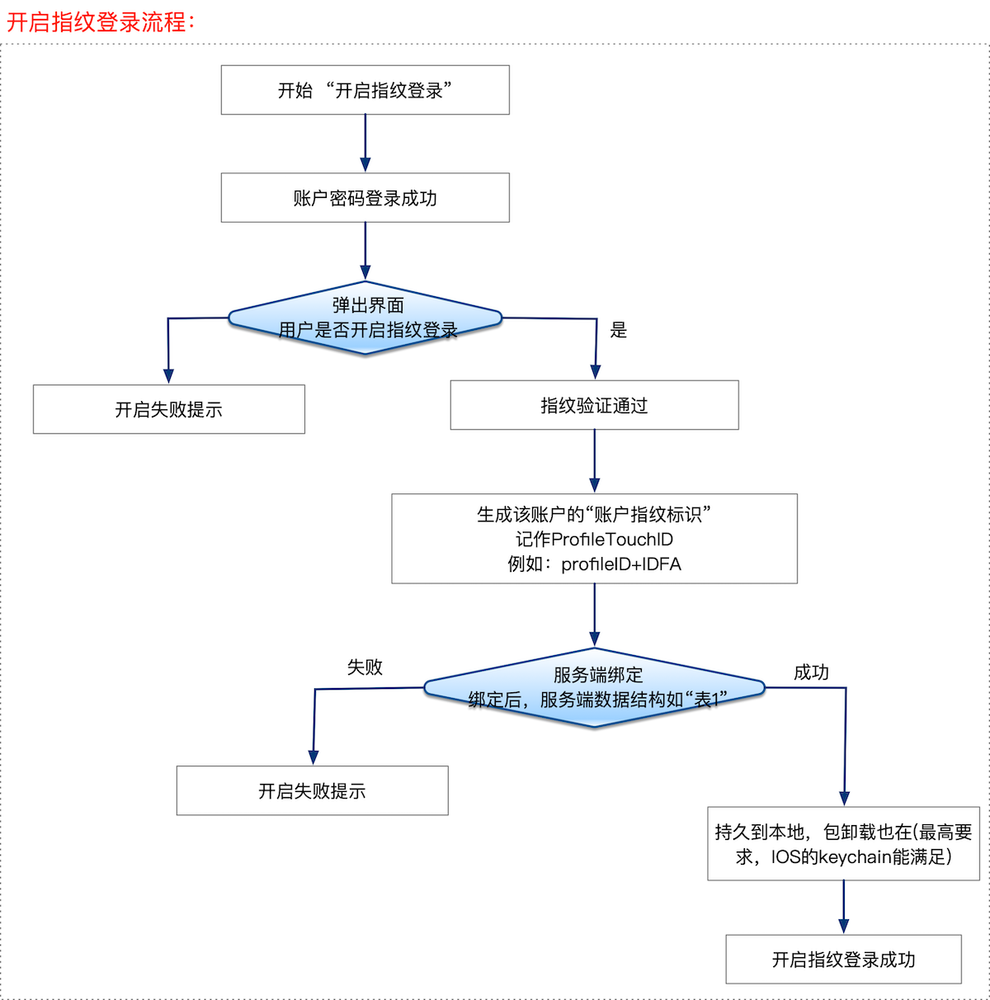
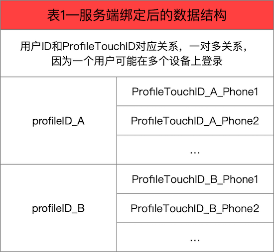
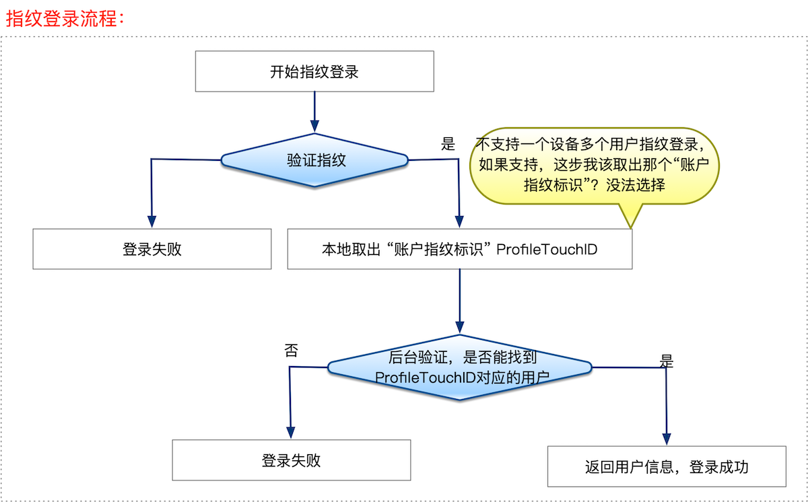

## 一、简介
TouchID指纹识别是iPhone 5S设备中增加的一项重大功能.苹果的后续移动设备也相继添加了指纹功能,在实际使用中还是相当方便的,比如快捷登录,快捷支付等等.系统提供了相应框架,使用起来还是比较方便的.使用LAContext对象即可完成指纹识别,提高用户体验.

指纹登录，可以分解为两个流程：

1. 用户名密码登录成功之后，开启指纹登录。
2. 指纹登录开启后，下次使用指纹登录。

## 二、登录流程介绍

### 1. 开启指纹登录
流程图：



主要流程说明如下：

1. 用户使用“用户名密码”登录成功后，在没有开启指纹登录的情况下，弹出开启指纹登录提示页面。<font color = red> 这个弹出机制需要产品设计，比如用户首次登录才弹出，又比如每次登录后都弹出。</font>
2. 用户在“开启指纹登录页面” 做出选择，假如选择了“开启”。
3. 弹出“指纹验证窗口”， 指纹验证的结果只有成功和失败两种状态， 假如验证成功。
4. **本地生成**当前登录账户对应的“**账户指纹标识**”，记作 `ProfileTouchID`。生成机制自定义，但尽量长，防止数据冲突。  比如最简单的`profileID+IDFA` ，也可以选择设备指纹等等。不过设备指纹在IOS系统上不稳定，也就是说如果系统重新安装，或者有大版本变化的情况，不能保证指纹的唯一性。
5. 绑定：绑定就是将当前用户的`profileID` 和上面第四步生产的`ProfileTouchID` 发送到后端，后端保存对应关系，完成绑定。
6. 绑定成功后，用户本机存储`ProfileTouchID`，为将来指纹登录做准备。

### 2. 后端数据结构
随着社会不断的进步，人们不止拥有一部手机，所以，改设计兼容了“同一账号多个手机登录”的场景，也就是一个用户ID---profileID可以对应多个“账户指纹标识”--`ProfileTouchID` ，故而，将后端的数据结构定义如下：



### 3. 指纹登录流程
如果用户开启了指纹登录，下次就可以选择使用“指纹登录”登录APP，具体流程如下图所示：



1. 用户选择指纹登录，<font color = red>这里需要产品设计业务逻辑，即，指纹登录展示的优先级，是无条件直接展示指纹登录，还是把指纹登录作为一种三方登录方式，用户选择后才展示。</font>
2. 验证指纹，即，证明使用者是你本人，假如验证成功。
3. 取出本地存储的“账户指纹标识”--`ProfileTouchID`。<font color = red>解释下，这里不能支持“一个设备多个账号指纹登录”。原因就在这里，假如支持了“一个设备多个账号指纹登录”功能，目前APP的状态是用户没有登录，无法拿到用户相关的信息，那么我改选择哪个指纹登录呢？ 显然我们无法选择。所以无法支持“一个设备多个账号指纹登录”功能。</font>
4. 将指纹发送给服务器，在上节定义的数据库中查找哪个用户下的指纹和当前指纹一直，则登录该账户，完成登录

### 4. 安全性
对于登录操作，安全性是我们绕不过去的话题，它的重要性不言而喻， 归纳起来，有四点：

1. 指纹验证的安全性，这是系统层面的问题，无法介入。
2. 本地存储 “账户指纹标识”（`ProfileTouchID` ）的安全性。 在IOS中，加密存储在keychain中是显而易见的解决方案。
3. 生成“账户指纹标识”（`ProfileTouchID` 的规则，生成的算法需要不能太简单，如果太简单，不怀好意的人绕过指纹验证，直接使用“账户指纹标识”登录。
4. 绑定步骤、登录步骤中， 将“账户指纹标识”（`ProfileTouchID` ）发送到后端过程中也存在安全性。加密传输即可。

## 三、登录代码

#### 1. 添加头文件
```
#import <LocalAuthentication/LocalAuthentication.h>
```

#### 2. 指纹验证

```
- (IBAction)btnClick:(id)sender {
    //首先判断版本
    if(NSFoundationVersionNumber < NSFoundationVersionNumber_iOS_8_0){
        NSLog(@"系统版本不支持TouchID");
        return;
    }
    
    LAContext *context = [[LAContext alloc] init];
    context.localizedFallbackTitle = @"输入密码";
    
    NSError *error = nil;
    
    if([context canEvaluatePolicy:LAPolicyDeviceOwnerAuthenticationWithBiometrics error:&error]){
        [context evaluatePolicy:LAPolicyDeviceOwnerAuthentication localizedReason:@"通过Home键验证已有手机指纹" reply:^(BOOL success, NSError * _Nullable error) {
            if(success){
                dispatch_async(dispatch_get_main_queue(), ^{
                    NSLog(@"TouchID 验证成功");
                });
            }else if(error){
                switch (error.code) {
                    case LAErrorAuthenticationFailed:
                        dispatch_async(dispatch_get_main_queue(), ^{
                            NSLog(@"TouchID 验证失败");
                        });
                        break;
                    case LAErrorUserCancel:
                        dispatch_async(dispatch_get_main_queue(), ^{
                           NSLog(@"TouchID 被用户手动取消");
                        });
                        break;
                    case LAErrorUserFallback:
                        dispatch_async(dispatch_get_main_queue(), ^{
                            NSLog(@"用户不使用TouchID,选择手动输入密码");
                        });
                        break;
                    case LAErrorSystemCancel:
                        dispatch_async(dispatch_get_main_queue(), ^{
                            NSLog(@"TouchID 被系统取消 (如遇到来电,锁屏,按了Home键等)");
                        });
                        break;
                    case LAErrorPasscodeNotSet:
                        dispatch_async(dispatch_get_main_queue(), ^{
                            NSLog(@"TouchID 无法启动,因为用户没有设置密码");
                        });
                        break;
                    case LAErrorTouchIDNotEnrolled:
                        dispatch_async(dispatch_get_main_queue(), ^{
                            NSLog(@"TouchID 无法启动,因为用户没有设置TouchID");
                        });
                        break;
                    case LAErrorTouchIDLockout:
                        dispatch_async(dispatch_get_main_queue(), ^{
                            NSLog(@"TouchID 被锁定(连续多次验证TouchID失败,系统需要用户手动输入密码)");
                        });
                        break;
                    case LAErrorAppCancel:
                        dispatch_async(dispatch_get_main_queue(), ^{
                            NSLog(@"当前软件被挂起并取消了授权 (如App进入了后台等)");
                        });
                        break;
                    case LAErrorInvalidContext:
                        dispatch_async(dispatch_get_main_queue(), ^{
                           NSLog(@"当前软件被挂起并取消了授权 (LAContext对象无效)");
                        });
                        break;
                    default:
                        break;
                }
            }
        }];
    }else{
        NSLog(@"当前设备不支持TouchID");
    }
}
```

#### 3. 鉴定方式
在 LAContext的canEvaluatePolicy方法中，输入传入一个参数LAPolicy， 这是一个枚举，我们这里简单列出2个参数值

>  LAPolicyDeviceOwnerAuthenticationWithBiometrics : 生物指纹识别。验证弹框有两个按钮，第一个是取消按钮，第二个按钮可以自定义标题名称（输入密码）。只有在第一次指纹验证失败后才会出现第二个按钮，这种鉴定方式的第二个按钮的功能自定义。前三次指纹验证失败，指纹验证框不再弹出。再次重新进入验证，还有两次验证机会，如果还是验证失败，TOUCH ID 被锁住不再继续弹出指纹验证框。以后的每次验证都将会弹出设备密码输入框直至输入正确的设备密码方可解除TOUCH ID锁。

>  LAPolicyDeviceOwnerAuthentication: 生物指纹识别或系统密码验证。如果TOUCH ID 可用，且已经录入指纹，则优先调用指纹验证。其次是调用系统密码验证，如果没有开启设备密码，则不可以使用这种验证方式。指纹识别验证失败三次将弹出设备密码输入框，如果不进行密码输入。再次进来还可以有两次机会验证指纹，如果都失败则TOUCH ID被锁住，以后每次进来验证都是调用系统的设备密码直至输入正确的设备密码方可解除TOUCH ID锁。


