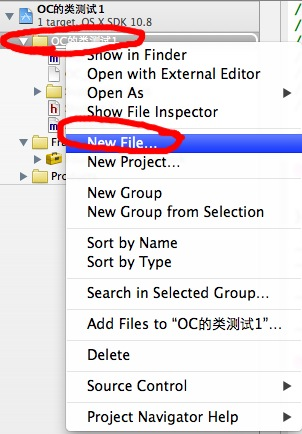
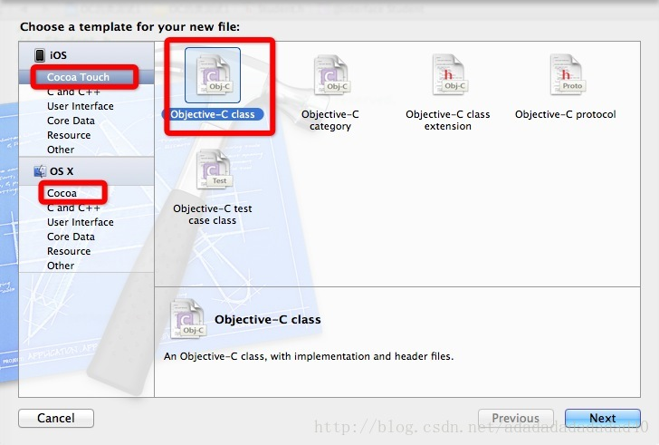
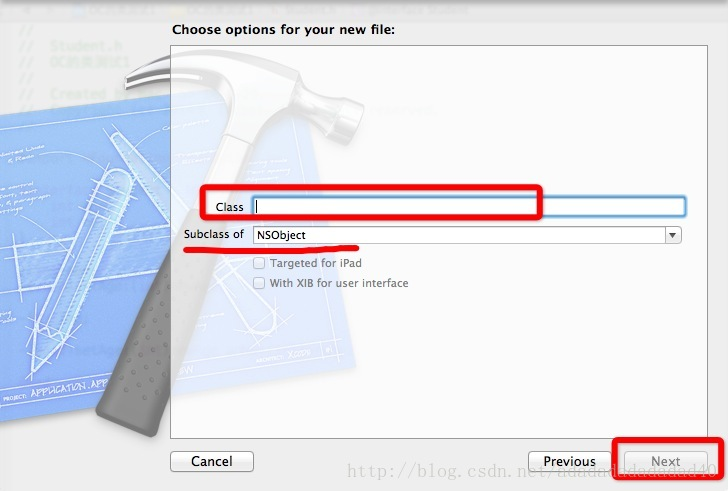
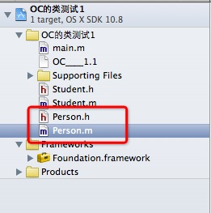
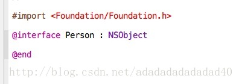
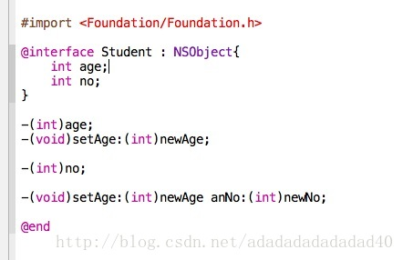
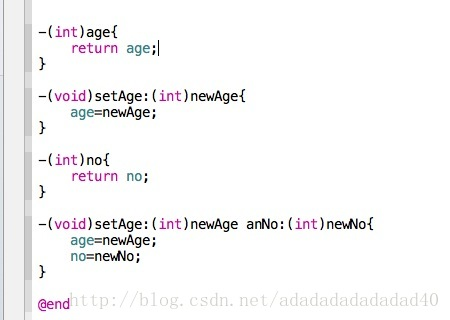

一：创建一个类。

在文件上右键单击create file

点击过后：

左侧选取ios中的Cocoa Touch或者OS X中Cocoa都可以，右侧选择Objective-C class，选取之后，点击下一步即可。

Class代表要创建的类名，Subclass of 表示要创建的类继承于哪个类，这里选取NSObject ,  NSObject是OC中一切类的父类

点击下一步之后，就会弹出框，让选择存放位置，这里不再截图。

创建之后，会生成两个文件：如图所示：

一个是类名.h文件，另外一个是类名.m文件

h文件是头文件，用于变量和方法的声明

m文件是实现文件，用于方法的实现。

创建好的头文件为：

@interface 是关键字，用于类的声明，以@end结尾代表结束。冒号代表继承与哪个类。OC中的类必须要继承一个类，即使继承了NSObject这个类，也要明确写上。

NSObject这个类是在Foundtaion中的Foundation.h中定义的，所以，用#import导入。类中变量要声明在大括号中，如下图：

在声明方法时，减号代表动态方法，加好代表静态方法。（int）代表返回值类型，返回值类型一定要带括号，如果不带参数，就直接以分号结尾。

如果带有参数，一个冒号代表有一个参数，如上图中的，-(int)age;表示木有任何参数。 -(void)setAge:(int)age;  表示有一个参数。

如果有连个参数，就有连个冒号，如上图中的  -(void)setAge:(int)newAge andNo:(int)newNo;

方法的实现：如图所示：

