1, 在github上新建一个空的仓库 

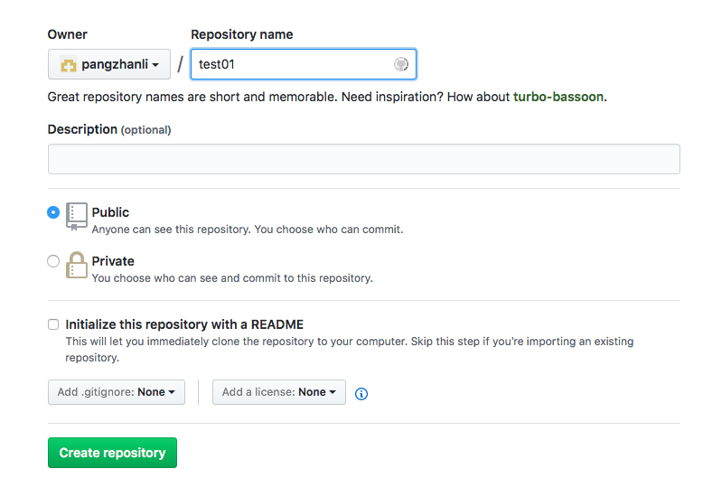

创建成功：

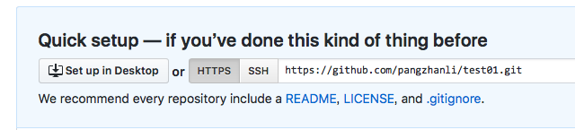

2,  本地创建一个新的项目之后，用命令行工具cd到该目录

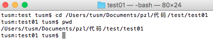

3, 执行git初始化操作

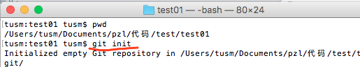

4,查看当前状态:

红色代表当前代码已经修改，未提交到本地

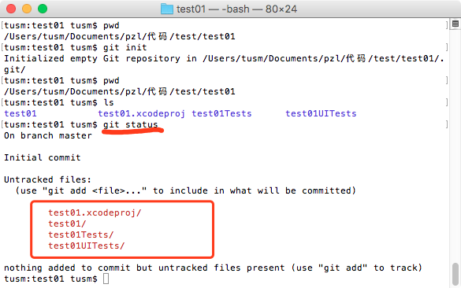

5，将需要提交的代码添加到本地( 使用命令 git add .  )

git status 后，绿色的代表已经文件已经添加到本地仓库，但是还未提交

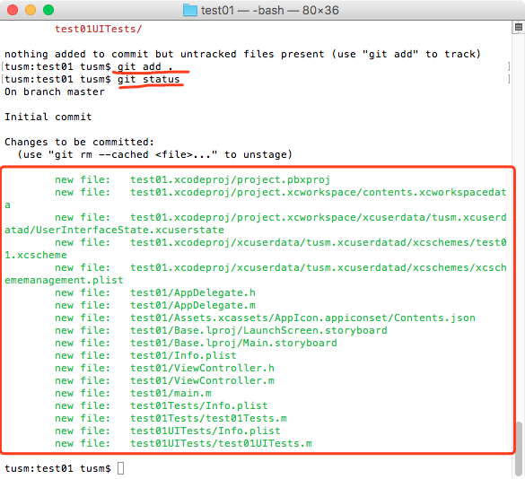

5， 提交代码到本地仓库(git commit -m "这是注释")

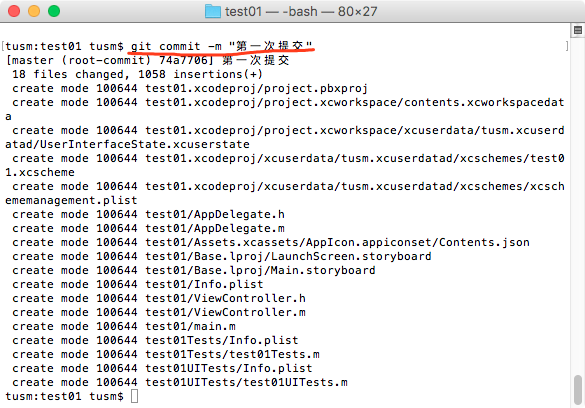

6,  查看已经存在的远程分支(  git remote)

如果为空，代表当前没有远程分支

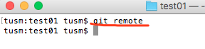

7， 添加远程分支 git remote add origin 远程仓库的名称

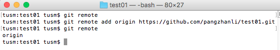

8, 将当前分支push到git上

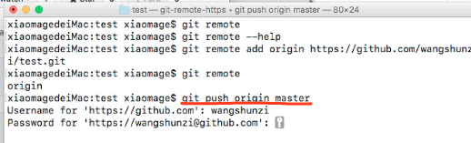

9, push之后，刷新github，如图：

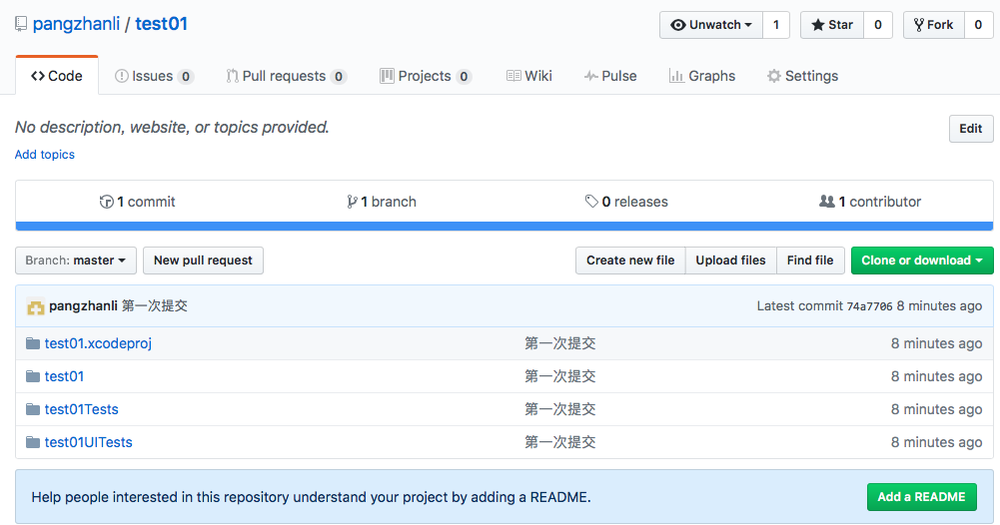

10，打标签(跟releases对应，就是项目版本)，查看当前的tag

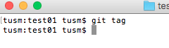

11,  打标签:

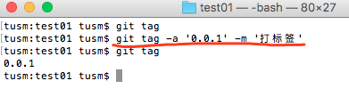

12, 将标签push到远程仓库上:

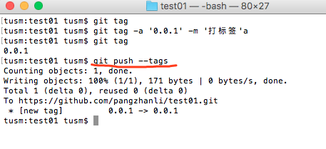

此时查看github远程仓库上：

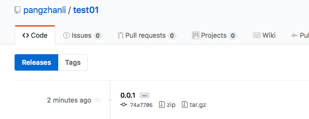

tag跟提交的以后的版本对应关系：

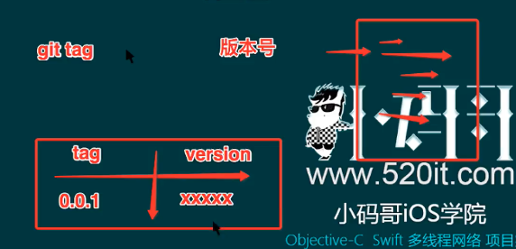

13,删除本地的一个tag

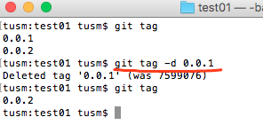

14,将删除本地tag的操作push到远程仓库上去

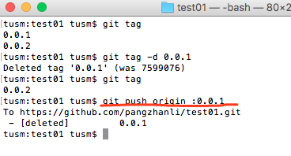

注意:
git push 403错误，原因: 本地缓存了用户名和密码

解决办法: 重新设置用户名和密码:

git remote set-url origin https://github.com/pangzhanli/test01.git

