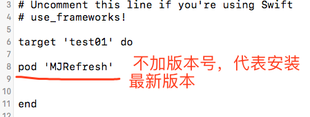
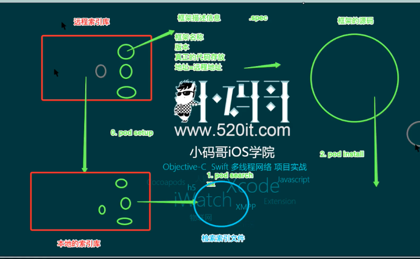
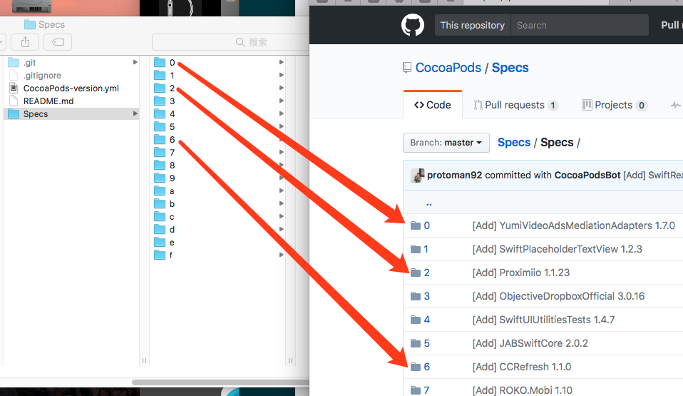
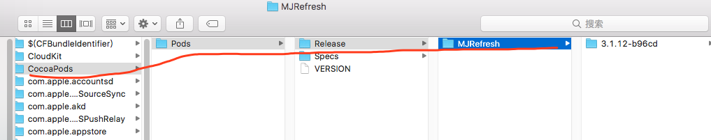

# 一：pod的基本使用

#### 1，podfile文件的初始化
	
	cd到项目文件所在的目录，使用命令pod init 即可以自动初始化一个podfile文件
	
#### 2，打开podfile文件，写上需要安装的第三方库，如

#### 3，  在命令行中，使用 pod install 既可自动安装。

#### 4， pod install 和 pod update的区别

 - a, pod  install  安装第三方框架的时候是根据Podfile.lock 中的来安装的

 - b, pod  update  将本地第三方框架更新到最新版本，并且更新Podfile.lock，并安装

# 二：pod的介绍

# 三：对比
github上的远程索引库 和 本地 /Users/tusm/.cocoapods/repos/master 中的索引库对比图：

# 四：位置
本地的cocoapods库中所包含该的第三方框架源代码位于：/Users/tusm/Library/Caches/CocoaPods/Pods/Release

注意：  安装cocoapods遇到错误，查看 http://blog.csdn.net/adadadadadadad40/article/details/70948849 

