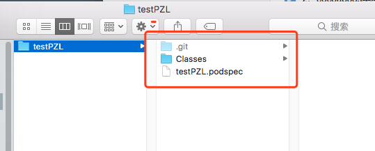
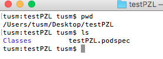
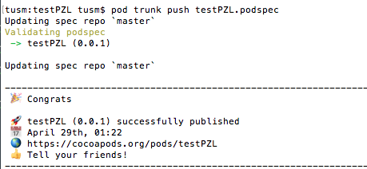

# 一：步骤
1，创建库工程，添加源文件到Classess文件夹

2，上传项目到github,并且打好标签

3，配置并上传框架的 PodSpec文件，并使用trunk的方式上传

4，更新本地pod 第三方框架信息数据源(pod setup, 这一步其实也是可是省略的，因为上述的上传，直接更新了本地索引库)

# 二：具体创建

1，创建库工程，省略（创建工程，实现功能）

2，上传到github上，在命令行中，cd 到工程目录下 






步骤：

	- a, 	初始化 git init
 	- b,	git add .
	- c,	git commit -m "提交"
	- d,	git remote add origin https://github.com/pangzhanli/testPZL.git
	- e,	git push origin master
	- f,   git tag '0.0.1'
	- g,	git push --tags

3, 创建  ***.podspec 文件

执行命令 pod spec create testPZL ,就会自动生成podspec文件，将文件内容修改为如下：

```
Pod::Spec.new do |s|
s.name         = "testPZL"
s.version      = "0.0.1"
s.summary      = "testPZL"
s.description  = "testPZL,这是详细描述，一定要注意,字数比s.summary长"
s.homepage     = "https://github.com/pangzhanli/testPZL"
s.license      = { :type => "MIT", :file => "FILE_LICENSE" }
s.author       = { "pzl" => "pangzhanli2009@163.com" }
s.source       = { :git => "https://github.com/pangzhanli/testPZL.git", :tag => "#{s.version}" }
s.source_files = "Classes", "Classes/**/*.{h,m}"
```

4, 注册trunk ,   命令:   pod trunk register pangzhanli2009@163.com 'pzl'  --verbose

注册之后，会给邮箱发送一封邮件(也有可能在垃圾邮件中)，  点击 邮件中的url连接，验证通过.

5, 通过trunk推送podspec文件到远程索引库, 使用命令: pod trunk push testPZL.podspec,
推送成功之后，如图：



6，  等待审核，需要作者同意才可以。

7，  更新本地pod第三方框架信息数据源 pod setup

8，  测试是否成功， pod search testPZL


