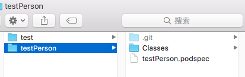
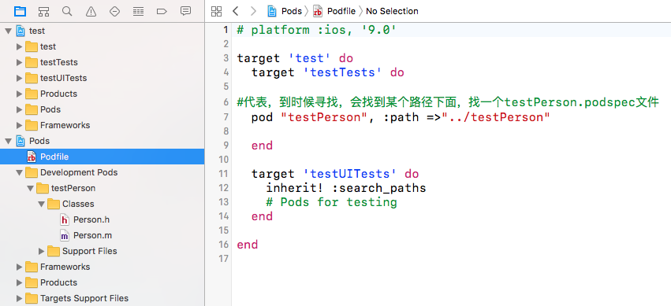
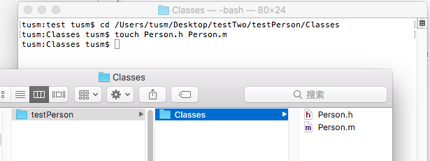
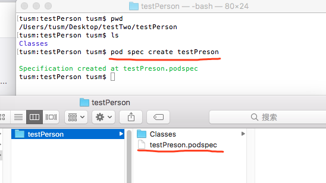
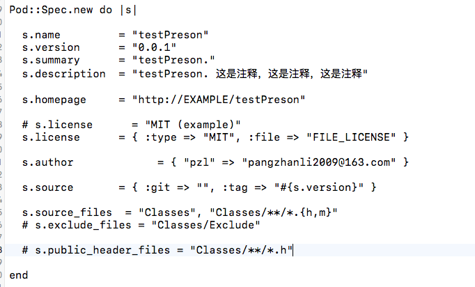
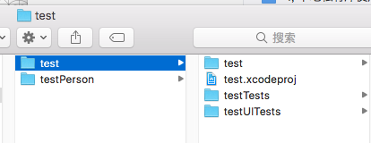
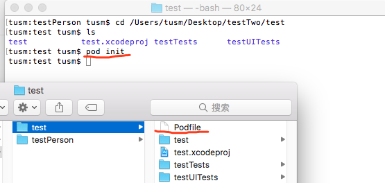
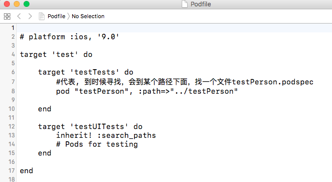

# 一：目的
 1，创建本地私有库testPreson
 
 2，在test项目中，以pod方式使用本地的testPerson库
 
如图：

# 二：具体实现

1，创建私有库，如图

2， 创建podspec文件

testPerson.podspec文件具体内容如图：

3， 创建test项目

4, 初始化 Podfile文件(使用命令 pod init)

5, 修改Podfile文件的内容为：

6， 到 test项目目录下边 执行 pod install即可。