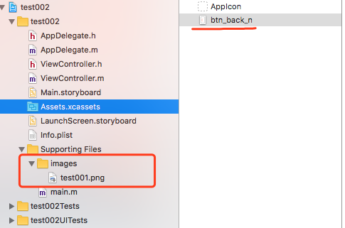

**问题：在xcode中，把图片放在Assets.xcassets中 和 放在 自定义文件夹有什么区别 ？**

一般的图片加载加载方式:

 - 1，UIImage *image = [UIImage imageNamed:@"btn_back_n"];

 - 2，NSString *path = [[NSBundle mainBundle] pathForResource:@"btn_back_n.png" ofType:nil];

  UIImage *image2 = [[UIImage alloc] initWithContentsOfFile:path];

区别: 

 - UIImage 的 imageNamed这种方式加载图片时，图片会自动加载到系统缓存中，并不会立即释放内存。这种方式会加快程序运行，减少IO操作，但对于项目中只用到一次的图片，如果使用这种方式加载，会导致程序内存使用增加。（比如开屏广告位）

 - 第2中加载图片方式：
	- 这种加载方式会在对象释放的时候，将图片内存释放掉。

