#  一：基础知识

#### 1，公钥和私钥的存放地址
 
前往->个人->.ssh 这里存放的是公钥和私钥

	 使用mac命令生成：   ssh-keygen    一路回车即可。

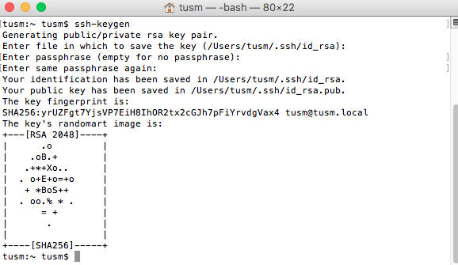

#### 2，使用的私有代码仓库地址
	https://coding.net/    用来存放私有远程索引库 和 私有框架代码

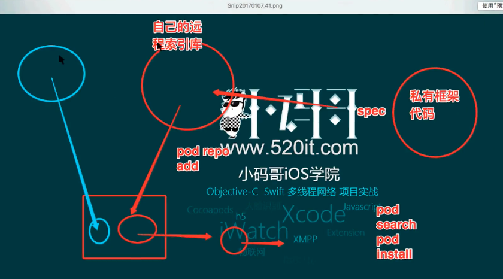

#### 3，查看本机的索引库有哪些
	命令：  pod repo

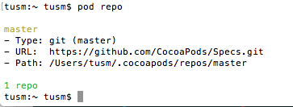

# 二： 创建私有索引库

***网站 http://coding.net***

#### 1，创建远程私有索引库

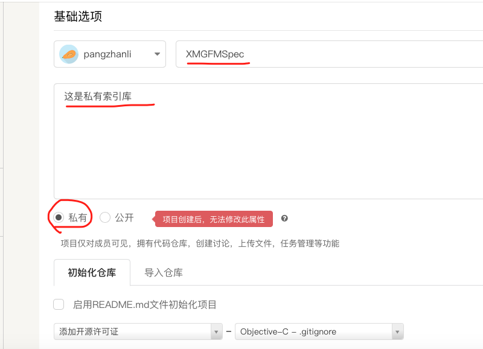

####  2, 在coding网站中配置SSH公钥。 

	账户 --》 SSH公钥

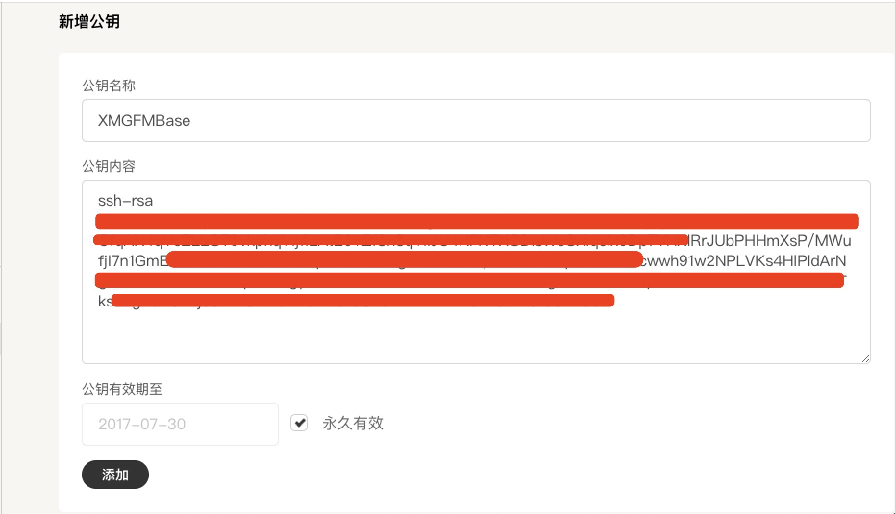

注意: 公钥内容可以参考 基础知识1中的公钥生成


#### 3，在本地添加私有索引库

使用命令 
	
	pod repo add XMGFMBase git@git.coding.net:pangzhanli/XMGFMSpec.git
	
这里的  git@git.coding.net:pangzhanli/XMGFMSpec.git 地址就是： coding网站中，私有索引库XMGFMSpec的SSH地址

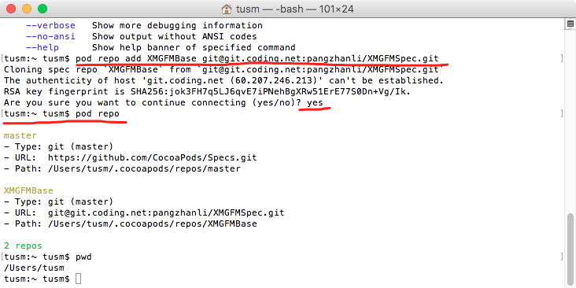

创建之后，通过 pod repo 查看自己本地的索引，有两个， 同时，在本机电脑的目录中， 前往-》个人-》.cocoapods中

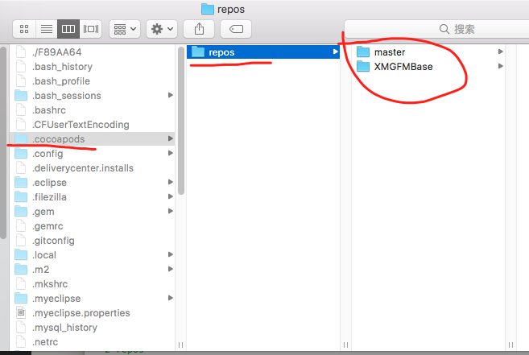

#### 4，创建远程代码仓库。

在coding.net中，添加一个项目，创建远程代码仓库

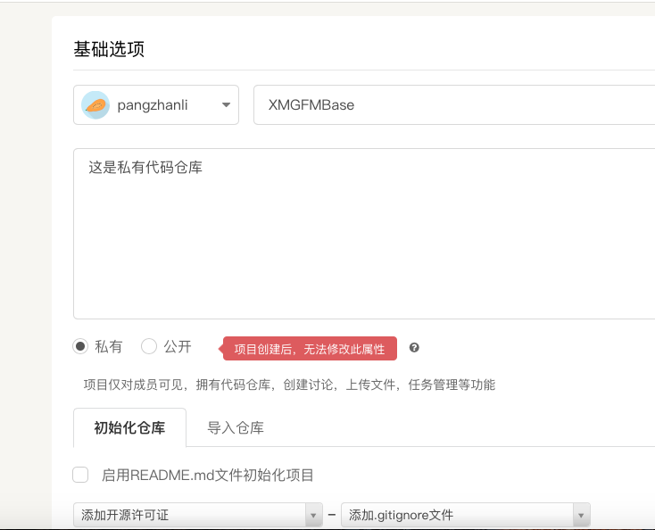

#### 5， 创建pod

通过命令   
	
	pod lib create XMGFMBase

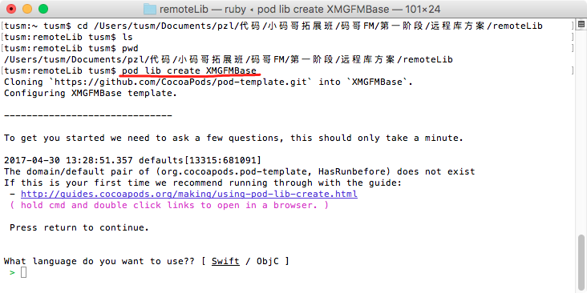

当执行pod lib create ProjectName时,其实是下载了一个pod模板,然后在内部通过更改.podspec文件的配置定制化自己的pod, 创建过程中，需要一些配置信息，如图

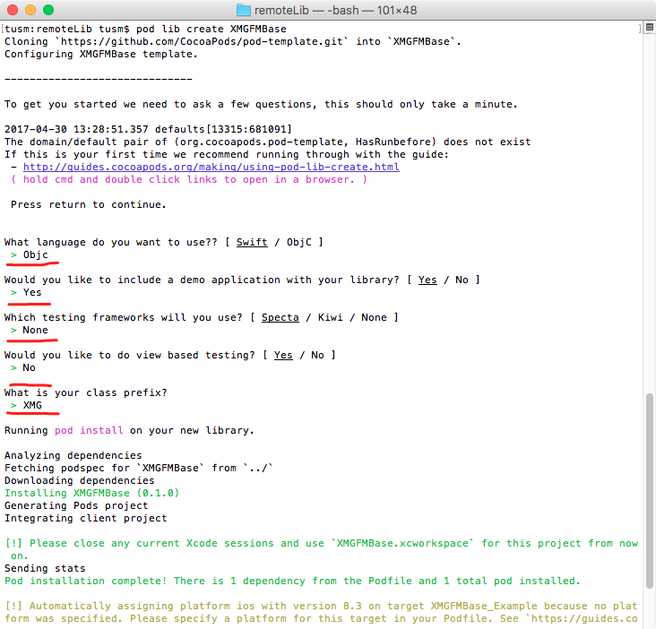

创建完成之后，会自动创建一个带有pod的项目，并且会自动打开。

#### 6，存放文件
将自己的基础库文件Category放到生成的pod项目文件中,存放位置:   
	
	项目名称-》项目名称同名文件夹-》Classes

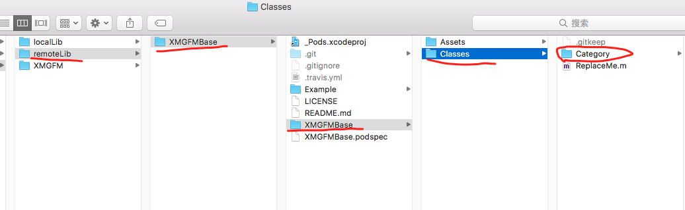

	cd 到 remoteLib-> XMGFMBase->Example目录下，执行 pod install

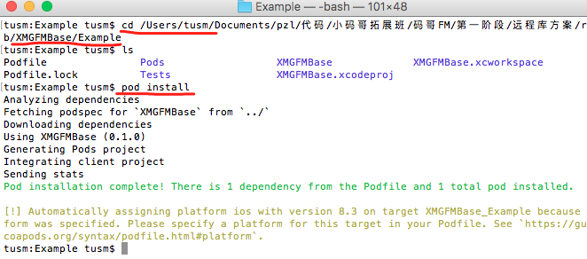

执行完毕之后，打开Example中的项目, 查看，编译

#### 7, 修改.podspec文件

在项目 Example -》XMGFMBase中, 修改XMGFMBase.podspec文件

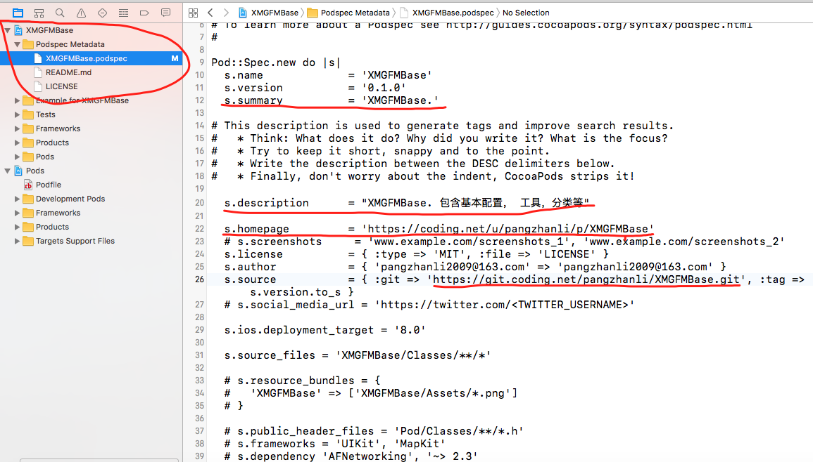

需要修改的几项：  s.summary,  s.description,  s.homepage,  s.source

注意：验证podspec文件是否修改正确，使用命令，  pod lib lint  （这个是本地验证, 远程验证使用 pod spec lint，  本地验证的时候，是不会验证远程地址source和version的）

需要先cd 到 podspec文件所在的目录

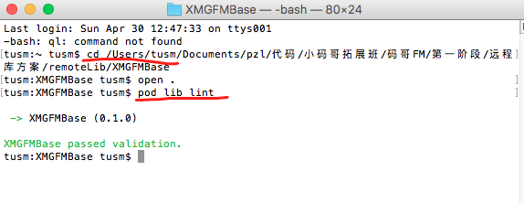

这个命令会自动验证该目录下的.podspec文件是否正确。

#### 8, 提交代码到coding.net

将 remoteLib-》 XMGFMBase项目代码提交到 coding.net网站上的XMGFMBase代码库中。

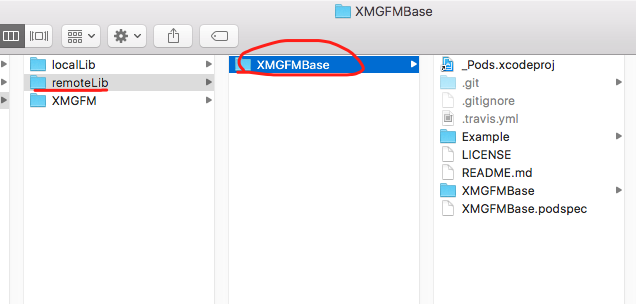

使用到的命令有：

```
git add .
git commit -m '提交代码'
git remote add origin https://git.coding.net/pangzhanli/XMGFMBase.git
git push origin master
```
 
#### 9, 打标签   

在remoteLib->XMGFMBase中

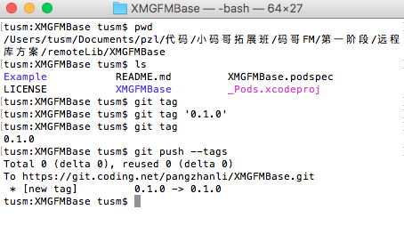

push到coding.net之后，去网站上查看：

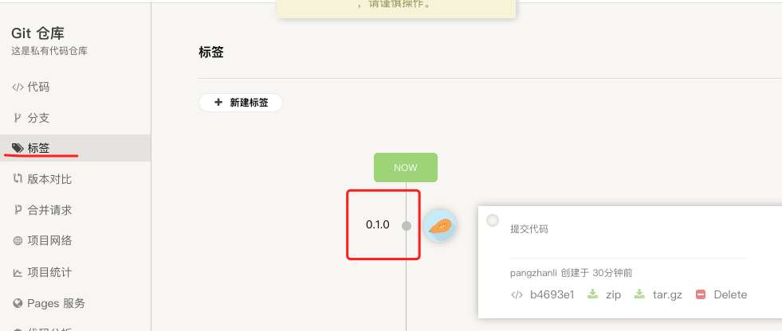

#### 10, 验证远程仓库

使用命令 
	
	pod spec lint

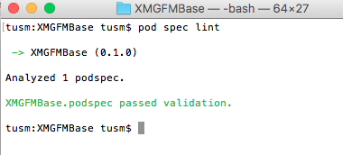

#### 11, push podspec文件

将本地的remoteLib->XMGFMBase/ 中的XMGFMBase.podspec这个文件push到本地的索引库中，本地索引库会自动的将索引文件push到远程索引库。

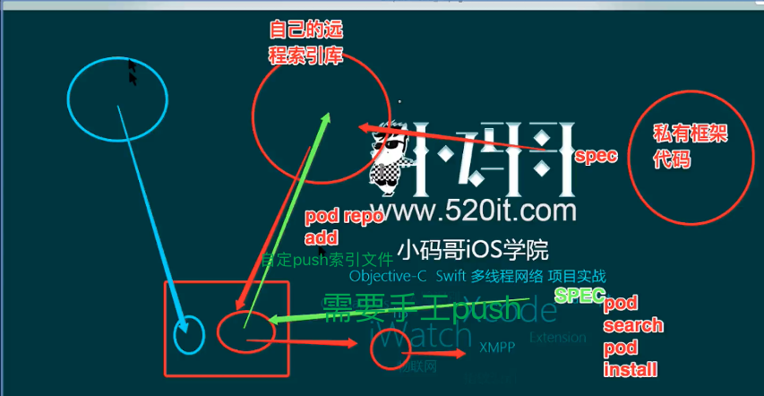

在remoteLib->XMGFMBase/目录下,  使用命令 
	
	pod repo push XMGFMBase XMGFMBase.podspec

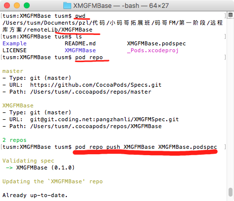

执行完毕之后，在本地索引库中，就可以看到XMGFMBase索引文件了.

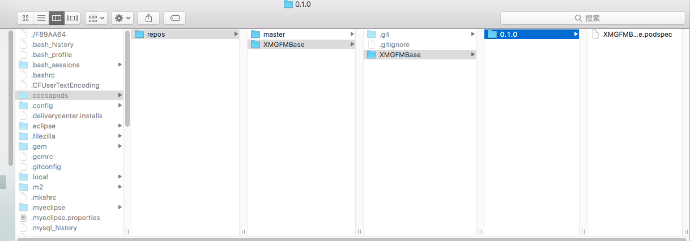

这儿的本地索引文件会被自动上传到远程索引库中，查看coding.net，如图：

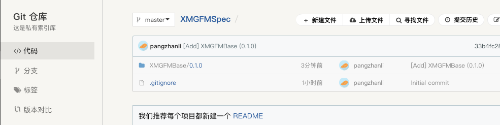

#### 12, 验证能否使用：

修改以前的podfile文件

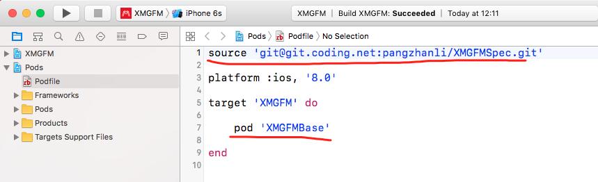

注意： 这儿要添加source，指定需要的框架的来源

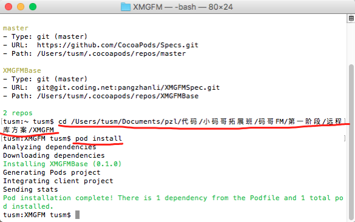

如果再在podfile文件中加入pod MJRefresh,查看

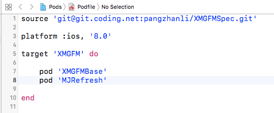

执行pod install查看结果：

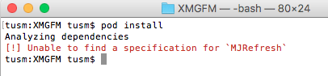

只要指定源以后，那么它就会向指定的source中查询框架是否存在

所以，需要将podfile文件修改为：

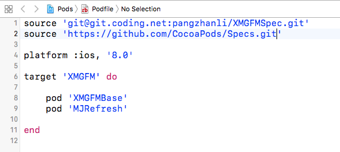


执行pod install之后：

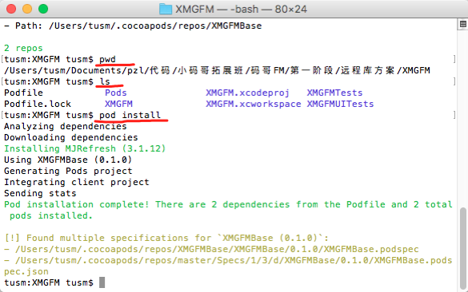
