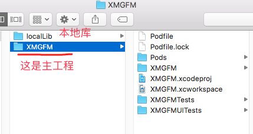
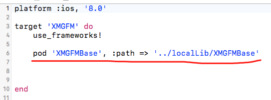
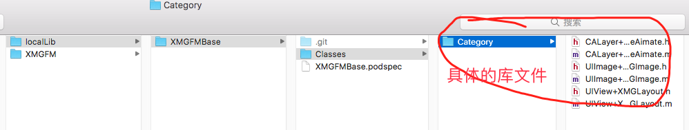
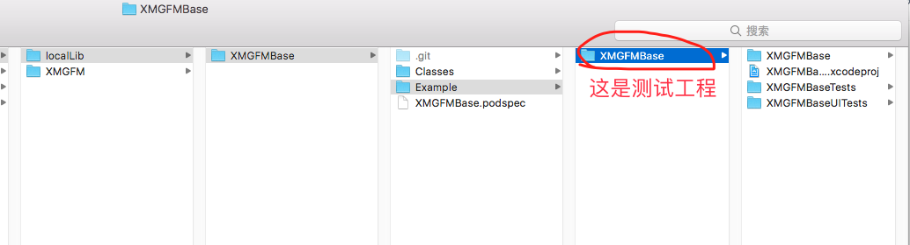
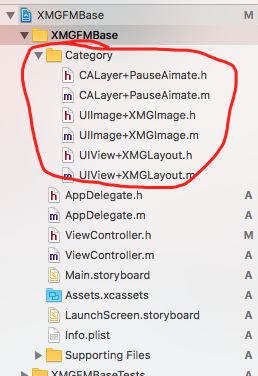
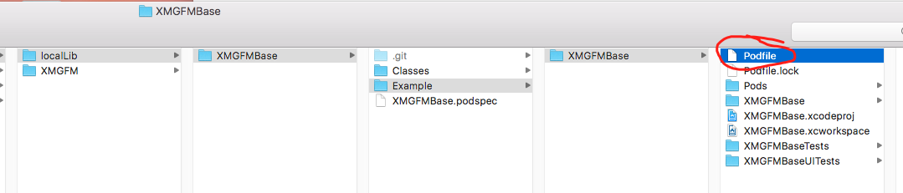
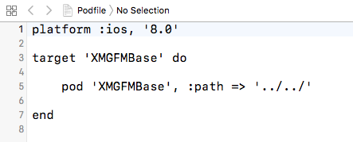
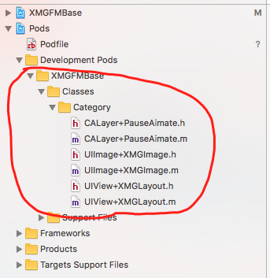

# 一，回顾

先前的本地私有库的实现方式：

在主工程的Podfile文件中，通过引用本地库方式：

本地库内容：

# 二：单独测试本地库文件

提出问题：如何单独测试本地库文件？

**解决办法：**

1，第一种办法：

在本地库localLib-》XMGFMBase中，新建一个专门用来测试的文件夹Example,里边创建一个工程，通过手工引入（只是引入路径，不拷贝文件）的方式，引入到测试工程中，然后再测试。

在XMGFMBase测试工程中，引入Classes中的库文件，直接拖进去，不要勾选拷贝(copy)这一项，如图：

2，第二种办法：
在本地库localLib-》XMGFMBase中，新建一个专门用来测试的文件夹Example,里边创建一个工程，在测试工程中，通过引入Podfile文件，来引入本地库文件。

Podfile文件中的内容：

这样测试工程就引入了本地库文件，项目代码情况：

