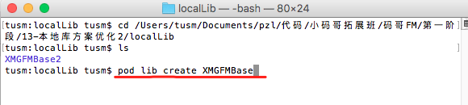
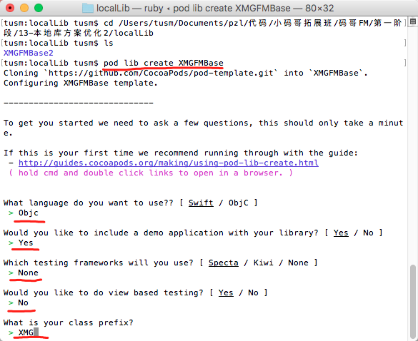
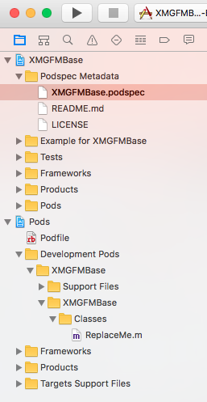
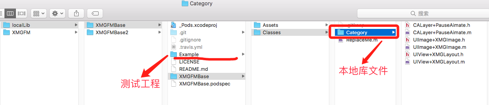
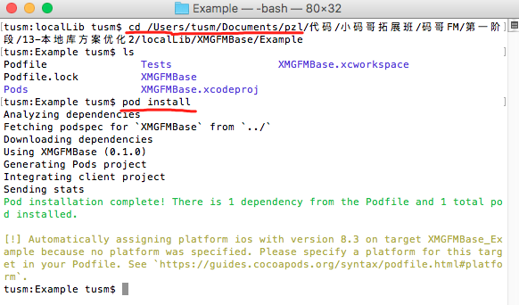

# 一，回顾

先前的本地私有库的实现方式：

在主工程的Podfile文件中，通过引用本地库方式：

本地库内容：

# 二：单独测试本地库文件

提出问题：如何单独测试本地库文件？

解决办法:
1, cd 到 local文件夹中, 通过命令 pod lib create XMGFMBase  创建一个pods库的模板库(注意，先将原先的XMGFMBase修改为XMGFMBase2)

在执行的过程中，需要输入一下配置信息

执行成功之后，会自动创建一个项目，并且Podfile已经配置完毕

此时，我们需要将我们的本地库文件拷贝到  localLib-》XMGFMBase-》XMGFMBase-》Classes中

此时 cd 到 localLib-》XMGFMBase-》Example中，执行 pod install

