目的：将Base库 和 Tool库加入到远程库中

1,现将Base库和Tool库文件拷贝到Classes文件夹中，如图

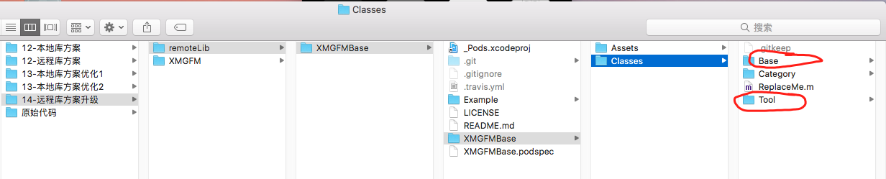

2, cd到Example（测试工程）目录下，执行pod install命令

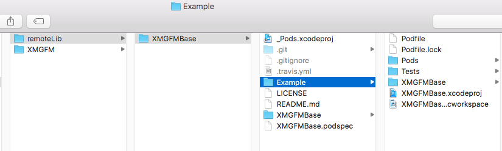

3, 打开Example中的测试工程，发现Base库和Tool库已经被引入

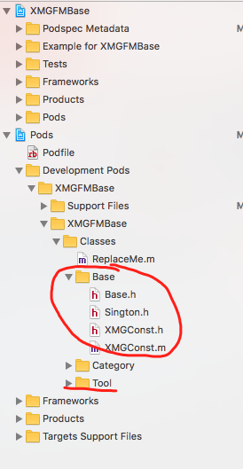

4，修改podspec文件的版本

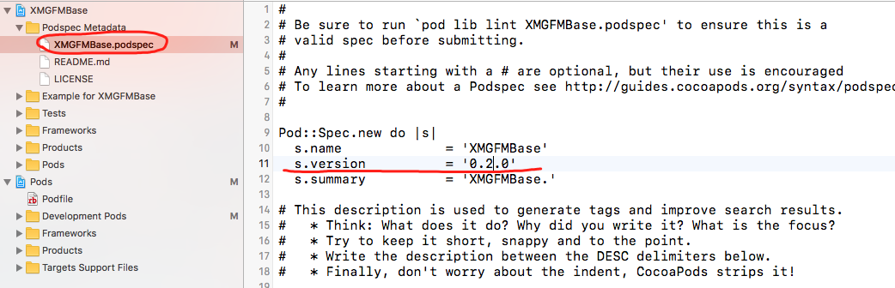

5，验证本地podspec文件是否正确，使用命令 pod lib lint

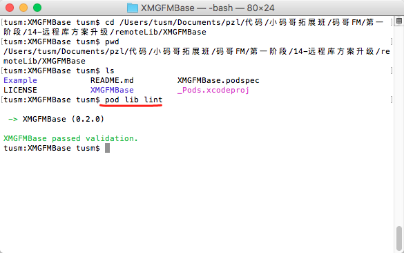

6,  提交代码到coding.net远程代码仓库中

使用到的命令有：

```
git add .
git commit -m '添加Base和Tool库文件'
git push origin master
```

7,  打标签  git tag '0.2.0'

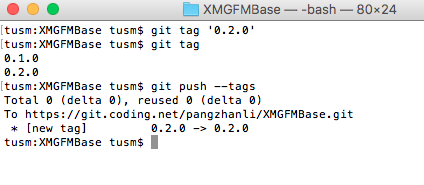

查看coding.net代码仓库中：

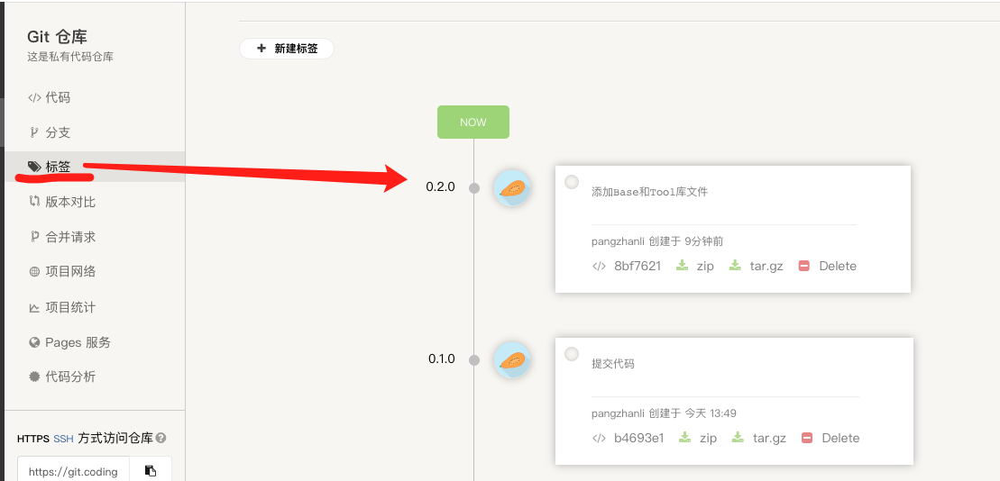

8,  验证远程podspec是否正确， 使用命令 pod spce lint

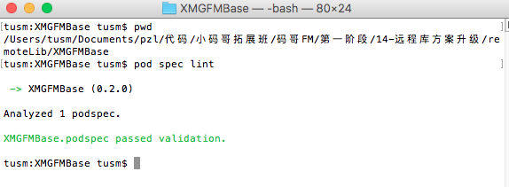

9, 将podspec文件push到本地索引库中，使用到的命令: pod repo XMGFMBase XMGFMBase.podspec

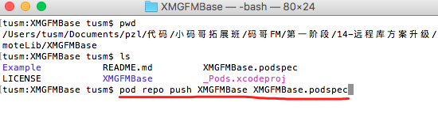

10, 查看本地索引库， 前往-》个人-》.cocoapods->repos-》XMGFMBase-》XMGFMBase

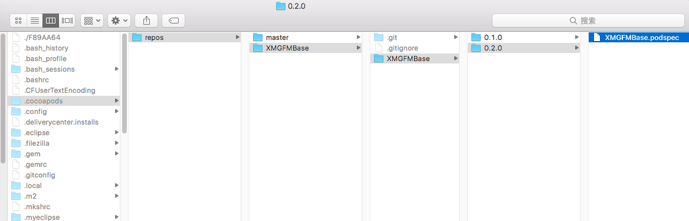

11,  去项目XMGFMBase中验证是否可以使用

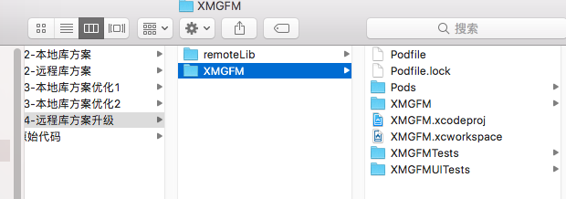

使用命令 pod update， 更新了本地索引库。也可以使用 pod install --no-repo-update  (不更新本地库的情况下下载库文件)

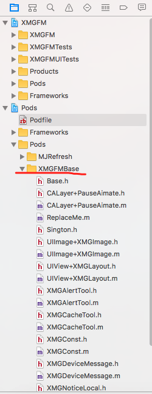


