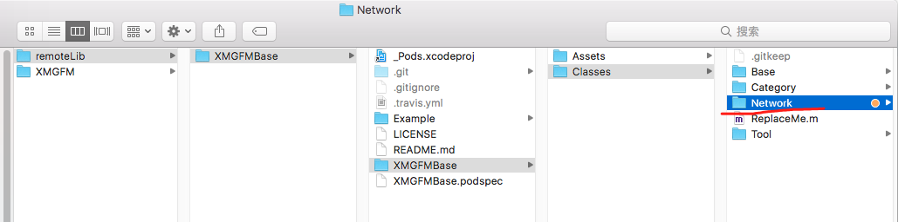
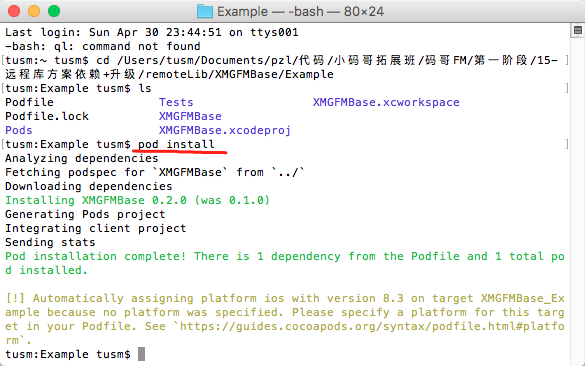
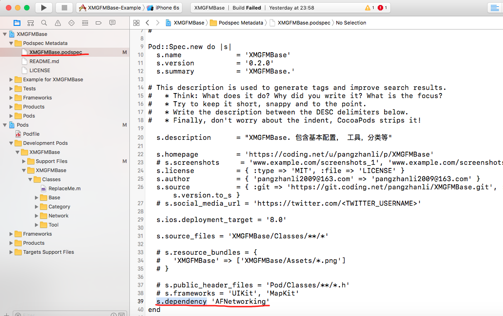
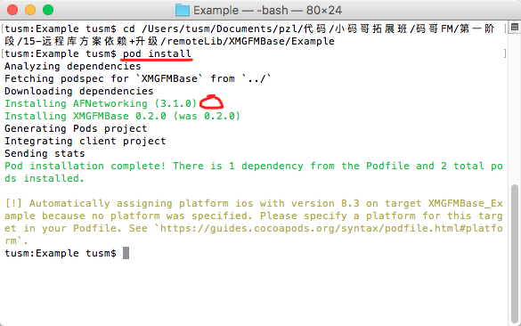
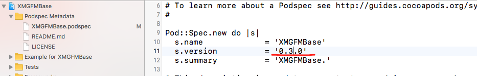
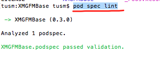
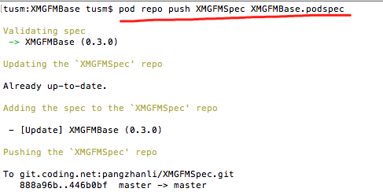
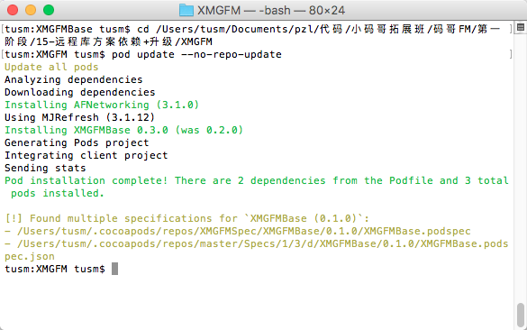
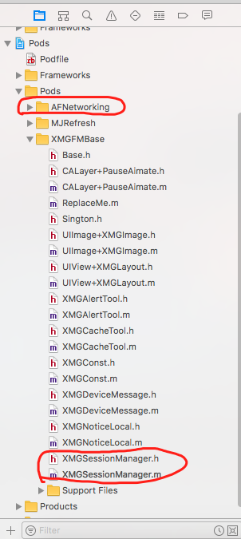

目的：添加Network私有库，但是这个库里边引用了AFNetworking

# 一：添加Network私有库文件

1，将networkd库文件拷贝到remoteLib-》XMGFMBase-》XMGFMBase-》Classes中




2，在remoteLib-》XMGFMBase-》Example 中，执行命令 :  pod install



注意：执行完毕之后，打开Example中的工程，无法编译通过，因为，Network这个库引用了AFNetworking这个框架

3, 在remoteLib-》XMGFMBase中的XMGFMBase.podspec文件，启用 s.dependency



4, 再次去remoteLib-》XMGFMBase-》Example 中，执行命令 :  pod install
这次发现，会自动安装AFNetworing第三方框架



最后编译项目，通过

# 二： 提交代码
1, 将XMGFMBase.podspec文件中的版本修改为0.3.0



2，提交代码到远程仓库 coding.net

使用到的命令:

```
git add .
git commit -m '添加库文件Network'
git push origin master
git tag '0.3.0'
git push --tags
```

3, 验证远程仓库spec文件, 使用命令   pod spec lint



4，将podspec文件推送到本地缓存索引库中



# 三： 正式代码更新
1, 通过不更新本地代码缓存库文件使用最新版本的库文件。 pod update --no-repo-update



执行之后，打开正式项目发现，最新的Network中的文件也被引入了过来，同时AFNetworing库也被下载了下来



