提出问题：
查看当前本地的私有库代码，可以看到分为四个模块，Base, Categroy,Network,Tool,  如果，我们仅仅只需要引入Base这个模块，另外三个都不需要，那么我们在使用的时候，应该怎么使用？

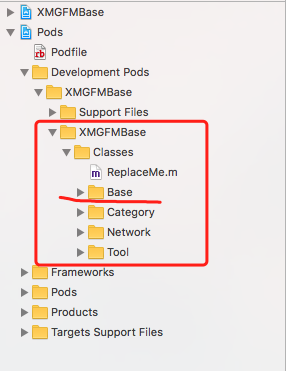

# 一： 查看AFNetworking
使用命令： pod search AFNetworking

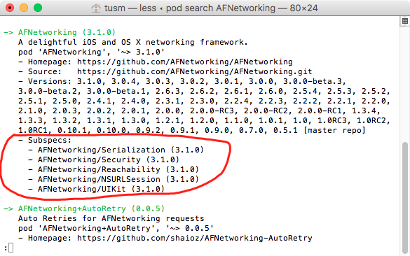

在命令行中，除了列出了AFNetworking的Homepage,Source,Versions之外，还有一个重要的属性

Subspecs,  这个就代表了AFNetworkin中的子库，如果我们想要引用AFNetworking中的Reachability这个库，只需要在podfile文件中直接引用Reachability即可。

```
使用命令： pod 'AFNetworking/Reachability'
```

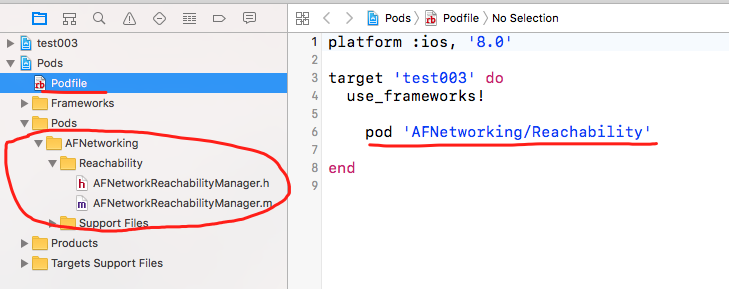

# 二： 制作自己的私有库分支
1, 查看XMGFMBase.podspec文件，先看第一句：Pod::Spec.new do |s|    代表 给Spec.new 指定别名，别名为s

2, 查看一个属性，s.source_files = 'XMGFMBase/Classes/**/*'   这句话表明，我们在引用XMGFMBase的时候，会指定XMGFMBase/Classes路径下的所有文件

3，添加私有库的分支（子库）

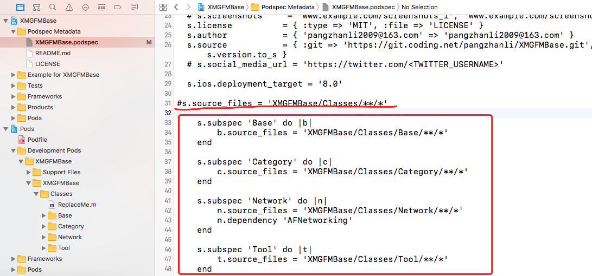

注解：

 - a, 先将s.source_files 属性注释，这儿指定的全部的路径。
 - b,添加subspec子库，注意，在Network子库中，需要引用AFNetworking库。
 - c,需要将文件的最低部， s.dependency 属性去掉（它代表全都引用第三方框架AFNetworking）

4， 修改podspec文件的版本

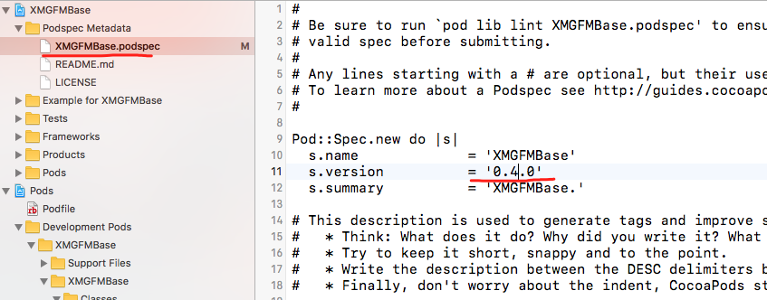

5,验证podspec文件在本地是否正确  使用命令:   pod lib lint

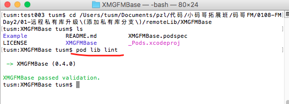

6,将本地私有库上传到远程代码仓库中。

使用到的命令有：

```
git add .
git commit -m '添加私有库分支'
git push origin master
git add '0.4.0'
git push --tags
```

查看远程代码仓库的标签：

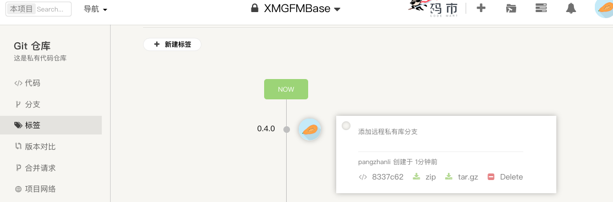

7, 验证podspec文件在远程上是否正确,  使用命令:  pod spec lint
  
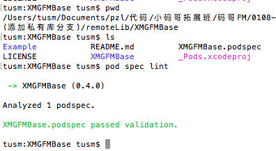


8,将podspec文件推送到本地, 使用命令 pod repo push XMGFMSpec XMGFMBase.podSpec

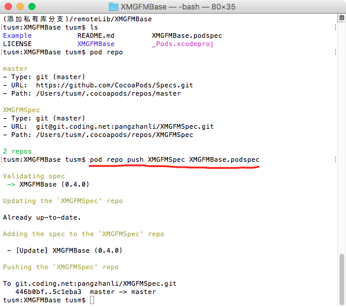

9，项目测试。将正式项目的podfile文件修改

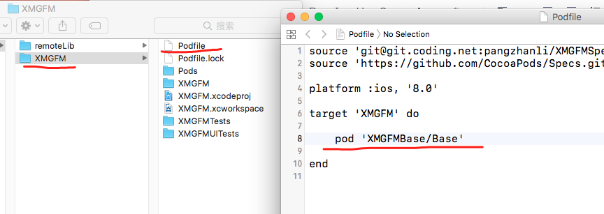

pod install 之后，在项目中，确实只引用了Base库

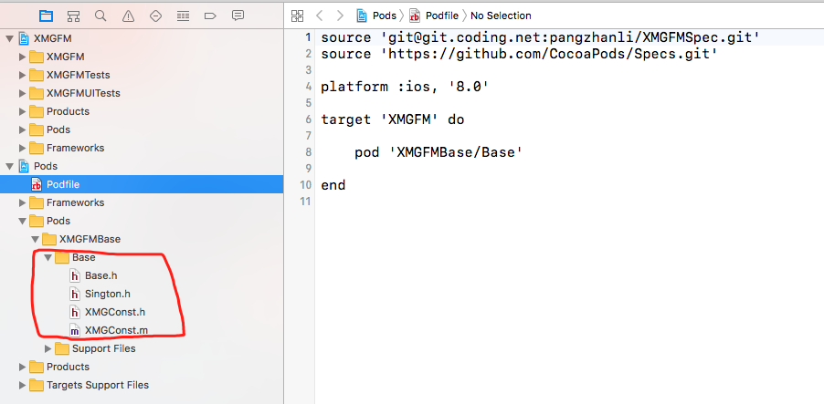

10, 如果项目中只需要几个子类库，该怎么办？

可以在podfile文件，多引入几次。如图：

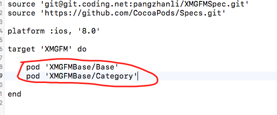


安装之后，如图：

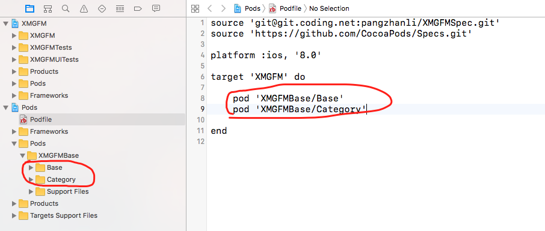

11， 如果引入了好多子库，这样写，势必造成很累赘，可以使用 :subspecs 指定需要使用的子库。

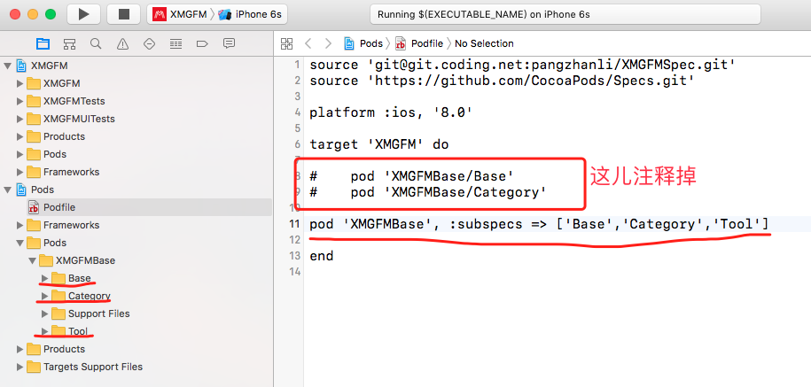