提出问题：

通过观察主工程目录结构，现在, 我们如何将MainModule主业务框架提取出来，做成一个单独的库?

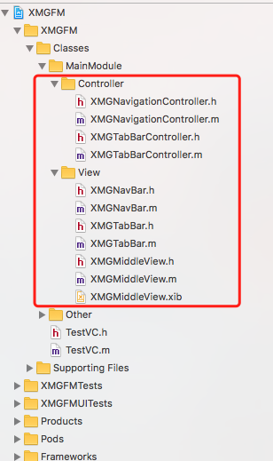

# 一：生成主业务框架模板项目

1，cd到remoteLib中，通过 pod lib create XMGFMMain 自动生成主业务库模板

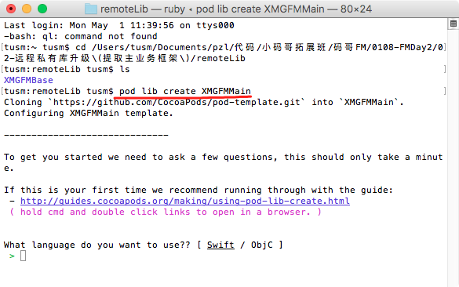

2，配置信息

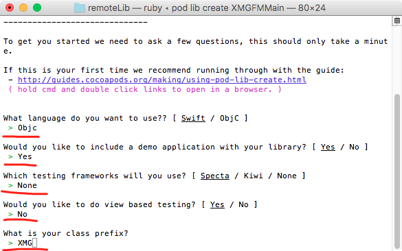

自动生成之后，就会创建一个库模块工程，也会自动打开. 如图：

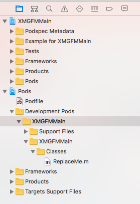

我们只需要把我们的主业务文件放到对应位置： remoteLib-》XMGFMMain-》XMGFMMain-》Classes

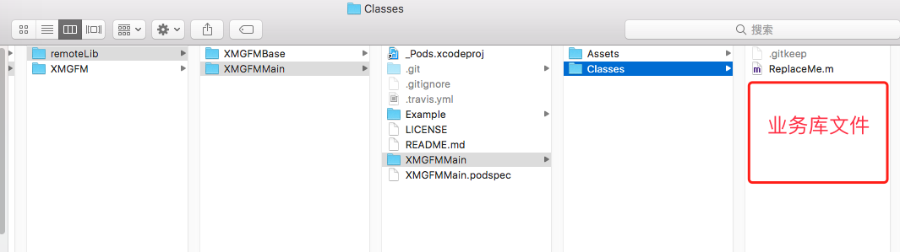

3, 执行 pod install 命令

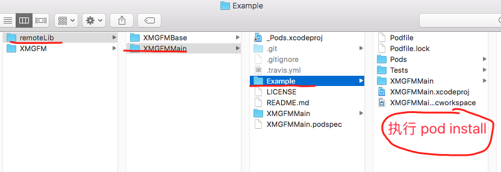

4，测试主工程框架库是否能正确使用。

编译之后，发现主工程框架中发生错误，原因是引入了XMGFMBase中的Category中的文件。

解决办法：

第一步：手工修改XMGFMMain.podspec这个文件，添加依赖。如图：

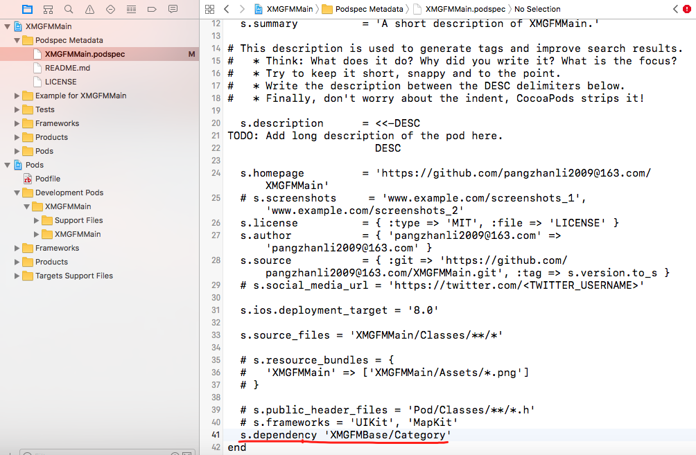

第二步，手工修改podfile文件，添加source源

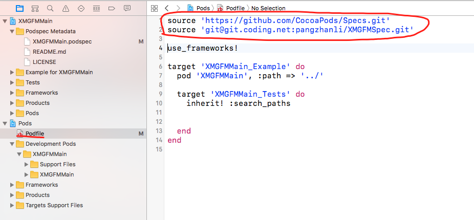

第三步，执行pod install 命令。执行完成之后，已经自动引入了XMGFMBase中的category子类库

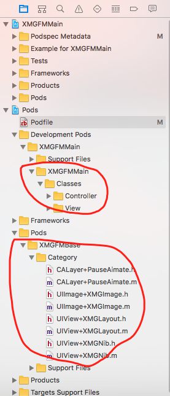

5,编译正确，查看能否正常使用。将正式代码库中AppDelegate中的文件拷贝过来，以及测试文件TestVC。

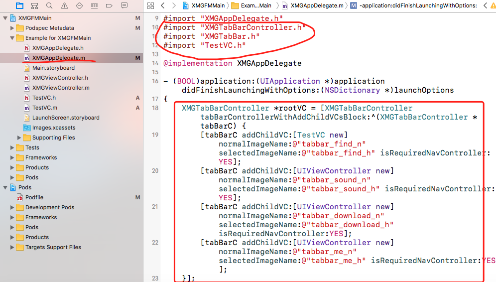

6, 运行项目，发现报错信息，在主Bundle下没有找到XMGMiddleView这个xib

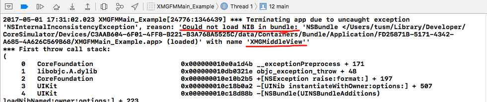

这是我们去主bundle查看，确实没有XMGMiddleView这个xib文件，但是，我们在它的类库XMGFMMain.framework中，发现了XMGMiddleView.nib文件，如图：

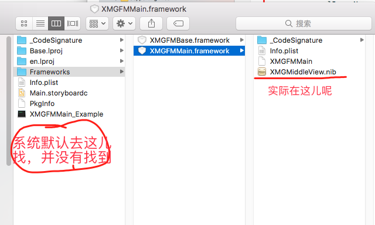

7， 解决办法：去XMGFMMain这个类库中，查看XMGMiddleView文件引用Bundle的地方。

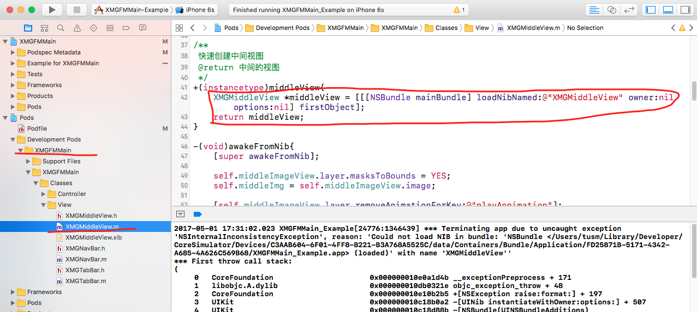

发现这儿采用的mainBundle这种格式，所以，系统才会去我们的mainBundle下去找，现在，我们要让系统去XMGFMMain这个框架下去找XMGMiddleView这个xib文件，修改如图：

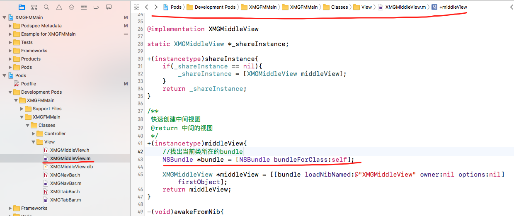

再次运行项目，发现项目已经能跑起来了。