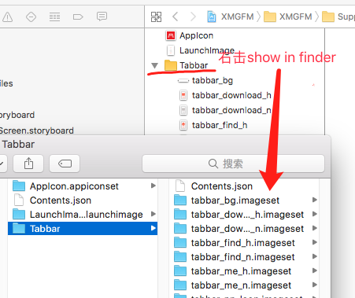
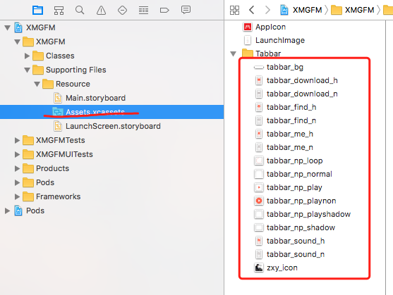
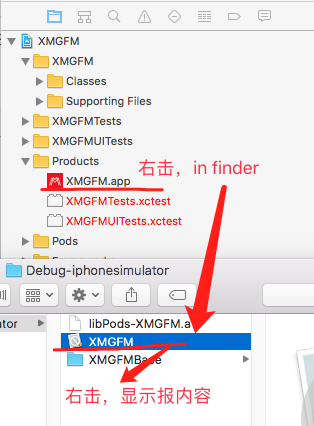
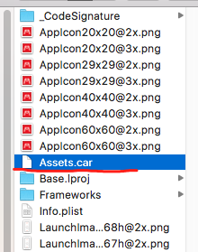
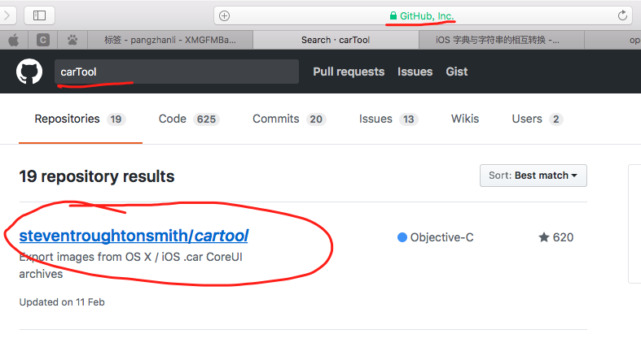
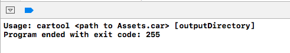
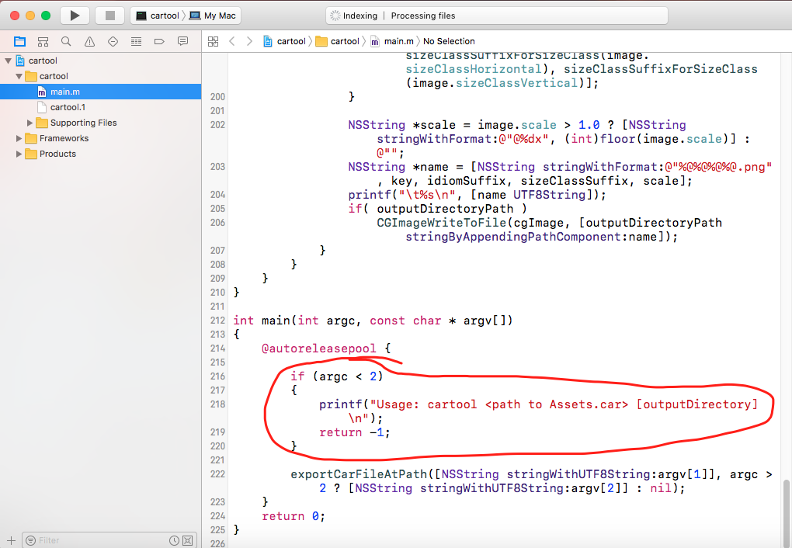
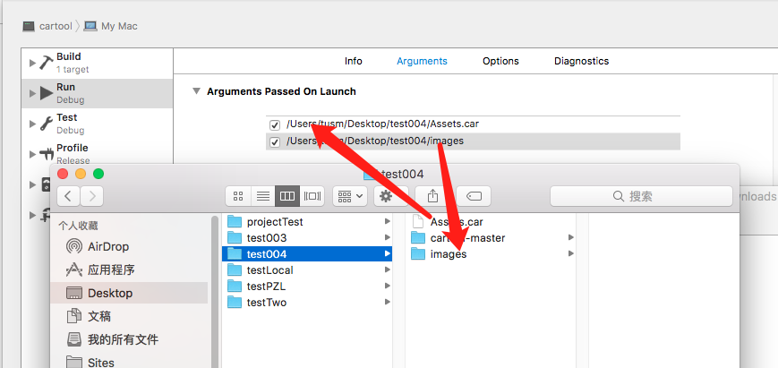
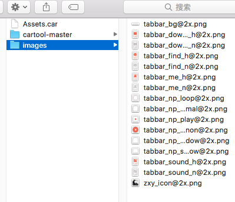

提出问题：主项目中，资源文件夹Assets.xcassets中的图片文件如何提取出来？

# 一： 手动拷贝
第一种解决办法，右击show in finder,  获取位置，一个一个手工拷贝出来。

# 二：批量的导出来
主项目中，资源文件夹Assets.xcassets中的图片资源在打成安装包之后，存放在哪儿了？

1，项目编译之后，在Products中，找到项目名称.app中，右击in finder->项目包（右击显示包内容）

右击显示包内容之后，如图：

资源文件，就存放在这里边，如何获取出来？

2， 需要借助一个工具，carTool，它在github上

下载下来之后，运行，发现只打印了一句话，

查看代码，找到主入口，发现主入口需要2个参数

3，给carTool工具设置入口参数.

	- a, 我们将刚刚Assets.car文件拷贝出来（里边是资源文件），并且新建一个images文件夹，用来存放解压缩以后的图片文件。
 	- b, 打开carTool项目的Edit scheme

 

给程序入口设置两个参数，第一个是将要解压缩的文件地址，  第二个是解压缩文件之后，解压缩出来的文件的存放地址

4，再次运行，我们发现，已经将Assets.car中的资源文件解压缩了出来。

