提出问题：在笔记2中，虽然测试程序能运行起来，但是没有图片。如何解决？

# 一，导入外部四个tabbar图标
1，仔细查看当前的测试程序代码，发现底部的tabbar的四张图片是由外界引入的

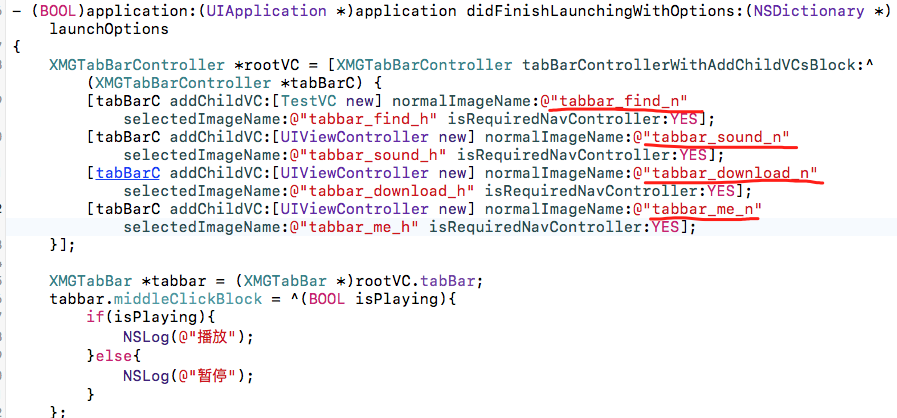

在查看主业务库中的代码，发现采用的UIImage的方式

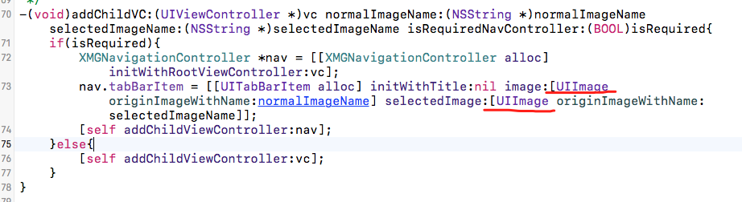

UIImage会到MainBundle中查询图片，所以，我们将四张tabbar图标拖拽到测试项目的image.xcassets中

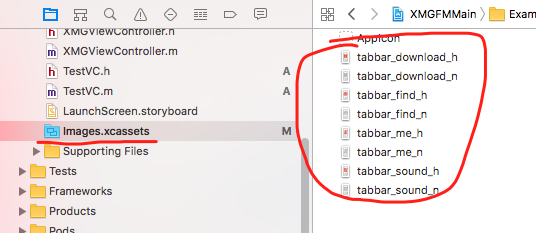

再次运行，发现四个图标已经能正常使用了

# 二： 图片使用问题

tabbar的背景图片，中间播放的图片都是在主框架中，如何解决？

1，给主框架添加资源文件

查看主框架库，在XMGFMMain中，有一个Assets文件夹，这个文件夹就是用来存放资源文件

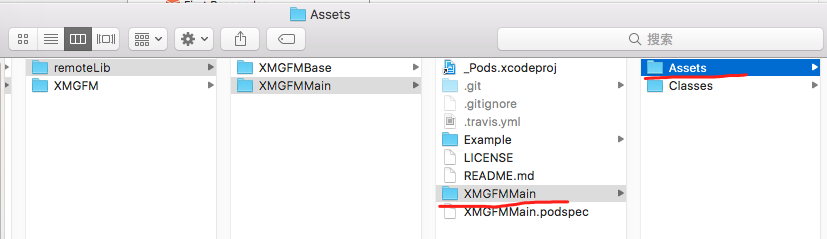

将tabbar用的底部背景，中间播放按钮用到的图片拷贝进去：

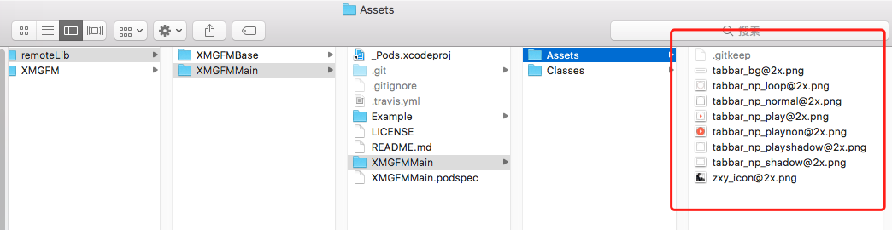

同时在XMGFMMain.podspec文件中，启用资源文件路径引用

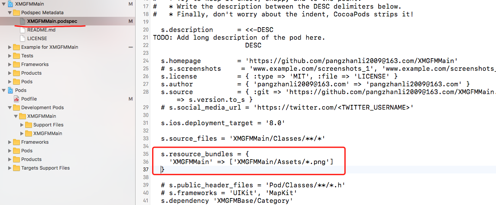

再次pod install之后，发现资源文件已经被引入过来了

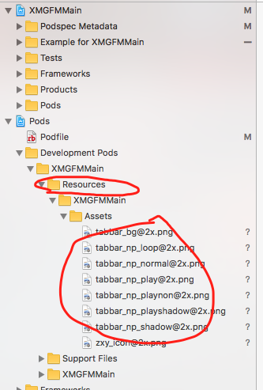

再次运行测试项目，发现没有任何效果。

2，接着，我们查看主业务框架代码，发现中间的播放视图是采用xib方式创建的，其中的图片是使用UIImageView直接加载图片的方式，如图：

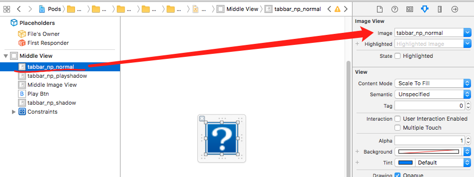

这里右边的图片会到当前框架类库所在的bundle中查找，但是，我们的业务框架类库的bundle是不知道当前这个图片的存在，因为，图片资源已经被打成了一个XMGFMMain.bundle文件夹，所以，我们要让它使用我们主框架的资源文件， 将image中的名称修改为： XMGFMMain.bundle/tabbar_no_normal

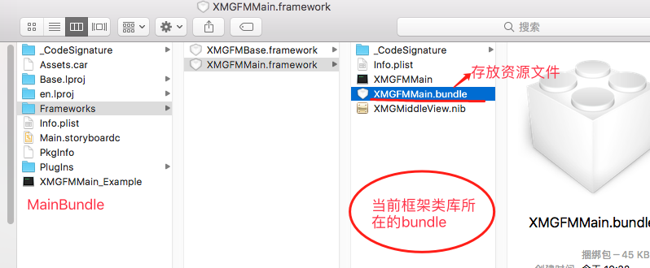

修改名称之后：

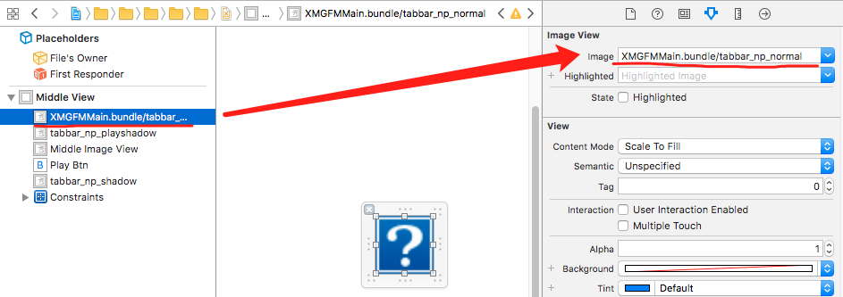

3，运行至项目之后，发现中间的播放视图已经正常了，但是，tabbar的背景图片还是没有加载，如图：

查看主框架业务代码：

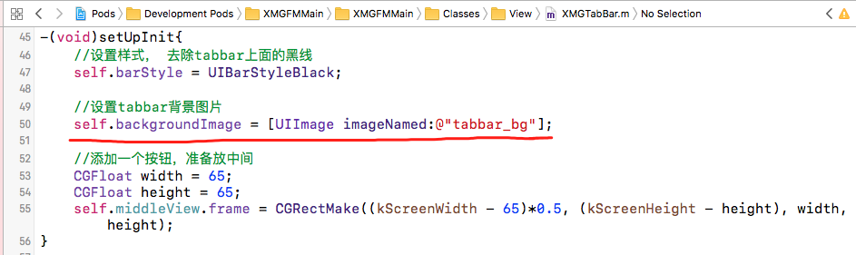

发现使用的是UIImage这种方式加载的，这种方式是回去MainBundle中找tabbar_bg这种图片，所以，将代码修改为:

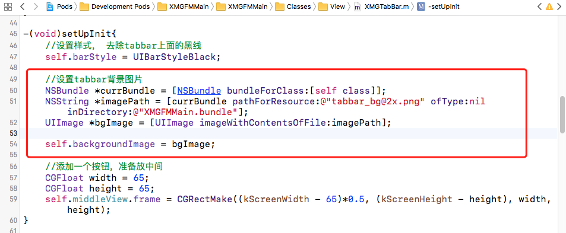

上图使用的方式是： 在当前的bundle中，先获取到图片的路径，再用UIImage获取图片的方式获取图片。