经过笔记2，3两步骤，现在我们将代码提交到远程仓库，并在主项目上做验证。
1，在远程仓库上 coding.net 上创建项目

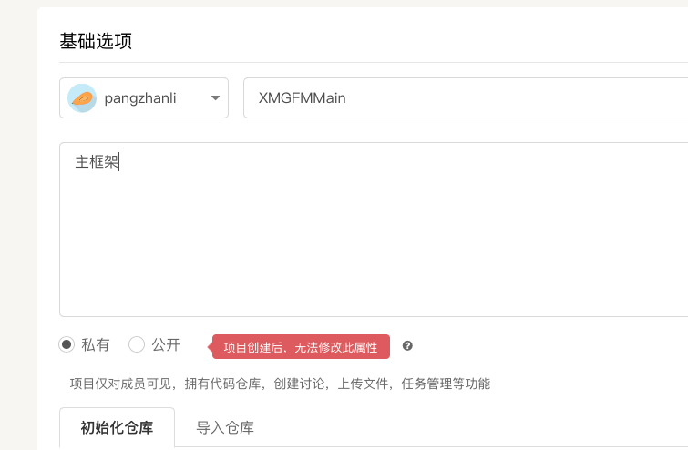

2，修改本地的podspec文件

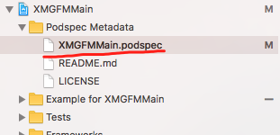

内容修改为：

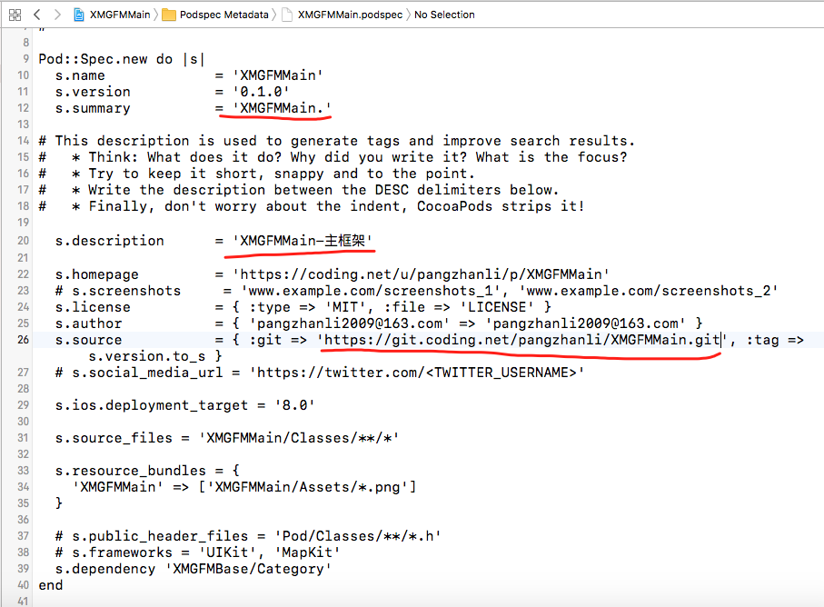

3，本地验证代码。使用到的命令：  pod lib lint

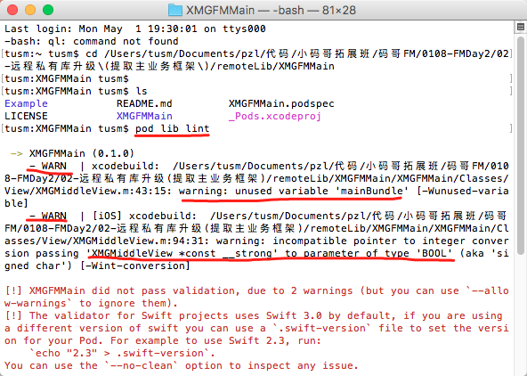

验证没有通过，原因：

第一个警告:  是因为mainBundle这个变量并没有用到，查看代码，可以看到：

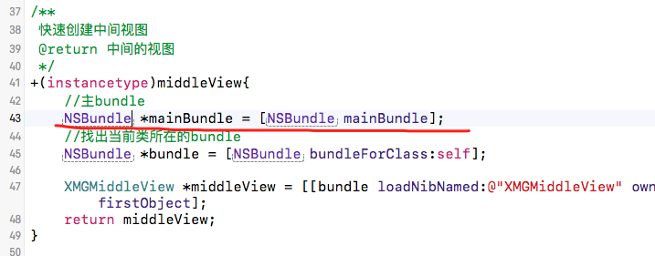

第二个警告：说是指针不兼容情况

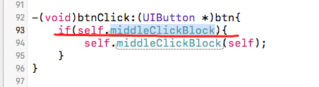


如果确实这些警告都可以忽略，我们可以使用忽略警告的命令： pod lib lint --allow-warnings
执行之后，结果如下：

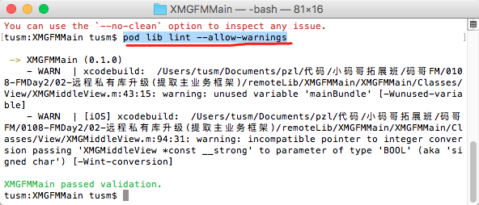

4， 提交源代码到远程仓库，使用到的命令：

```
git add .
git commit -m '提交竹筐将代码'
git remote add origin https://git.coding.net/pangzhanli/XMGFMMain.git
git push origin master

git tag '0.1.0'
git push --tags
```

5, 查看远程仓库代码和标签

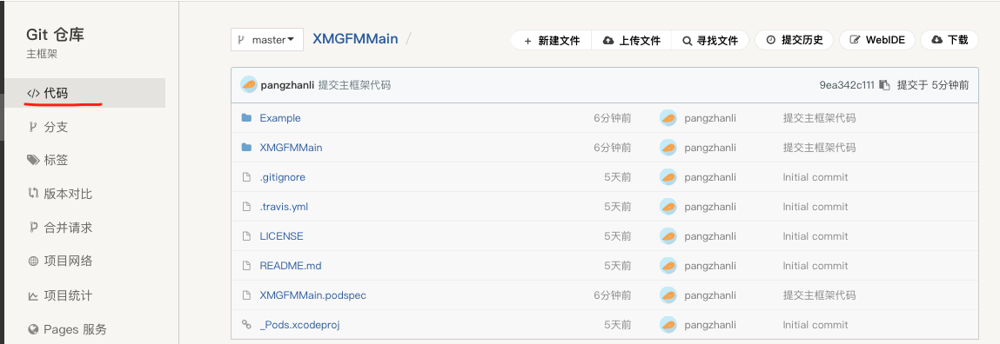

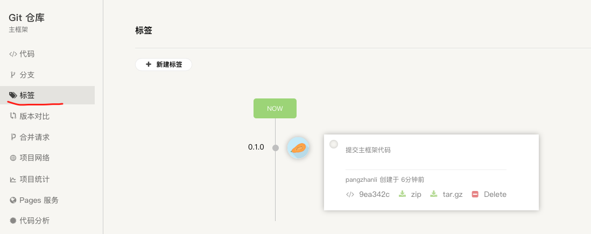

6，podspec文件远程验证：  pod spec lint --allow-warnings

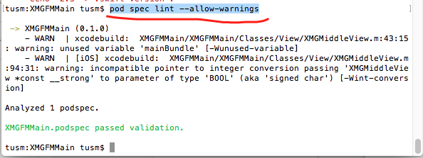

7，将podspec文件推送到本地。  使用命令：  pod repo push XMGFMSpec XMGFMMain.podspec

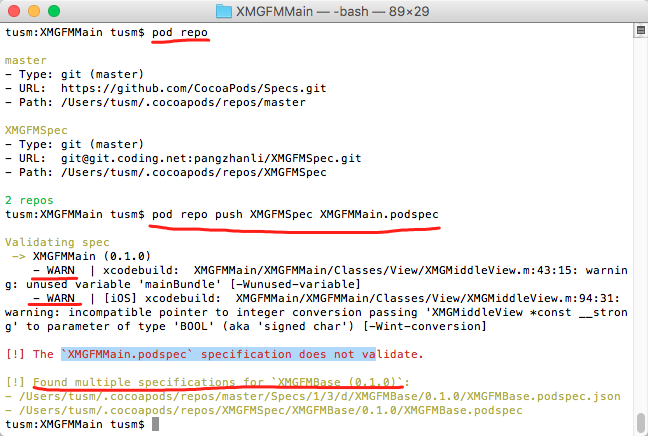

 - a,  先说下边这个问题，他是发现了两个重复的XMGFMBase类库，然后列出了两个地址，这个不是主要的问 题。

 - b,  上边这个问题，发现是两个警告，可以忽略,  使用命令 : pod repo push XMGFMSpec XMGFMMain.podspec --allow-warnings

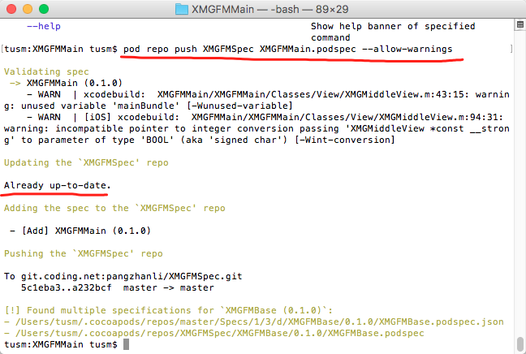

已经更新成功了。

8, 在正式项目中验证主框架类库。

podfile文件修改：

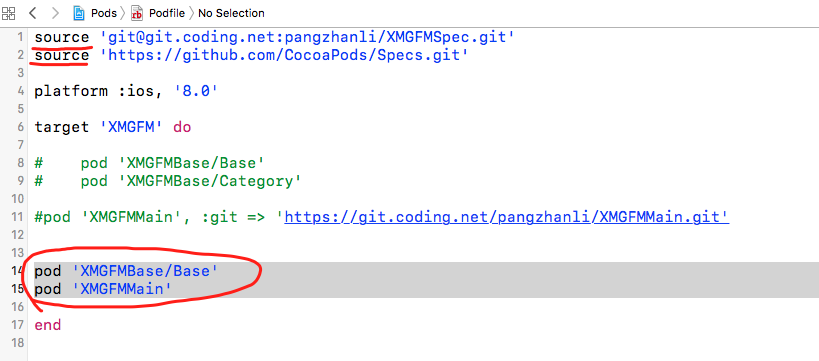

注意执行顺序：

pod XMGFMBase/Base的时候，会先去第一个source中查找，如果没有，接着去第二个source中查找。

如果要指定类库的源码地址，可以使用命令：

```
pod '库名', :git => '源码git地址'  :  指定导入库的源码git地址  
```

9, 执行 pod install 命令，发现了错误：

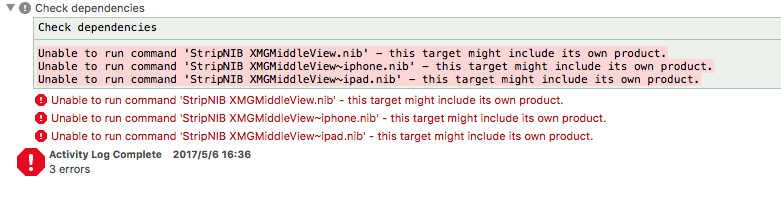

这个错误的意思是说，我们的类库中使用xib文件，其实，在pod中，xib文件不能当成源文件的（s.source_files）, 否则pod install之后就会报出"Unable to run command 'StripNIB xxx.nib' - this target might include its own product". .所以必须要将xib放入资源文件中(即s.resources)。解决步骤10。

10，  将类库中的xib文件放到Assets中

打开我们的本地Main框架的项目，拖动xib文件，放到Assets中，并且修改XMGFMMain.podspec文件。

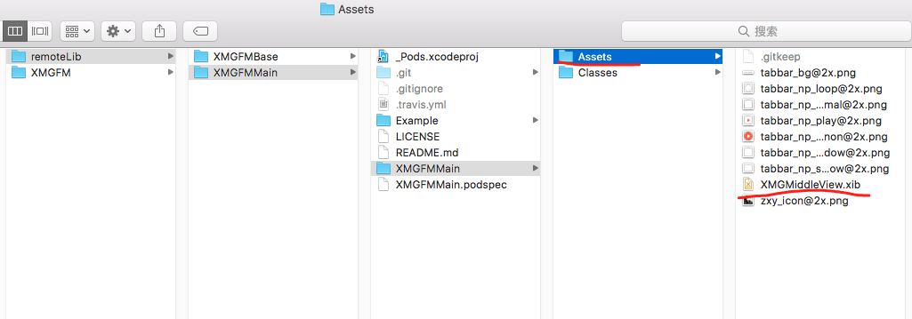

修改podspec文件：

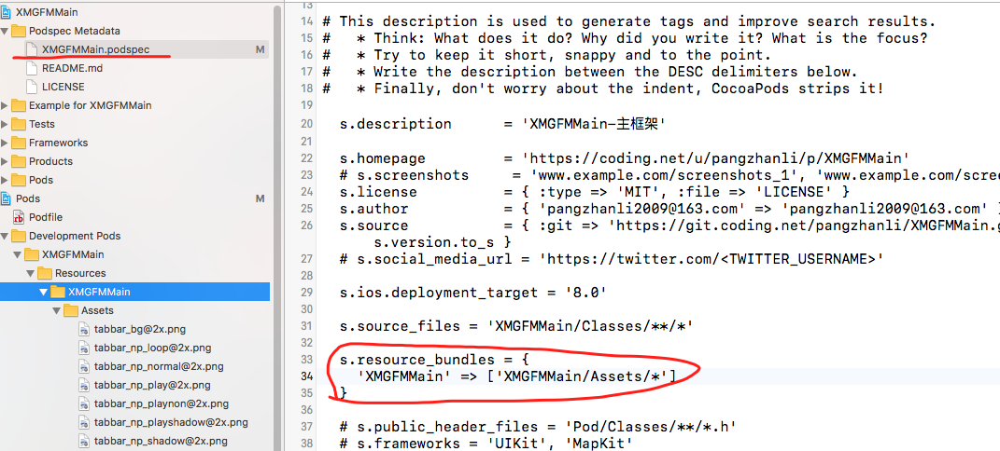

同时修改获取xib的方式：

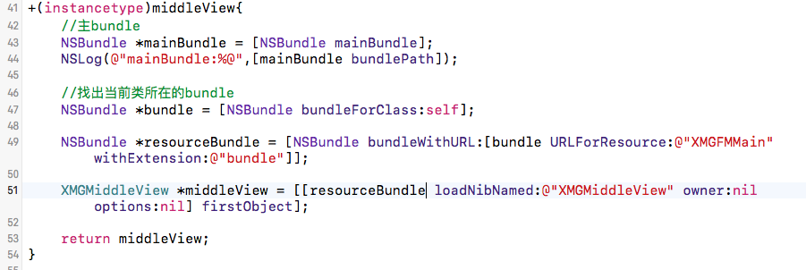

在测试项目中，pod install命令，执行之后，运行项目，没有错误，提交主框架类库代码。
