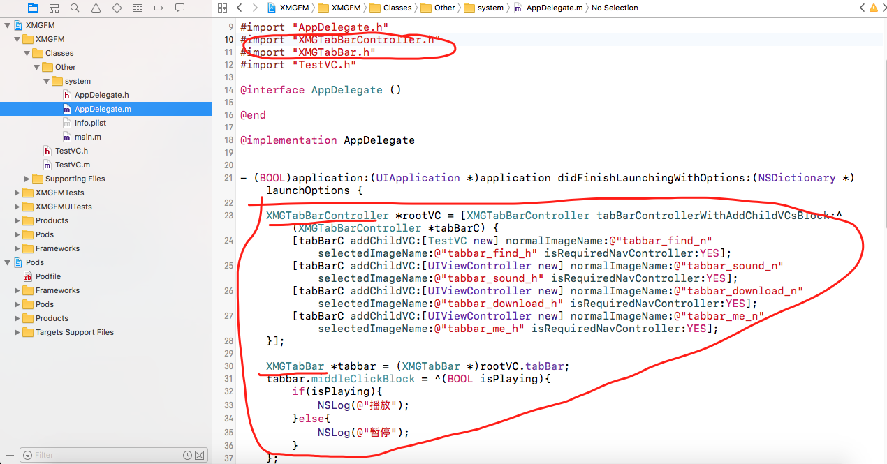
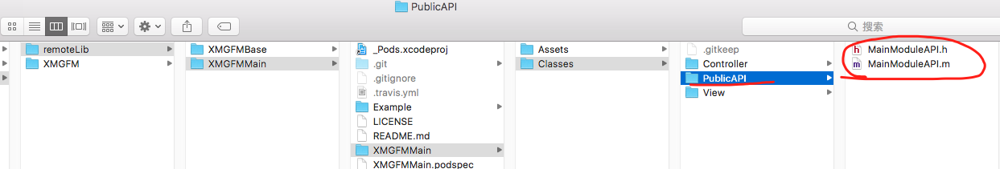
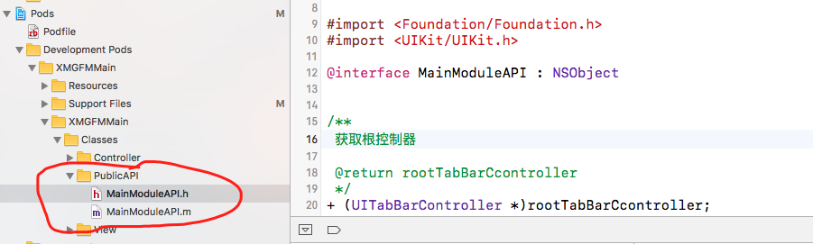
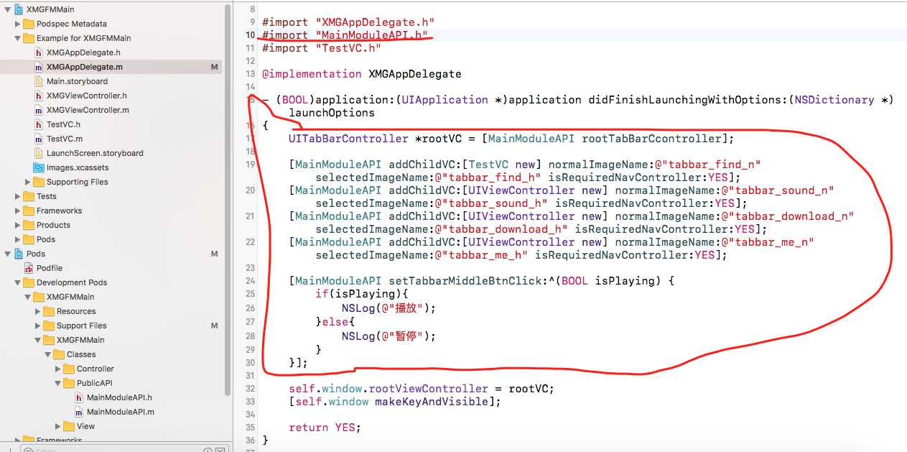

解决问题：观察我们的真正项目，在引用主框架的时候，会发现，引入的头文件过多，在使用的时候，各个类也是过多，那么，我们如何把这些真正需要的功能封装起来，只用一些类来使用，不管里边怎写，外边在调用的时候后比较方便呢？

提取出来共同使用的类，然后添加到主框架类中

1，添加主框架的公共使用类。

2，测试项目执行pod install命令，执行正确

3，修改使用方法

4, 提交主框架代码
