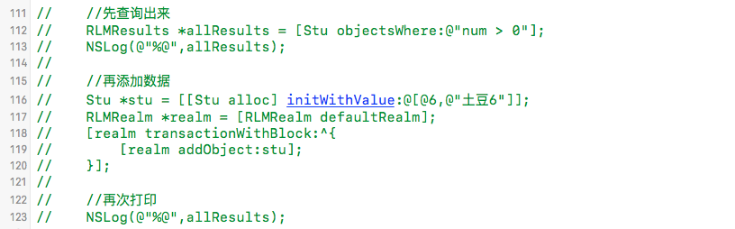
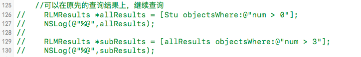
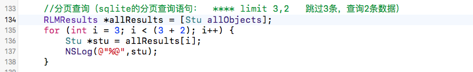

注意：

 - 所有的查询(包括查询和属性访问)，在Realm中，都是延迟加载的，只有当属性访问时，才会读取相应的数据。
 - 查询结果并不是数据的拷贝，修改了查询结果（在写入事务中）会直接修改硬盘上的数据。（地址映射）
 - 一旦检索执行之后，RLMResults将随时保持更新。

1，先查询出来，在添加数据，然后再次打印刚刚查询的结果，发现allResults被更新了

2, 在原先的查询结果上，继续查询：

3，分页查询。（传统的sqlite分页查询： **** limit 3,2   跳过3条，查询2条数据）

