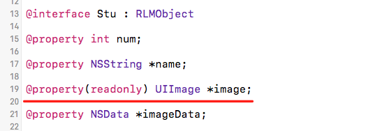
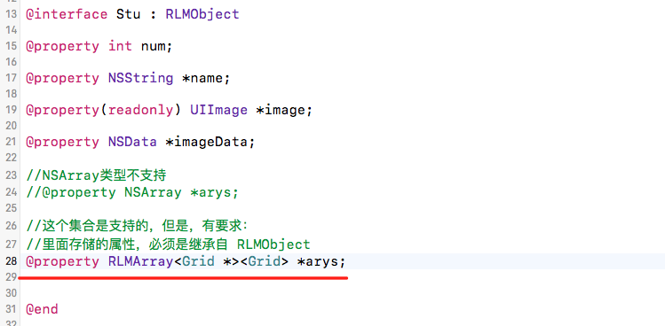
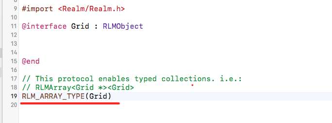

注： 意Realm支持的数据类型： BOOL, bool, int NSInteger, long, long long, float, double, NSString, NSDate, NSData, NSNumber
1，如果在模型类一定要声明属性，请添加readonly修饰。

然后再.m文件中，重新getImage方法：

2，集合类型的该如何操作，例如：NSArray

需要使用RLMArray,  其中里边存储的属性，必须是继承自RLMObject,注意在Grid类中，一定要有：

