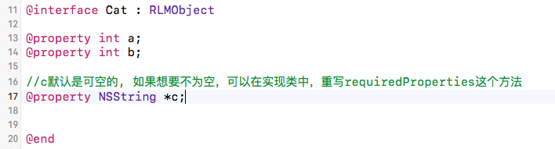
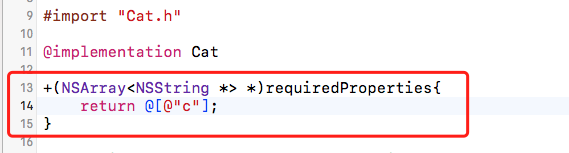
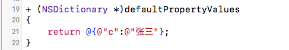
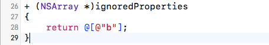
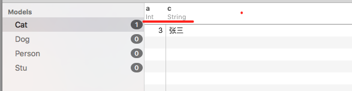

1，在模型类中，普通属性是可以为空的，如果想要非空，则可以在实现类中，重写requiredProperties这个方法

重写方法：

2，如果想要给属性一个默认值，则可以重写defaultPropertyValues这个方法：

3，忽略属性：需要重新ignoredProperties这个方法：

Realm框架在发现模型类重写了这个方法以后，会在数据库中不创建此列：如图：

只有a, c 列，没有b列。
