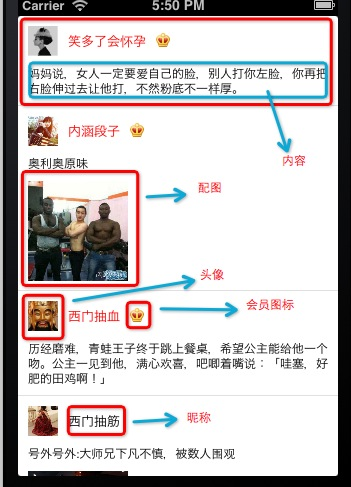
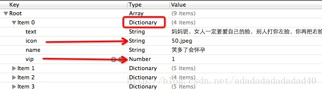
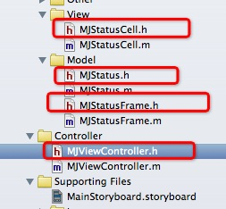

先看一下，我们将要做出的效果：




如上图中，现在分析：

- 1，这像是一个表格，而表格的每一个cell高度不定。
- 2，头像不一样 
- 3，昵称不一样，昵称的字数也不一样 
- 4，有的有会员图标（昵称显示红色），有的没有（昵称显示黑色) 
- 5，内容不一样，内容的高度不定 
- 6，有的有配图，有的没有配图

如果使用xib创建，那么cell的高度无法确定，控件的位置无法确定，所以，我们采用，整个表格使用一个UITableViewController, 里边的cell采用代码创建。数据使用加载plist文件的方式。

先看一下我们的plist文件：



一：文件分类及作用：



 - 1，视图文件：StatusCell，  对应的是表格中的cell  。 也就是表格在加载UITableViewCell的时候，我们要用代码创建出来。 
 - 2，模型文件：有两个Status 和 StatusFrame，第一个是Status,  用于提供数据，例如，昵称，图片的名称，内容，等等。 第二个是StatusFrame, 用于提供cell中的各个控件的frame, 比如，图片大小及位置，内容的大小及位置，等等。
 - 3，控制器：ViewController  这个ViewController继承自UITableViewController, 这样就拥有了UITableView的各个属性。
 - 4, 还有一点，我们的storyboard文件中，我们直接拖一个UITableView即可，同时，在属性设置框中将它的Custom Class  设置为ViewController 。

二：各个文件的代码：

1，ViewController.m文件中的代码：

```
#import "MJViewController.h"

#import "MJStatus.h"
#import "MJStatusCell.h"
#import "MJStatusFrame.h"
 
@interface MJViewController ()
 
@property(nonatomic,strong)NSArray *statusFrames;
 
@end
 
@implementation MJViewController
 
- (void)viewDidLoad
{
    [super viewDidLoad];
    
}
/** 懒加载（只加载一次） */
-(NSArray *)statusFrames{
    
    if(_statusFrames == nil){
        NSString *path = [[NSBundle mainBundle] pathForResource:@"statuses.plist" ofType:nil];
        NSArray *dictArray = [NSArray arrayWithContentsOfFile:path];
        NSMutableArray *statusFrameArray = [NSMutableArray array];
        for (NSDictionary *dict in dictArray) {
            MJStatus *status = [MJStatus statusWithDict:dict];
            MJStatusFrame *statusFrame = [[MJStatusFrame alloc] init];
            statusFrame.status = status;
            
            [statusFrameArray addObject:statusFrame];
        }
        _statusFrames = statusFrameArray;
    }
    return _statusFrames;
}
#pragma mark - UITableView的数据源方法
/** 返回本组数据有多少行 */
-(NSInteger)tableView:(UITableView *)tableView numberOfRowsInSection:(NSInteger)section{
    return self.statusFrames.count;
}
#pragma mark 返回每一组的UITableViewcell
-(UITableViewCell *)tableView:(UITableView *)tableView cellForRowAtIndexPath:(NSIndexPath *)indexPath{
    // 1,创建cell
    MJStatusCell *cell = [MJStatusCell cellWithTableView:tableView];
    
    // 2,设置cell的数据和控件的frame
    cell.statusFrame = self.statusFrames[indexPath.row];
    
    return cell;
  
}
 
/** 每一行的高度 */
-(CGFloat)tableView:(UITableView *)tableView heightForRowAtIndexPath:(NSIndexPath *)indexPath{
    MJStatusFrame *statusFrame = self.statusFrames[indexPath.row];
    
    return statusFrame.cellHeight;
    
}
 
@end

```

2，StatusCell.h中的代码：

```
#import <UIKit/UIKit.h>
@class MJStatusFrame;
@interface MJStatusCell : UITableViewCell
@property(nonatomic,strong) MJStatusFrame *statusFrame;
 
+(id)cellWithTableView:(UITableView *)tableView;
 
@end


```

StatusCell.m中的代码：

```
#import "MJStatusCell.h"
#import "MJStatus.h"
#import "MJStatusFrame.h"
 
#define MJNameFont [UIFont systemFontOfSize:13]
#define MJTextFont [UIFont systemFontOfSize:12]
@interface MJStatusCell ()
/** 
 头像 
*/
@property(nonatomic,weak) UIImageView *iconImgView;
/** 昵称 */
@property(nonatomic,weak) UILabel *nameLbl;
/** 会员图标 */
@property(nonatomic,weak) UIImageView *vipImgView;
/** 正文 */
@property(nonatomic,weak) UILabel *textLbl;
/** 配图 */
@property(nonatomic,weak) UIImageView *pictureImgView;
 
@end
 
 
@implementation MJStatusCell
 
+(id)cellWithTableView:(UITableView *)tableView{
    static NSString *flag = @"status";
    
    MJStatusCell *cell = [tableView dequeueReusableCellWithIdentifier:flag];
    
    if(cell == nil){
        cell = [[MJStatusCell alloc] initWithStyle:UITableViewCellStyleDefault reuseIdentifier:flag];
    }
    return cell;
}
 
- (id)initWithStyle:(UITableViewCellStyle)style reuseIdentifier:(NSString *)reuseIdentifier
{
    self = [super initWithStyle:style reuseIdentifier:reuseIdentifier];
    if (self) {
        
        //头像
        UIImageView *iconImgView = [[UIImageView alloc] init];
        [self.contentView addSubview:iconImgView];
        self.iconImgView = iconImgView;
        
        //昵称
        UILabel *nameLbl = [[UILabel alloc] init];
        nameLbl.font = MJNameFont;
        [self.contentView addSubview:nameLbl];
        self.nameLbl = nameLbl;
        
        //会员头像
        UIImageView *vipImgView = [[UIImageView alloc] init];
        vipImgView.image = [UIImage imageNamed:@"vip"];
        [self.contentView addSubview:vipImgView];
        self.vipImgView = vipImgView;
        
        //正文
        UILabel *textLbl = [[UILabel alloc] init];
        textLbl.numberOfLines = 0;
        textLbl.font = MJTextFont;
        [self.contentView addSubview:textLbl];
        self.textLbl = textLbl;
        
        //配图
        UIImageView *pictureImgView = [[UIImageView alloc] init];
        [self.contentView addSubview:pictureImgView];
        self.pictureImgView = pictureImgView;
        
    }
    return self;
}
 
-(void)setStatusFrame:(MJStatusFrame *)statusFrame{
    _statusFrame = statusFrame;
    //1,设置数据
    [self settingData];
    //2，设置frame
    [self settingFrame];
}
/**
 设置数据
 */
-(void)settingData{
    /** 头像 */
    self.iconImgView.image = [UIImage imageNamed:self.statusFrame.status.icon];
    /** 昵称 */
    self.nameLbl.text = self.statusFrame.status.name;
    /** 会员头像 */
    if(self.statusFrame.status.vip){
        self.vipImgView.hidden = NO;
        self.nameLbl.textColor = [UIColor redColor];
    }else{
        self.vipImgView.hidden = YES;
        self.nameLbl.textColor = [UIColor blackColor];
    }
    /** 正文 */
    self.textLbl.text = self.statusFrame.status.text;
    /** 配图 */
    if(self.statusFrame.status.picture){
        self.pictureImgView.hidden = NO;
        self.pictureImgView.image = [UIImage imageNamed:self.statusFrame.status.picture];
    }else{
        self.pictureImgView.hidden = YES;
    }
    
}
/**
 设置frame
 */
-(void)settingFrame{
    /** 头像 */
    
    self.iconImgView.frame = self.statusFrame.iconFrame;
    
    /** 昵称 */
    self.nameLbl.frame =self.statusFrame.nameFrame;
  
    /** 会员头像 */
    self.vipImgView.frame = self.statusFrame.vipFrame;
    
    /** 正文 */
    self.textLbl.frame = self.statusFrame.textFrame;
    
    /** 配图 */
    if(self.statusFrame.status.picture){
         self.pictureImgView.frame = self.statusFrame.pictureFrame;
    }
   
    
}
 
@end

```

3, status.h中的代码：

```
#import <Foundation/Foundation.h>
 
@interface MJStatus : NSObject
/** 正文 */
@property(nonatomic,copy) NSString *text;
/** 头像 */
@property(nonatomic,copy) NSString *icon;
/** 昵称 */
@property(nonatomic,copy) NSString *name;
/** 配图 */
@property(nonatomic,copy) NSString *picture;
/** 会员 */
@property(nonatomic,assign) BOOL vip;
 
+(id)statusWithDict:(NSDictionary *)dict;
-(id)initWithDict:(NSDictionary *)dict;
 
@end

```

Status.m中的代码：

```
#import "MJStatus.h"
 
@implementation MJStatus
 
+(id)statusWithDict:(NSDictionary *)dict{
    return [[self alloc] initWithDict:dict];
}
-(id)initWithDict:(NSDictionary *)dict{
    if(self = [super init]){
        [self setValuesForKeysWithDictionary:dict];
    }
    return self;
}
 
@end

```

4，StatusFrame.h文件中的代码：

```
#import <Foundation/Foundation.h>
@class MJStatus;
 
@interface MJStatusFrame : NSObject
 
@property(nonatomic,assign,readonly) CGRect iconFrame;
@property(nonatomic,assign,readonly) CGRect nameFrame;
@property(nonatomic,assign,readonly) CGRect vipFrame;
@property(nonatomic,assign,readonly) CGRect textFrame;
@property(nonatomic,assign,readonly) CGRect pictureFrame;
 
@property(nonatomic,assign,readonly) CGFloat cellHeight;
 
@property(nonatomic,strong) MJStatus *status;
 
 
@end

```

StatusFrame.m中的代码：

```

#import "MJStatusFrame.h"
#import "MJStatus.h"
 
#define MJNameFont [UIFont systemFontOfSize:13]
#define MJTextFont [UIFont systemFontOfSize:12]
 
@implementation MJStatusFrame
 
-(void)setStatus:(MJStatus *)status{
    _status = status;
    CGFloat padding = 10;
    
    CGFloat iconX = padding;
    CGFloat iconY = padding;
    CGFloat iconW = 30;
    CGFloat iconH = 30;
    
    _iconFrame = CGRectMake(iconX, iconY, iconW, iconH);
    
    /** 昵称 */
    CGFloat nameX = CGRectGetMaxX(_iconFrame) + padding;
    CGSize nameMaxSize = [self.status.name sizeWithFont:MJNameFont];
    CGFloat nameW = nameMaxSize.width;
    CGFloat nameH = nameMaxSize.height;
    CGFloat nameY = padding + (iconH - nameH) * 0.5;
    _nameFrame = CGRectMake(nameX, nameY, nameW, nameH);
    
    /** 会员头像 */
    
    CGFloat vipX = CGRectGetMaxX(_nameFrame) + padding;
    CGFloat vipY = nameY;
    CGFloat vipW = 14;
    CGFloat vipH = 14;
    
    _vipFrame = CGRectMake(vipX, vipY, vipW, vipH);
    
    /** 正文 */
    CGFloat textX = iconX;
    CGFloat textY = CGRectGetMaxY(_iconFrame) + padding;
    CGFloat textW = 300;
    CGSize textMaxSize = [self.status.text sizeWithFont:MJTextFont constrainedToSize:CGSizeMake(300, MAXFLOAT) lineBreakMode:UILineBreakModeCharacterWrap];
    CGFloat textH = textMaxSize.height;
    _textFrame = CGRectMake(textX, textY, textW, textH);
    
    /** 配图 */
    CGFloat pictureX = iconX;
    CGFloat pictureY = CGRectGetMaxY(_textFrame) + padding;
    CGFloat pictureW = 100;
    CGFloat pictureH = 100;
    _pictureFrame = CGRectMake(pictureX, pictureY, pictureW, pictureH);
    
    if(self.status.picture){
        _cellHeight = CGRectGetMaxY(_pictureFrame) + padding;
    }else{
        _cellHeight = CGRectGetMaxY(_textFrame) + padding;
    }
}
 
@end

```

虽然贴上了代码，还是要说一下这个过程：

- 1，在控制器初始化的时候，从plist文件中将数据提取出来，然后放到Status这个模型中，在创建一个StatusFrame模型，这个StatusFrame模型中有一个属性是Status, 而数组中放入的就是StatusFrame这个模型对象。 在赋值的时候，就把各个控件的frame 以 cell的高度计算了出来。

- 2，控制器初始化完以后，会先加载一共有多少组这个方法，-(NSInteger)numberOfSectionsInTableView:  ,

- 3，继续加载每组有多少行这个方法：-(NSInteger)tableView:numberOfRowsInSection:
- 4，继续加载 -(CGFloat)tableView:heightForRowAtIndexPath: 这个方法，这个方法主要是返回表格中，每一行的高度，这时候，我们就可以从已经加载完的数组将cell的高度提取出来了。

- 5，加载完每一组高度这个方法之后，会继续加载 -(UITableViewCell *)tableView:cellForRowAtIndexPath: 这个方法是返回每一行的cell.  这段代码被调用的频率非常高，不用在这段代码中频繁创建cell,这样效率会有点低。现在粘上此段代码：

```
// 1,创建cell
MJStatusCell *cell = [MJStatusCell cellWithTableView:tableView];

// 2,设置cell的数据和控件的frame	
cell.statusFrame = self.statusFrames[indexPath.row];

return cell;
```


第一行代码，就是创建一个cell,创建cell代码如下：

```
+(id)cellWithTableView:(UITableView *)tableView{

    static NSString *flag = @"status";
    MJStatusCell *cell = [tableView dequeueReusableCellWithIdentifier:flag];
    if(cell == nil){
        cell = [[MJStatusCell alloc] initWithStyle:UITableViewCellStyleDefault reuseIdentifier:flag];
    }

    return cell;
}

```

这段代码是采用，先从缓存池中去查找，是否有被先前不用的cell ,如果没有，就去创建一个cell,如果有cell,直接返回cell,如果没有cell，就直接创建一个cell。当然，在创建cell的时候，我们会创建这个cell中的子控件。


再看  cell.statusFrame = self.statusFrames[indexPath.row]; 这行代码，这行代码是将存在数组中的模型对象数据提取出来，赋值给cell的frame对象，在赋值的时候，我们会设置cell控件中的数据和空间的frame.
现在贴上赋值的代码：

```
-(void)setStatusFrame:(MJStatusFrame *)statusFrame{

    _statusFrame = statusFrame;

    //1,设置数据
    [self settingData];

    //2，设置frame
    [self settingFrame];

}

/**
 设置数据
 */
-(void)settingData{

    /** 头像 */
    self.iconImgView.image = [UIImage imageNamed:self.statusFrame.status.icon];

    /** 昵称 */
    self.nameLbl.text = self.statusFrame.status.name;

    /** 会员头像 */
    if(self.statusFrame.status.vip){
        self.vipImgView.hidden = NO;
        self.nameLbl.textColor = [UIColor redColor];
    }else{
        self.vipImgView.hidden = YES;
        self.nameLbl.textColor = [UIColor blackColor];
    }

    /** 正文 */
    self.textLbl.text = self.statusFrame.status.text;

    /** 配图 */
    if(self.statusFrame.status.picture){
        self.pictureImgView.hidden = NO;
        self.pictureImgView.image = [UIImage imageNamed:self.statusFrame.status.picture];
    }else{
        self.pictureImgView.hidden = YES;
    }
}

/**
 设置frame
 */

-(void)settingFrame{

    /** 头像 */
    self.iconImgView.frame = self.statusFrame.iconFrame;

    /** 昵称 */
    self.nameLbl.frame =self.statusFrame.nameFrame;

    /** 会员头像 */
    self.vipImgView.frame = self.statusFrame.vipFrame;

    /** 正文 */
    self.textLbl.frame = self.statusFrame.textFrame;

    /** 配图 */
    if(self.statusFrame.status.picture){
         self.pictureImgView.frame = self.statusFrame.pictureFrame;

    }
}

```

通过代码自定义cell(cell的高度不一致)

总结：

- 1，新建一个继承自UITableViewCell类。

- 2，重新这个类的initWithStyle:reuseIdentifier:方法

	   a,添加所有需要显示的子控件（不需要设置子控件的数据和frame,子控件要添加到contentView中）
	
	   b,进行子控件的一次性的属性设置(有些属性只需要设置一次，比如，字体，固定的图片等)

- 3，提供2个模型

	  a,数据模型：存放文字数据\图片数据
	
	  b,frame模型：存放数据模型，以及所有子控件的frame,以及cell的高度

- 4，cell拥有一个frame模型（不要直接拥有数据模型）

- 5，重写frame模型属性的setter方法：在这个方法中设置子控件的显示数据和frame

- 6, frame模型数据的初始化采用懒加载的方式（每一个cell对应的frame模型数据只加载一次）
