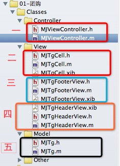
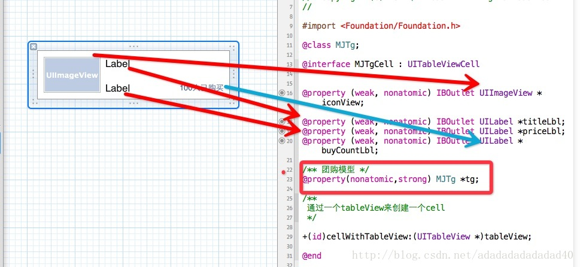
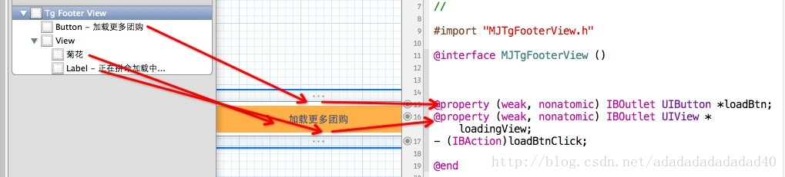
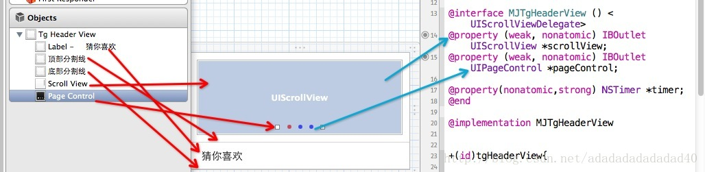
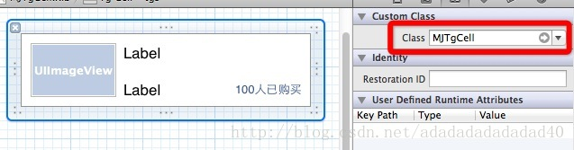

现在我们看一下最终效果： 上部：


底部：


如上图中，可以使用表格UITableView， 顶部的图片轮换可以采用scrollView,加上一个定时器。中间部分，因为每一个cell的中子控件位置固定，大小固定。底部有一个加载更多的按钮。所以，我们可以对顶部图片轮换，中间固定部分，底部，加载更多部分，都使用xib文件  。顶部作为表格的头部，中间作为表格的每一个cell  ,底部加载更多作为表格的底部部分。

一：代码结构如图：



代码部分解析：

- 1, 第一部分是控制器

- 2, 第二部分是cell的view类和xib文件，cell模型类继承自UITableViewCell  .

- 3, 第三部分是 尾部的view类和xib

- 4, 第四部分是头部的view类和xib

- 5, 第五部分是模型对象

二：代码部分：

1，ViewController.m文件：

```
#import "MJViewController.h"

#import "MJTg.h"

#import "MJTgCell.h"

#import "MJTgFooterView.h"

#import "MJTgHeaderView.h"


@interface MJViewController () <UITableViewDataSource,MJTgFooterViewDelegate>

@property (weak, nonatomic) IBOutlet UITableView *tableView;

@property(nonatomic,strong) NSMutableArray *tgs;

@end

@implementation MJViewController


- (void)viewDidLoad

{

    [super viewDidLoad];

    //设置每一行的高度

self.tableView.rowHeight = 80;

    

    MJTgFooterView *footerView = [MJTgFooterView tgFooterView];

    footerView.delegate =self;

    self.tableView.tableFooterView = footerView;

    

    self.tableView.tableHeaderView = [MJTgHeaderView tgHeaderView];

    

}

#pragma mark - MJTgFooterViewDelegate的代理方法

/** 加载按钮的更多数据 */

-(void)tgFooterViewDidLoadBtnClick:(MJTgFooterView *)tgfooterView{

   

    //加载更多的模型数据

    int count = self.tgs.count;

    NSArray *array = self.tgs;

    for (int i=0; i<count; i++) {

        MJTg *tg = array[i];

        MJTg *tempTg = [[MJTg alloc] init];

        tempTg.title = tg.title;

        tempTg.icon =tg.icon;

        tempTg.price = tg.price;

        tempTg.buyCount = tg.buyCount;

        

        [self.tgs addObject:tempTg];

    }    

    //2,刷新表格，高数tableView重新加载模型数据，调用tableView的reloadData方法

    [self.tableView reloadData];

}


-(NSMutableArray *)tgs{

    if(_tgs == nil){

        // 初始化

        // 1. 获得plist的全路径

        NSString *path = [[NSBundle mainBundle] pathForResource:@"tgs.plist" ofType:nil];

        //2,健在数组

        NSArray *dictArray = [NSArray arrayWithContentsOfFile:path];

        

        //3,将dictArray里面的所有字典都转换成模型对象，放到新的数组中

        NSMutableArray *tgArray = [NSMutableArray array];

        for (NSDictionary *dict in dictArray) {

            // 3.1 创建模型对象

            MJTg *tg=[MJTg tgWithDict:dict];

            // 3.2 添加模型对象到数组中

            [tgArray addObject:tg];

        }

        //4,赋值

        _tgs = tgArray;

    }

    return _tgs;

}

#pragma mark - 数据源方法

/** 一共有多少行数据 */

-(NSInteger)tableView:(UITableView *)tableView numberOfRowsInSection:(NSInteger)section{

    return self.tgs.count;

}

/** 每一行显示怎么样的cell */

-(UITableViewCell *)tableView:(UITableView *)tableView cellForRowAtIndexPath:(NSIndexPath *)indexPath{ 

    MJTgCell *cell =[MJTgCell cellWithTableView:tableView];

    MJTg *tg = self.tgs[indexPath.row];

    cell.tg =tg;

    return cell;

}

@end

```

2，TgCell的xib文件和TgCell.h对应的部分，如图：



TgCell.h代码如下：


```
#import <Foundation/Foundation.h>

@class MJTg;

@interface MJTgCell : UITableViewCell


@property (weak, nonatomic) IBOutlet UIImageView *iconView;


@property (weak, nonatomic) IBOutlet UILabel *titleLbl;

@property (weak, nonatomic) IBOutlet UILabel *priceLbl;

@property (weak, nonatomic) IBOutlet UILabel *buyCountLbl;


/** 团购模型 */

@property(nonatomic,strong) MJTg *tg;


/**

 通过一个tableView来创建一个cell

 */


+(id)cellWithTableView:(UITableView *)tableView;


@end


TgCell.m文件如下：


#import "MJTgCell.h"

#import "MJTg.h"

@implementation MJTgCell


+(id)cellWithTableView:(UITableView *)tableView{

    static NSString *flag= @"tgs";

    

    MJTgCell *cell = [tableView dequeueReusableCellWithIdentifier:flag];

    if(cell ==nil){

        cell = [[NSBundle mainBundle] loadNibNamed:@"MJTgCell" owner:nil options:nil][0];

        

    }

    return cell;

}


-(void)setTg:(MJTg *)tg{

    self.iconView.image = [UIImage imageNamed:tg.icon];

    self.titleLbl.text = tg.title;

    self.priceLbl.text = [NSString stringWithFormat:@"￥%@",tg.price];

    self.buyCountLbl.text = [NSString stringWithFormat:@"%@人已购买",tg.buyCount];

}


@end
```

3，TgFooterView的xib文件和TgFooterView.h对象如下：



这儿需要注意一点：当点击加载更多按钮之后，将刷新按钮和正在拼命加载显示出来。所以，一开始的时候，将view隐藏，当点击按钮之后，再将按钮隐藏，view显示出来。

TgFooterView.h代码如下：

```
#import <UIKit/UIKit.h>

@class MJTgFooterView;

@protocol MJTgFooterViewDelegate <NSObject>


@optional

-(void)tgFooterViewDidLoadBtnClick:(MJTgFooterView *)tgfooterView;


@end


@interface MJTgFooterView : UIView


@property(nonatomic,weak) id<MJTgFooterViewDelegate> delegate;


+(id)tgFooterView;


@end


TgFooterView.m文件代码：


#import "MJTgFooterView.h"


@interface MJTgFooterView ()

@property (weak, nonatomic) IBOutlet UIButton *loadBtn;

@property (weak, nonatomic) IBOutlet UIView *loadingView;

- (IBAction)loadBtnClick;


@end

@implementation MJTgFooterView


+(id)tgFooterView{

    //创建Nib对象

//    UINib *nib = [UINib nibWithNibName:@"MJTgFooterView" bundle:[NSBundle mainBundle]];

//    return [[nib instantiateWithOwner:nil options:nil] lastObject];

    

    return [[NSBundle mainBundle] loadNibNamed:@"MJTgFooterView" owner:nil options:nil][0];

}


- (IBAction)loadBtnClick {

    

    //1,将加载按钮隐藏

    self.loadBtn.hidden = YES;

    

    //2,刷新按钮显示出来

    self.loadingView.hidden = NO;

    

    //3.0秒之后执行block中

    dispatch_time_t popTime = dispatch_time(DISPATCH_TIME_NOW, (int64_t)(2.0 * NSEC_PER_SEC));

    dispatch_after(popTime, dispatch_get_main_queue(), ^(void){

        //3,通知代理，按钮被人点击了

        if([self.delegate respondsToSelector:@selector(tgFooterViewDidLoadBtnClick:)]){

            [self.delegate tgFooterViewDidLoadBtnClick:self];

        }

        

        //4,加载按钮显示，刷新按钮隐藏

        self.loadBtn.hidden = NO;

        self.loadingView.hidden = YES;

        

    });

}

@end
```

3，TgHeaderView的xib和TgHeaderView属性对应部分：



TgHeaderView.h文件的代码：

```
#import <UIKit/UIKit.h>


@interface MJTgHeaderView : UIView


+(id)tgHeaderView;


@end


TgHeaderView.m文件代码：


#import "MJTgHeaderView.h"


#define MJImgCount 5


@interface MJTgHeaderView () <UIScrollViewDelegate>

@property (weak, nonatomic) IBOutlet UIScrollView *scrollView;

@property (weak, nonatomic) IBOutlet UIPageControl *pageControl;


@property(nonatomic,strong) NSTimer *timer;

@end


@implementation MJTgHeaderView 


+(id)tgHeaderView{

    

    return [[[NSBundle mainBundle] loadNibNamed:@"MJTgHeaderView" owner:nil options:nil] lastObject];

}


/** 当xib文件唤醒之后调用（就是xib文件上的空间加载完之后就会调用这个方法） */

-(void)awakeFromNib{

   

    //1,设置scrollView的代理

    self.scrollView.delegate = self;

    //2,设置scrollView中的image中的参数

    CGFloat imgViewY = 0;

    CGFloat imgViewW = self.scrollView.frame.size.width;

    CGFloat imgViewH = self.scrollView.frame.size.height;

    

    for (int i=0; i<MJImgCount; i++) {

        UIImageView *imgView = [[UIImageView alloc] init];

        UIImage *img = [UIImage imageNamed:[NSString stringWithFormat:@"ad_0%i",i]];

        imgView.image = img;

        CGFloat imgViewX = i*imgViewW;

        imgView.frame = CGRectMake(imgViewX, imgViewY, imgViewW, imgViewH);

        //3,将image添加到scrollView中

        [self.scrollView addSubview:imgView];

    }

    

    //4,设置scrollView的各项参数

    //4.1,设置scrollView的滚动区域

    self.scrollView.contentSize = CGSizeMake(imgViewW * MJImgCount, 0);

    

    //4.2, 不显示横向滚动条

    self.scrollView.showsHorizontalScrollIndicator = NO;

    //4.3  分页

    self.scrollView.pagingEnabled = YES;


    //5,设置pageControl的总共页数

    self.pageControl.numberOfPages = MJImgCount;

    

    //6,添加定时器

    [self addTimer];

}

/** 添加定时器 */

-(void)addTimer{

    self.timer = [NSTimer timerWithTimeInterval:2.0 target:self selector:@selector(nextImg) userInfo:nil repeats:YES];

    //消息循环（设置当前定时器的优先级比较）

    [[NSRunLoop currentRunLoop] addTimer:self.timer forMode:NSRunLoopCommonModes];

}


-(void)nextImg{

    //1,增加pageControl的页码

    int currentIndex = self.pageControl.currentPage;

    if(currentIndex == MJImgCount-1){

        currentIndex = 0;

    }else{

        currentIndex += 1;

    }

    self.pageControl.currentPage = currentIndex;

    

    //2,计算scrollView的滚动位置

    CGPoint offset = CGPointMake(currentIndex * self.scrollView.frame.size.width, 0);

    

    //3,有滚动效果

    [self.scrollView setContentOffset:offset animated:YES];


}


#pragma mark - scrollView的代理方法

/** scrollView正在滚动 */

-(void)scrollViewDidScroll:(UIScrollView *)scrollView{

    CGFloat offsetX = scrollView.contentOffset.x;

    

   

    int index = (offsetX + scrollView.frame.size.width*0.5)/scrollView.frame.size.width;

    

    self.pageControl.currentPage = index;

    

}
```


4，Tg模型部分：
Tg.h文件：

```
#import <Foundation/Foundation.h>


@interface MJTg : NSObject

/** 标题 */

@property(nonatomic,copy) NSString *title;

/** 图标 */

@property(nonatomic,copy) NSString *icon;

/** 价格 */

@property(nonatomic,copy) NSString *price;

/** 购买人数 */

@property(nonatomic,copy) NSString *buyCount;


+(id)tgWithDict:(NSDictionary *)dict;

-(id)initWithDict:(NSDictionary *)dict;


@end


Tg.m文件代码如下：


#import "MJTg.h"


@implementation MJTg


+(id)tgWithDict:(NSDictionary *)dict{

    return [[self alloc] initWithDict:dict];

}

-(id)initWithDict:(NSDictionary *)dict{

    if(self==[super init]){

        [self setValuesForKeysWithDictionary:dict];

    }

    return self;

}


@end
```

注意部分：

1，在TgCell.xib文件中，指定类为TgCell。



2,在创建TgCell对象时，要采用Cell的重用。

重用原理：在tableView滚动时，部分UITableViewCell会移出窗口，UITableView会将窗口外的UITableViewCell放入到一个对象池中，等待着重用，当UITableView要求datasource返回UITableViewCell时，datasource会先查看这个对象池，如果池中有未使用的UITableViewCell,datasource会使用新的数据配置这个UITableViewCell,然后返回给UITableView,重新显示到窗口中，从而避免创建新对象。

代码如下：

```
+(id)cellWithTableView:(UITableView *)tableView{

    static NSString *flag= @"tgs";

    

    MJTgCell *cell = [tableView dequeueReusableCellWithIdentifier:flag];

    if(cell ==nil){

        cell = [[NSBundle mainBundle] loadNibNamed:@"MJTgCell" owner:nil options:nil][0];

        

    }

    return cell;

}
```

3,使用xib封装一个view的步骤：

>1，新建一个xib文件描述一个view的内部结构（假设叫做TgCell.xib）

>2, 新建一个自定义类（自定义类需要继承自系统自带的view,继承自哪个类，取决于xib根对象的class）

>3, 新建的雷鸣最好跟xib文件名保持一致（比如类名就叫做TgCell）

>4, 将xib中的空间和自定义类的.m文件进行连线

>5, 提供一个类方法返回一个创建好的自定义view(屏蔽从xib加载的过程)

>6, 提供一个模型属性让外界传递模型数据

>7, 重写模型属性的setter方法，在这里将模型数据展示到对应的子控件上面