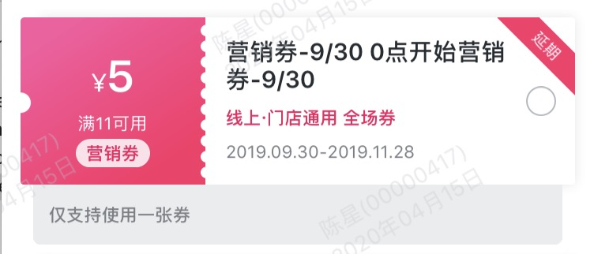

## 一、 简介

1， 先看一下，我们要实现的效果：




就是上图中的 “剩余3天” 和 "延期" 这种效果，这种是一个倾斜的控件， 如果文字是固定的一种或者多种，可以通过图标的方式来设置，但是，如果倾斜的文字内容前端无法确定，需要接口返回，那么，这种效果该怎么实现呢？

2， 设想，如果使用UILabel这个控件，设置背景色，文字颜色，然后通过控件的transform方法（设置锚点）旋转一下，能否？ 

经过实际测试，小编发现，旋转之后， UILabel的高度变了，这不符合需求。经过查找，发现使用UIButton, 把里边的UILabel旋转即可。

## 二、 实现代码 


```
///根据文字，获取倾斜的图片
- (UIImage *)imageWithText:(NSString *)text{
    UIView *view = [[UIView alloc] initWithFrame:CGRectMake(0, 0, 50, 50)];
    view.backgroundColor = [UIColor clearColor];
    
    UILabel *label = [[UILabel alloc] initWithFrame:CGRectMake(-3.5, 8.5, 71, 19)];
    label.backgroundColor = RGBAllColor(0xFF2C68);
    label.textColor = [UIColor whiteColor];
    label.text = text;
    label.font = FONT_QuanJiao(10.f);
    label.textAlignment = NSTextAlignmentCenter;
    label.transform = CGAffineTransformMakeRotation(M_PI / 4.0);
    [view addSubview:label];
    
    UIGraphicsBeginImageContextWithOptions(view.bounds.size, NO, [UIScreen mainScreen].scale);
    [view.layer renderInContext:UIGraphicsGetCurrentContext()];
    UIImage *image=UIGraphicsGetImageFromCurrentImageContext();
    UIGraphicsEndImageContext();
    return image;
}
```


