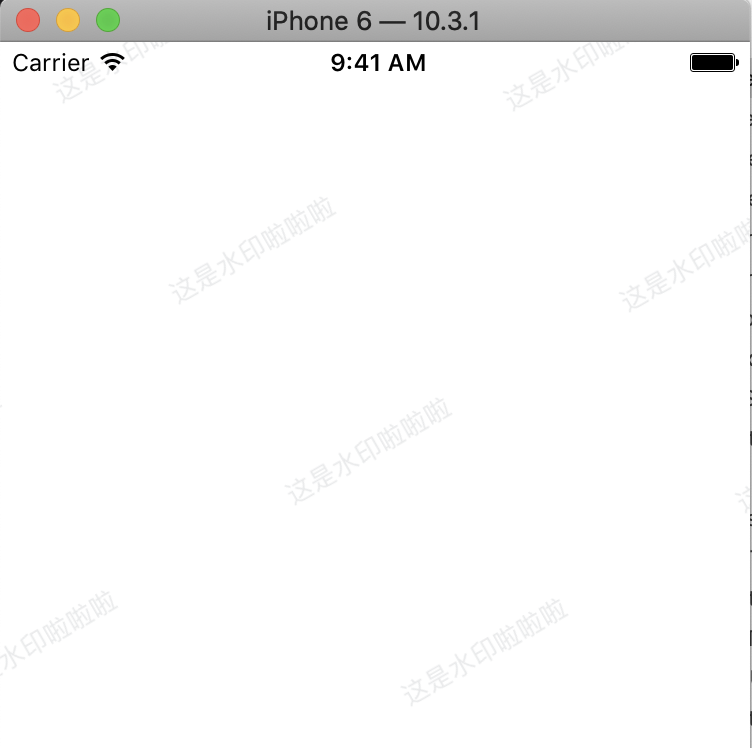

## 一、 简介

1， 先看一下，我们要实现的效果：



2， 第一种做法：可以让UI做一张有倾斜字体的图片，然后平铺一下图片，就ok了。

第二种做法： 根据文字，生成这种倾斜的图片，然后平铺。

上边这两种方法都可以实现，但是，第一种做法，图片是固定的，第二种做法可以根据接口返回的字符串，来动态实现水印。也许有人说了，第一种做法中的图片，也可以通过网络下载下来，然后形成水印。 毕竟条条大路通罗马，小编今天只实现第二种做法。

## 二、 代码

```
- (void)viewDidLoad {
    [super viewDidLoad];
    
    self.view.backgroundColor = [UIColor whiteColor];

    CGSize screenSize = [UIScreen mainScreen].bounds.size;
    CGFloat screenW = screenSize.width;
    CGFloat screenH = screenSize.height;

    //水印图片
    UIImage *img = [self generateWaterMark:@"这是水印啦啦啦"];

    UIImageView *waterMarkImgv = [[UIImageView alloc] init];
    
    
    waterMarkImgv.backgroundColor = [UIColor colorWithPatternImage:img];
    
    //让图片的宽高放大一倍，然后移动位置，在旋转，这样，手机屏幕左上角的位置就成了图片imgv的锚点了。
    waterMarkImgv.frame =  CGRectMake(0, 0, screenW * 2, screenH * 2);
    waterMarkImgv.transform = CGAffineTransformMakeTranslation(-screenW,-screenH);
    waterMarkImgv.transform = CGAffineTransformRotate(waterMarkImgv.transform, -M_PI_2/3.0);
    [self.view addSubview:waterMarkImgv];
}


- (UIImage *)generateWaterMark:(NSString *)hint{
    
    UIColor *textColor = [UIColor colorWithRed:202.0/255.0
                                         green:204.0/255.0
                                          blue:207.0/255.0
                                         alpha:0.4];
    
    UIFont *font = [UIFont systemFontOfSize:13];
    
    CGSize textSize = [self textSize:hint font:font];
    
    UIView *subv = [[UIView alloc] initWithFrame:CGRectMake(0, 0, textSize.width + 100.0, textSize.height + 100.0)];
    
    UILabel *m1 = [[UILabel alloc] init];
    m1.frame = CGRectMake(0, 0, textSize.width, textSize.height);
    m1.textColor = textColor;
    m1.textAlignment = NSTextAlignmentCenter;
    m1.font = font;
    m1.text = hint;
    
    [subv addSubview:m1];
    
    UIGraphicsBeginImageContextWithOptions(subv.frame.size, NO, 2.0);
    CGContextRef currentContext = UIGraphicsGetCurrentContext();
    [subv.layer renderInContext:currentContext];
    UIImage *screenshot = UIGraphicsGetImageFromCurrentImageContext();
    UIGraphicsEndImageContext();
    
    return screenshot;
}

- (CGSize)textSize:(NSString *)text font:(UIFont *)font {
    if (!text) return CGSizeZero;
    return [text boundingRectWithSize:CGSizeMake(MAXFLOAT, MAXFLOAT)
                              options:NSStringDrawingUsesLineFragmentOrigin
                           attributes:@{NSFontAttributeName : font}
                              context:nil].size;
}
```

- 1, 上边的代码中，是通过生成一张水印图片，然后放到UIImageView控件中，平铺的形式来展现。 

```
//主要代码
waterMarkImgv.backgroundColor = [UIColor colorWithPatternImage:img];
```

- 2,  旋转逻辑， 让控件大一倍，并且控件的center正好位于屏幕的左上角远点，这样，就可以直接旋转了。

```
waterMarkImgv.frame =  CGRectMake(0, 0, screenW * 2, screenH * 2);
waterMarkImgv.transform = CGAffineTransformMakeTranslation(-screenW,-screenH);
waterMarkImgv.transform = CGAffineTransformRotate(waterMarkImgv.transform, -M_PI_2/3.0);
```