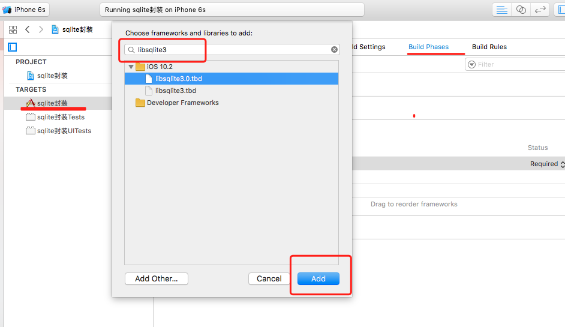
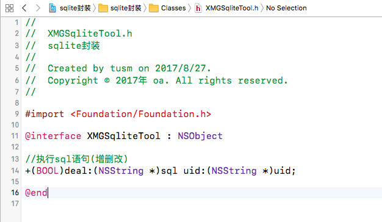
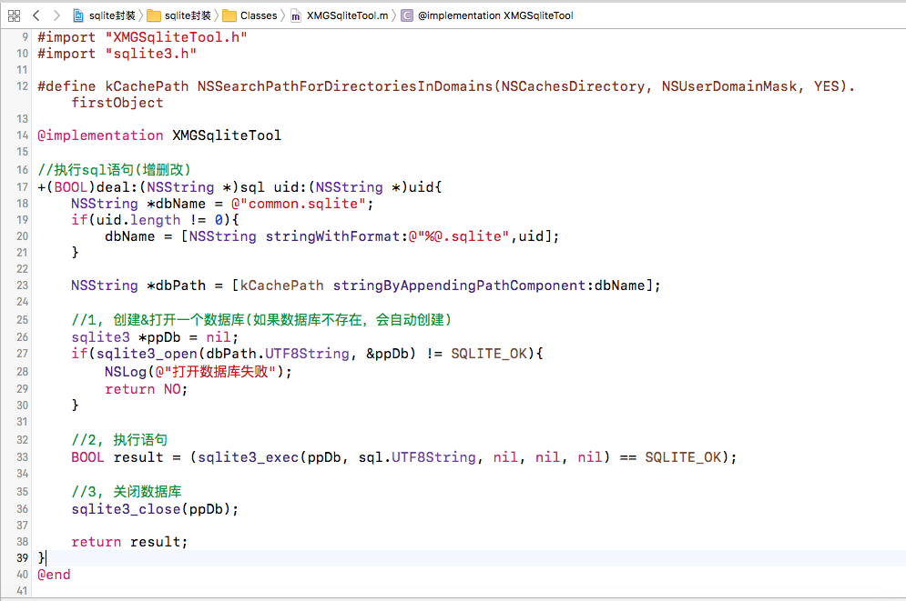

1，引入 libsqlite3.0.tbd   类库

targets --> Build Phases --> Link Binary With Libraries , 添加类库，找到libsqlite3.0.tbd

2, 创建基本工具类：XMGSqliteTool ，引入sqlite3.h, 并且创建执行sql语句的方法：

3，执行sql语句方法的实现：

4，总结：  执行语句的三个步骤： 
>1,   打开数据库

>2,   执行语句

>3,   关闭数据库
