1，创建项目单元测试，并且编写工具类，用于测试。

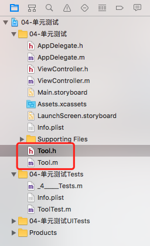

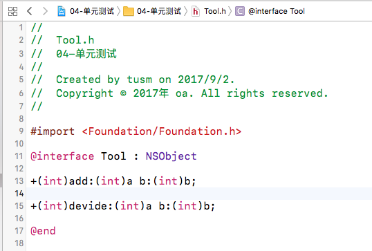

2，添加测试target。左侧目录中选中项目，在右侧的Target中添加一个测试的target

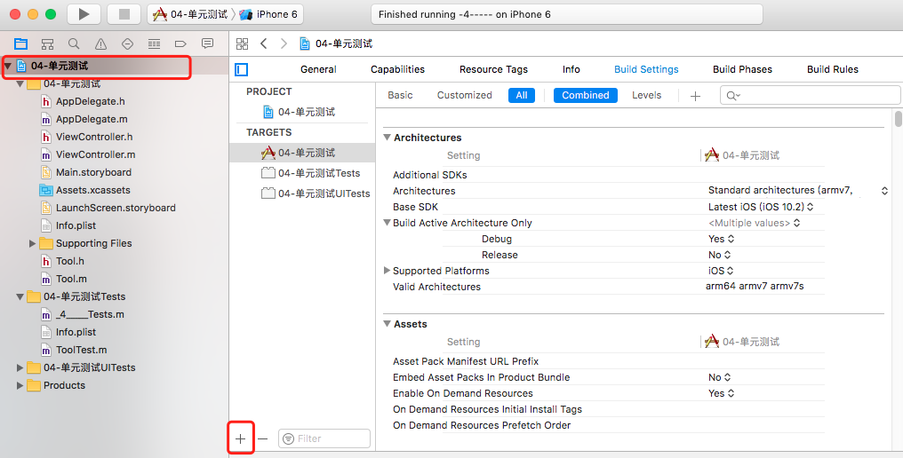

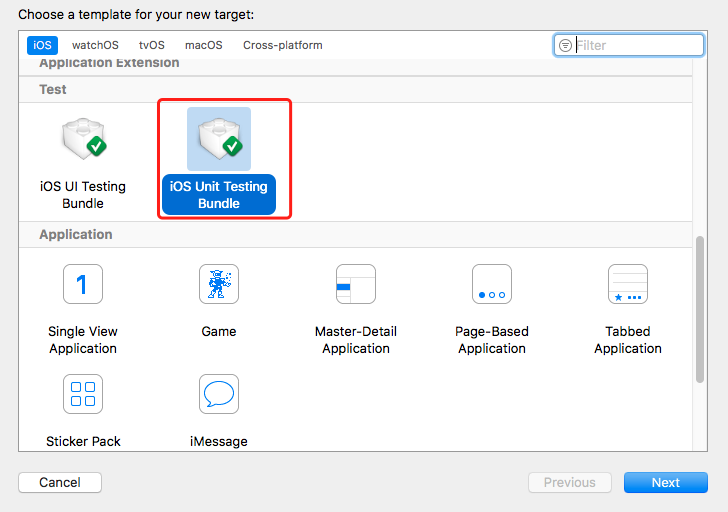

3, 在单元测试的target中，创建单元测试类

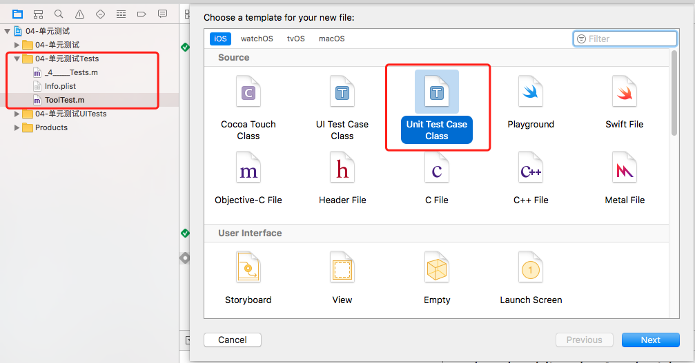

4， 在测试类中，编写测试代码， 测试方法一定要以test开头：

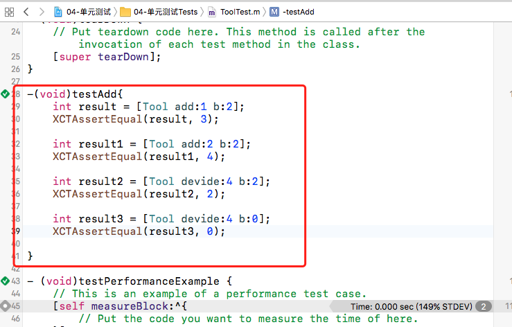

5， 可以单个执行测试方法，也可以 command+u  执行整个单元测试。

单个执行测试方法，可以直接在方法的左边，点击这个按钮执行这个方法：

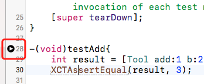

6， 查看测试结果：

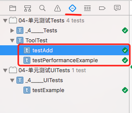

7，查看整个项目的代码测试覆盖率，可以直接看出哪些代码没有被测试到：

打开代码覆盖率：

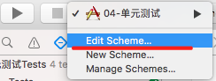

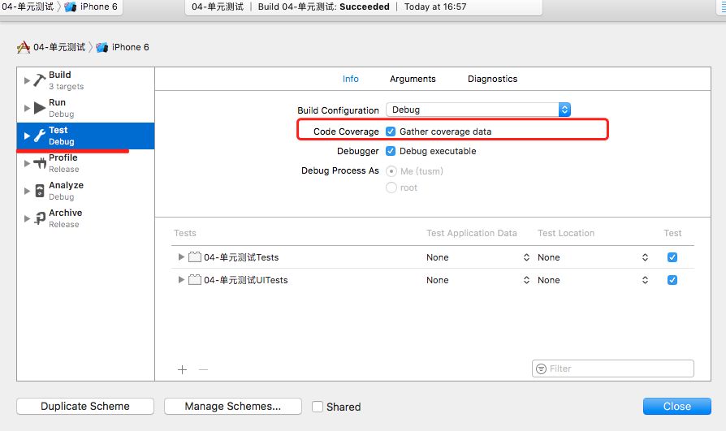

查看：

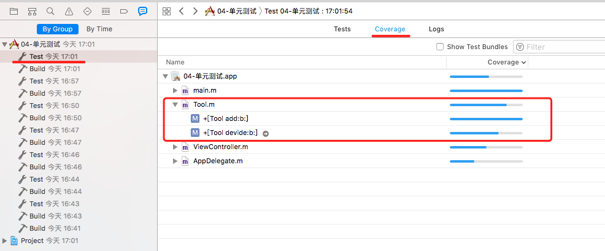

这个可以直接看出：Tool 类中的devide方法中，有些代码没有执行到，点击后边的箭头，打开该方法：

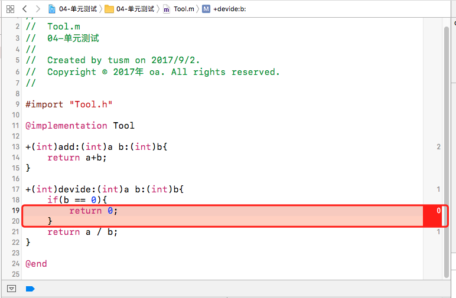

可以看到，return 0 没有被执行，后边的数字代表此段代码被执行的次数。
修改测试用例方法，使用return 0 执行到。

