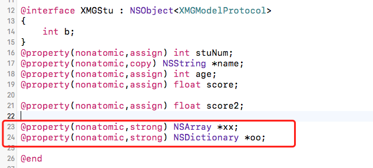
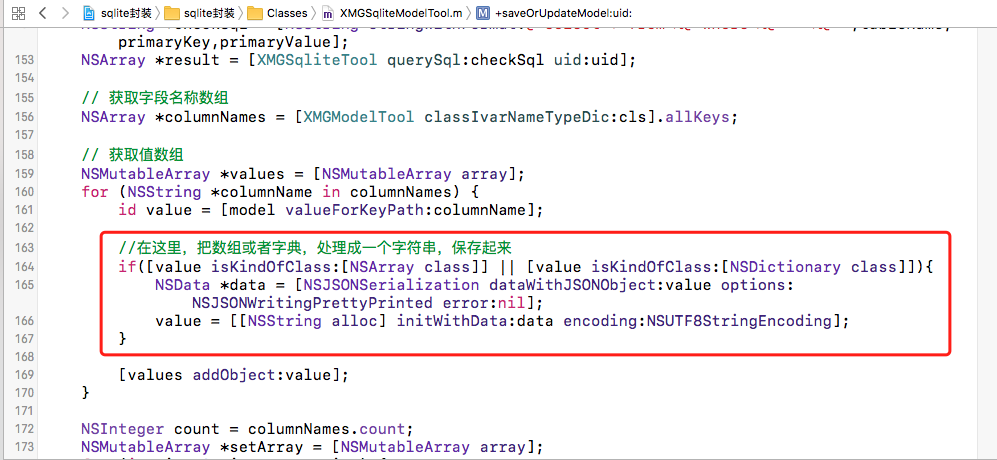
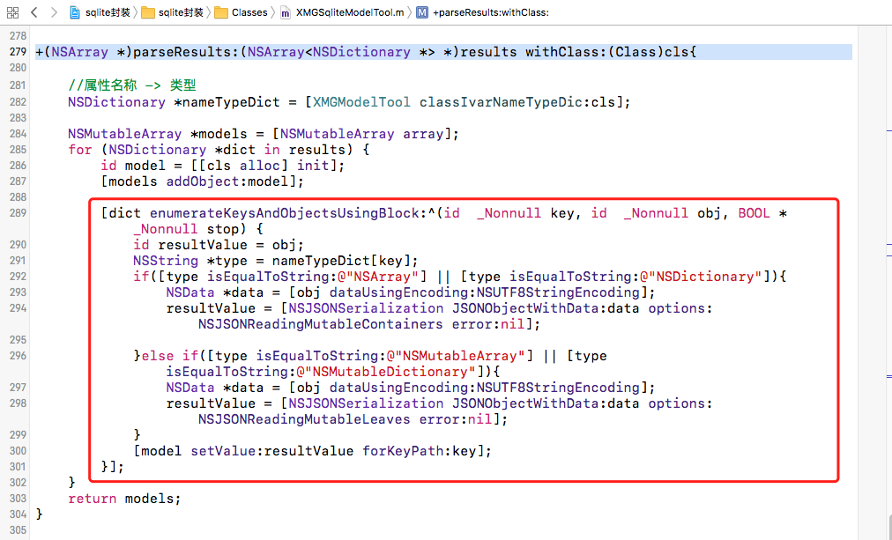

问题： 当给XMGStu模型类添加数组型属性和字典型属性，该如何处理？

1，在XMGSqliteModelTool中的saveOrUpdateModel:uid方法中，在保存的时候，将值为字典或者数组的时候，进行处理，先转成data, 然后转成字符串。

2，在查询的时候，将类型为数组或者字典的属性，对值进行处理，先转成data, 然后转成相应的类型值。

在XMGSqliteModelTool中的parseResults:withClass:方法中，进行修改

