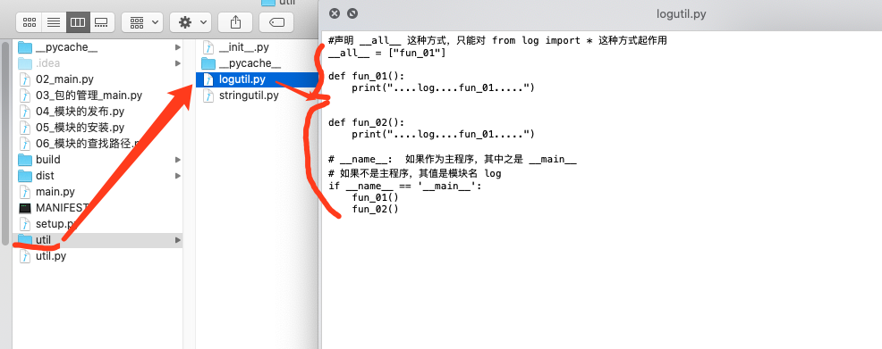
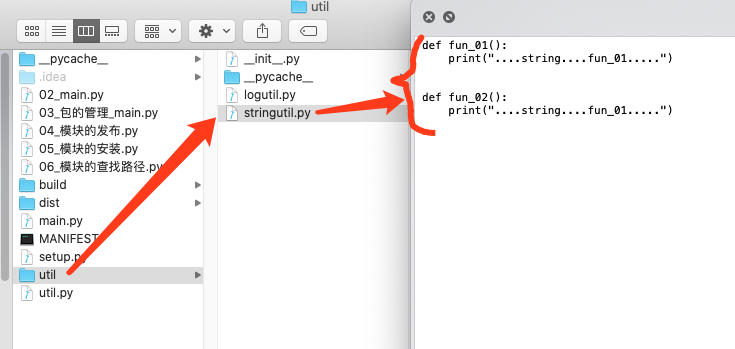
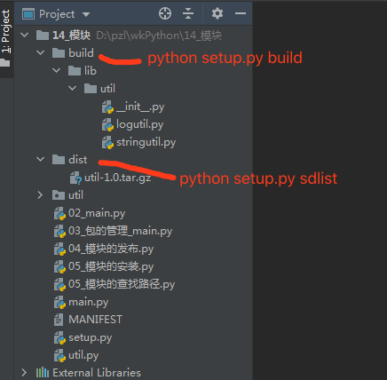

# 一.01_随机生成一个整数

```
#随机生成一个整数

#方式一
# import random
# num = random.randint(1,10)
# print(num)

#方式二, 导入random模块中的randint函数
# from random import randint
# num2 = randint(1,5)
# print(num2)

#方式三，导入random模块中的多个函数,
# from random import randint,choice
#导入的函数比较多，可以使用 * 代替
from random import *
num3 = randint(1,10)
print(num3)
#随机选择序列中的一个数字
print(choice([1,3,5,7,9]))
```

# 二.02_导入模块

```
#导入模块,
# import log
# log.fun_01()
# log.fun_02()

#导入模块
# from log import fun_01,fun_02
# fun_01()
# fun_02()

# #导入模块的时候，多个模块，有相同的函数名
# # 第一： 使用import 这种导入方法
# # 第二： 要是使用了from 模块名 import 函数名 这种，可以给函数名加上一个别名
# from util import fun_01 as logFn1,fun_02 as logFn2
# from log import fun_01 as utilFn1,fun_02 as utilFn2
#
# #使用
# logFn1()
# logFn2()
# utilFn1()
# utilFn2()

# from util.logutil import fun_02
# fun_02()

```

# 三.03_包的管理_main

```
# #第一种导入
# import util.logutil
# import util.stringutil
#
# if __name__ == "__main__":
#     util.logutil.fun_01()
#     util.logutil.fun_02()
#     util.stringutil.fun_01()
#     util.stringutil.fun_02()


#第二种方式导入
from util import logutil
from util import stringutil

if __name__ == '__main__':
    logutil.fun_01()
    logutil.fun_02()
    stringutil.fun_01()
    stringutil.fun_02()


```




# 四.04_模块的发布

```
"""
1, 制作一个setup.py文件
from distutils.core import setup
setup(
    name='util',
    version='1.0',
    author='wolfcode',
    author_email='wolfcode@wolfcode.cn',
    url='http://www.wolfcode.cn',
    download_url='http://www.wolfcode.cn',
    description='util module',
    py_modules=['util.logutil','util.stringuitl']
)
2, 构建模块(命令行中)
python setup.py build

3, 生成发布压缩包
python setup.py sdist
"""

```



# 五.05_模块的安装

```
"""
第一种方式：
命令行执行: pip install 模块名称
直到看见 Successfully installed ...

卸载模块： pip uninstall 模块名称

第二种方式：
去网站 https://pypi.org/ 找到对应的模块，下载 ***.whl 文件
使用命令： pin install ***.whl

第三种方式：
使用pycharm工具安装
file -> settings -> Project 项目名称*** -> Python Interpreter --> 右侧+

第四种方式：（源代码安装）
去网站 https://pypi.org/ 找到对应的模块，下载 ***.tar.gz 文件
解压到某个目录，然后命令行进入到该目录
执行命令： python setup.py install

"""

```

# 六.06_模块的查找路径

```
import time
import random
import util.logutil
import sys

if __name__ == '__main__':

    #查找模块的具体位置
    print(util.logutil.__file__)
    print(random.__file__)

    print("*"*50)

    #在sys中的path就指定了模块查找的路径方式
    for item in sys.path:
        print(item)


    """
    for循环打印：
    D:\pzl\wkPython\14_模块
    D:\pzl\wkPython\14_模块
    D:\pzl\yingyonganzhuang\python37\python37.zip
    D:\pzl\yingyonganzhuang\python37\DLLs
    D:\pzl\yingyonganzhuang\python37\lib
    D:\pzl\yingyonganzhuang\python37
    D:\pzl\yingyonganzhuang\python37\lib\site-packages
    """

```


## 参考资料
> - []()
> - []()
